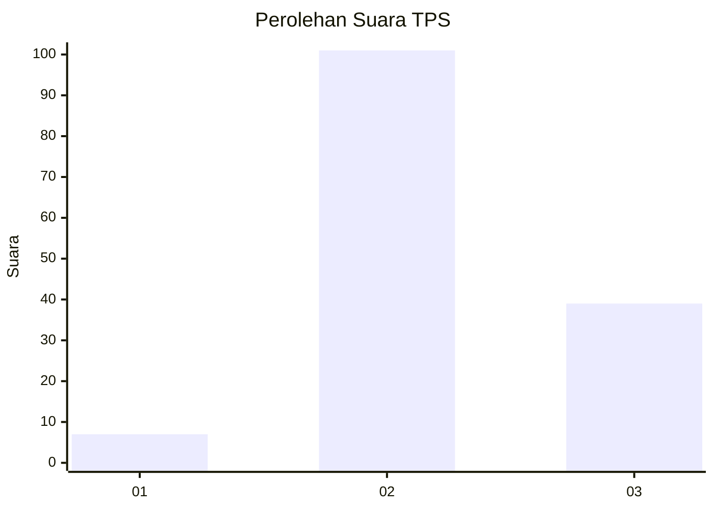

# Hasil

## Grafik

## Tabel

| No. | Nama Paslon    | Suara | Suara (raw) | Persentase |
|:--- |:-------------- | -----:| -----------:| ----------:|
| 1   | ANIES MUHAIMIN | 7     | [7][p-1]    | 4,76       |
| 2   | PRABOWO GIBRAN | 101   | [101][p-2]  | 68,71      |
| 3   | GANJAR MAHFUD  | 39    | [39][p-3]   | 26,53      |

[p-1]: https://github.com/gigit-pemilu/pemilu-2024-33-jawa-tengah/blob/main/pilpres/hitung-suara/sub/33-jawa-tengah/sub/15-grobogan/sub/06-pulokulon/sub/2008-mangunrejo/sub/014-tps/sub/paslon-1.txt
[p-2]: https://github.com/gigit-pemilu/pemilu-2024-33-jawa-tengah/blob/main/pilpres/hitung-suara/sub/33-jawa-tengah/sub/15-grobogan/sub/06-pulokulon/sub/2008-mangunrejo/sub/014-tps/sub/paslon-2.txt
[p-3]: https://github.com/gigit-pemilu/pemilu-2024-33-jawa-tengah/blob/main/pilpres/hitung-suara/sub/33-jawa-tengah/sub/15-grobogan/sub/06-pulokulon/sub/2008-mangunrejo/sub/014-tps/sub/paslon-3.txt

## Foto C Plano

https://sirekap-obj-formc.kpu.go.id/2052/pemilu/ppwp/33/15/06/20/08/3315062008014-20240214-200141--c632c58a-6489-4bfa-b547-2e4c0e6fdff5.jpg

https://sirekap-obj-formc.kpu.go.id/2052/pemilu/ppwp/33/15/06/20/08/3315062008014-20240214-200622--e1d9635a-7176-49ca-a0dd-4cdfbfc1f8ac.jpg

https://sirekap-obj-formc.kpu.go.id/2052/pemilu/ppwp/33/15/06/20/08/3315062008014-20240214-200435--c3012abd-c870-430c-984f-282dfddf7da0.jpg

## Metadata

| Key        | Value               |
| ---------- | ------------------- |
| Time Stamp | 2024-02-17 19:30:00 |

