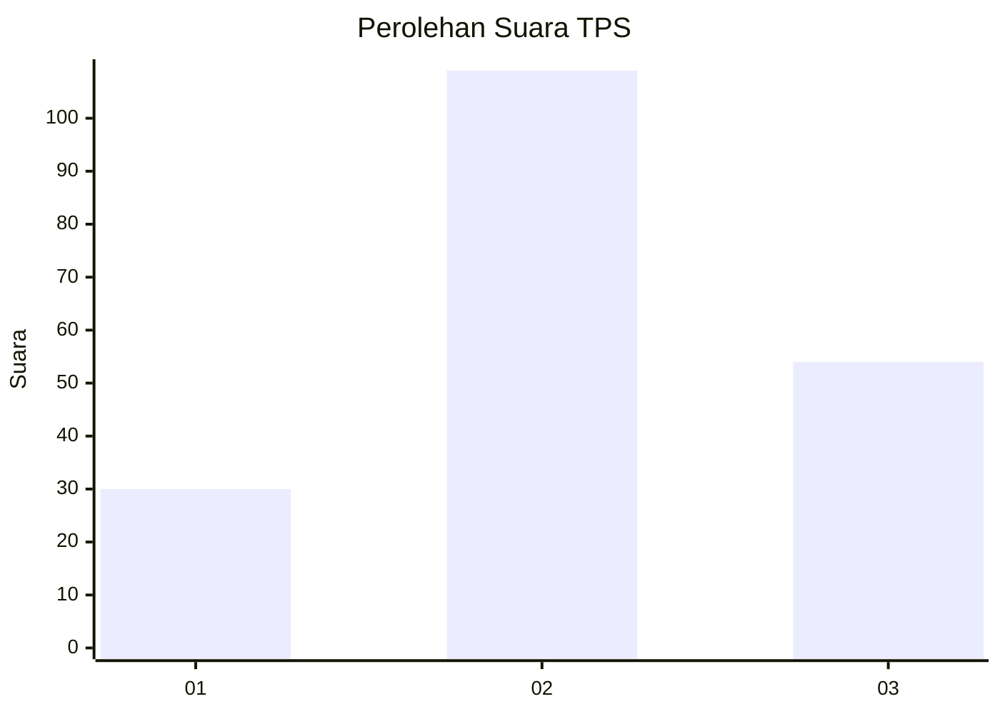
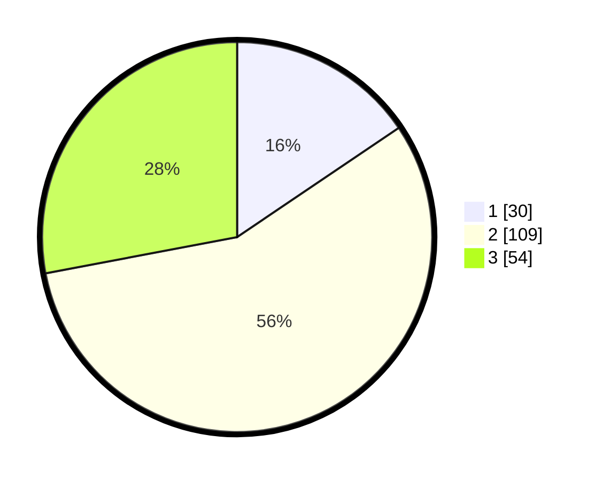

# Hasil

## Grafik

## Tabel

| No. | Nama Paslon    | Suara | Suara (raw) | Persentase |
|:--- |:-------------- | -----:| -----------:| ----------:|
| 1   | ANIES MUHAIMIN | 30    | [30][p-1]   | 15,54      |
| 2   | PRABOWO GIBRAN | 109   | [109][p-2]  | 56,48      |
| 3   | GANJAR MAHFUD  | 54    | [54][p-3]   | 27,98      |

[p-1]: https://github.com/gigit-pemilu/pemilu-2024/blob/main/pilpres/hitung-suara/sub/33-jawa-tengah/sub/15-grobogan/sub/06-pulokulon/sub/2010-pulokulon/sub/022-tps/sub/paslon-1.txt
[p-2]: https://github.com/gigit-pemilu/pemilu-2024/blob/main/pilpres/hitung-suara/sub/33-jawa-tengah/sub/15-grobogan/sub/06-pulokulon/sub/2010-pulokulon/sub/022-tps/sub/paslon-2.txt
[p-3]: https://github.com/gigit-pemilu/pemilu-2024/blob/main/pilpres/hitung-suara/sub/33-jawa-tengah/sub/15-grobogan/sub/06-pulokulon/sub/2010-pulokulon/sub/022-tps/sub/paslon-3.txt

## Foto C Plano

https://sirekap-obj-formc.kpu.go.id/4bc8/pemilu/ppwp/33/15/06/20/10/3315062010022-20240215-162447--e372e051-9dae-4ae1-934f-9663f7d53708.jpg

https://sirekap-obj-formc.kpu.go.id/4bc8/pemilu/ppwp/33/15/06/20/10/3315062010022-20240215-163624--3f464958-6010-44cd-89db-0a72604b05c0.jpg

https://sirekap-obj-formc.kpu.go.id/4bc8/pemilu/ppwp/33/15/06/20/10/3315062010022-20240215-162841--99beb76d-835c-4bca-bbc4-70e505be2eee.jpg

## Metadata

| Key        | Value               |
| ---------- | ------------------- |
| Time Stamp | 2024-02-17 19:30:00 |

## DATA PEMILIH TETAP

Jumlah pemilih dalam DPT: **243**.
 * L: **120**.
 * P: **627**.

## DATA PENGGUNA HAK PILIH

Jumlah pengguna hak pilih dalam DPT: **424**.
 * L: **696**.
 * P: **49**.

Jumlah pengguna hak pilih dalam DPTb: **222**.
 * L: **8**.
 * P: **802**.

Jumlah pengguna hak pilih dalam DPK: **6**.
 * L: **5**.
 * P: **6**.

Jumlah pengguna hak pilih: **726**.
 * L: **95**.
 * P: **19**.

## JUMLAH SUARA SAH DAN TIDAK SAH

JUMLAH SELURUH SUARA SAH: **193**.

JUMLAH SUARA TIDAK SAH: **4**.

JUMLAH SELURUH SUARA SAH DAN SUARA TIDAK SAH: **197**.

