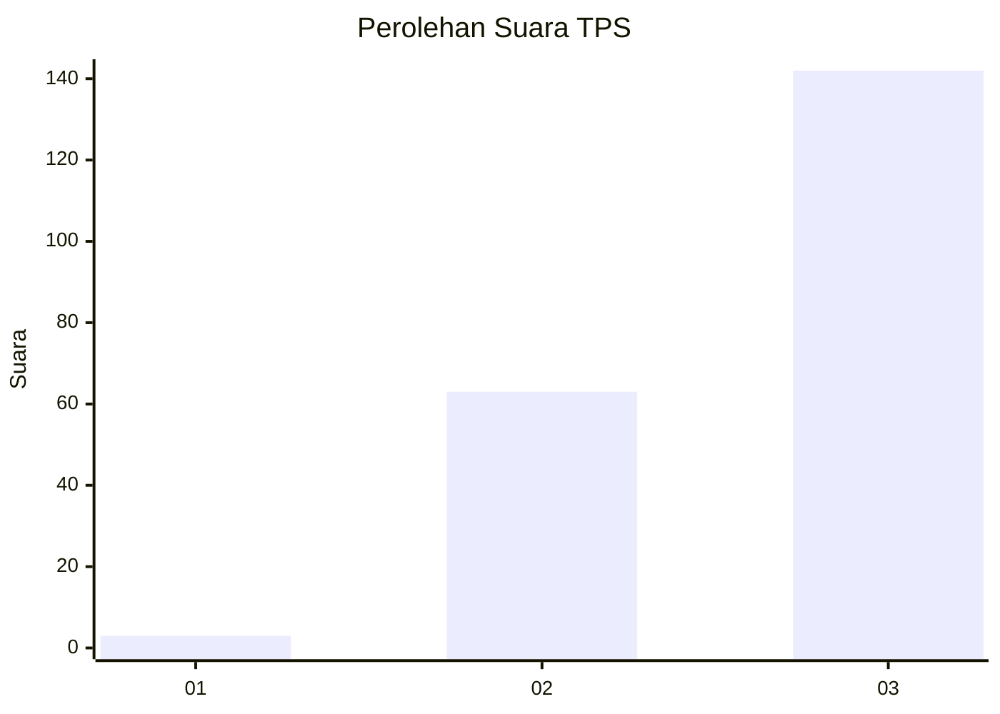
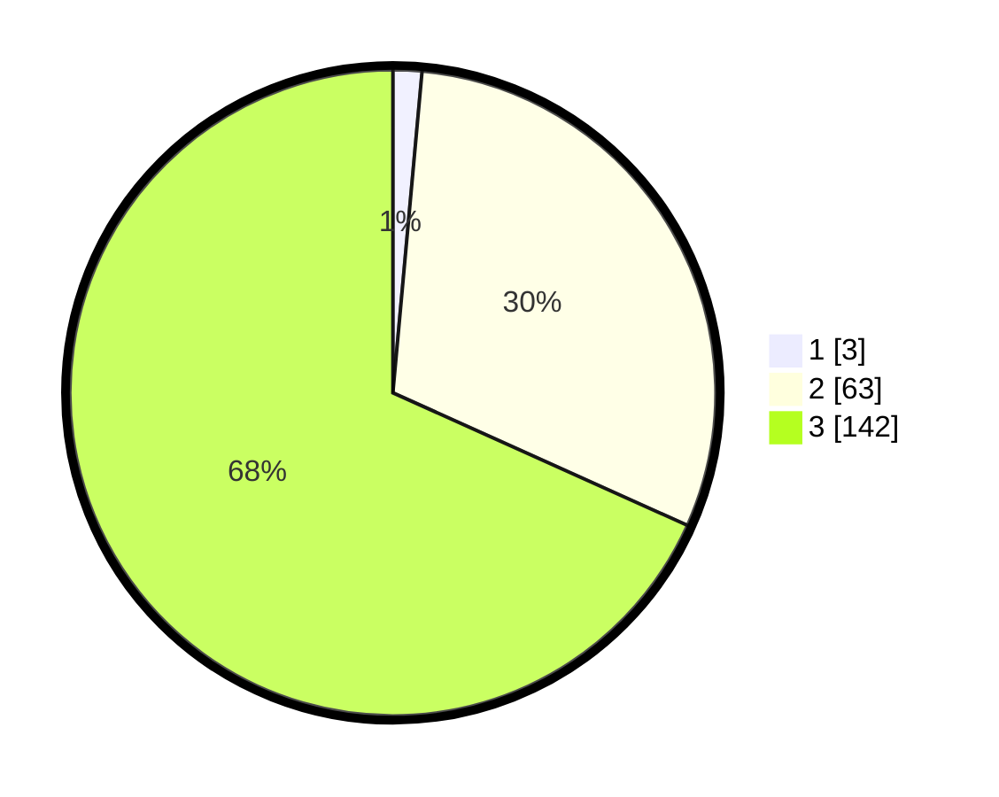

# Hasil

## Grafik

## Tabel

| No. | Nama Paslon    | Suara | Suara (raw) | Persentase |
|:--- |:-------------- | -----:| -----------:| ----------:|
| 1   | ANIES MUHAIMIN | 3     | [3][p-1]    | 1,44       |
| 2   | PRABOWO GIBRAN | 63    | [63][p-2]   | 30,29      |
| 3   | GANJAR MAHFUD  | 142   | [142][p-3]  | 68,27      |

[p-1]: https://github.com/gigit-pemilu/pemilu-2024/blob/main/pilpres/hitung-suara/sub/33-jawa-tengah/sub/15-grobogan/sub/06-pulokulon/sub/2012-karangharjo/sub/006-tps/sub/paslon-1.txt
[p-2]: https://github.com/gigit-pemilu/pemilu-2024/blob/main/pilpres/hitung-suara/sub/33-jawa-tengah/sub/15-grobogan/sub/06-pulokulon/sub/2012-karangharjo/sub/006-tps/sub/paslon-2.txt
[p-3]: https://github.com/gigit-pemilu/pemilu-2024/blob/main/pilpres/hitung-suara/sub/33-jawa-tengah/sub/15-grobogan/sub/06-pulokulon/sub/2012-karangharjo/sub/006-tps/sub/paslon-3.txt

## Foto C Plano

https://sirekap-obj-formc.kpu.go.id/0e51/pemilu/ppwp/33/15/06/20/12/3315062012006-20240215-094944--5c5c17a3-33e1-468f-952f-63b70bb6d6ef.jpg

https://sirekap-obj-formc.kpu.go.id/0e51/pemilu/ppwp/33/15/06/20/12/3315062012006-20240215-095134--af4c4533-6eef-478f-937c-e1bd19ec629f.jpg

https://sirekap-obj-formc.kpu.go.id/0e51/pemilu/ppwp/33/15/06/20/12/3315062012006-20240215-095241--8512a05f-182e-4de7-9311-2d64b7e1e9cb.jpg

## Metadata

| Key        | Value               |
| ---------- | ------------------- |
| Time Stamp | 2024-02-15 16:30:25 |

