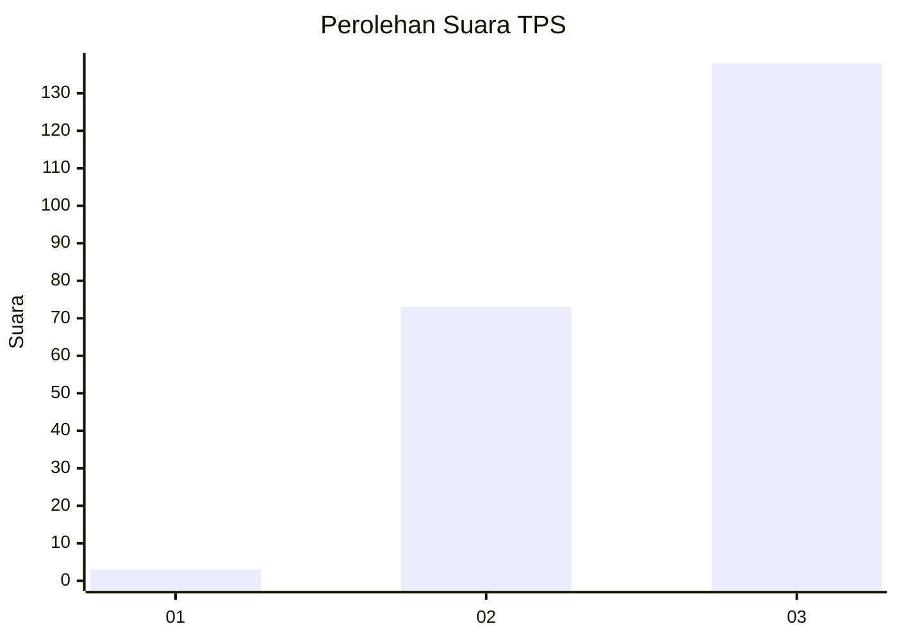
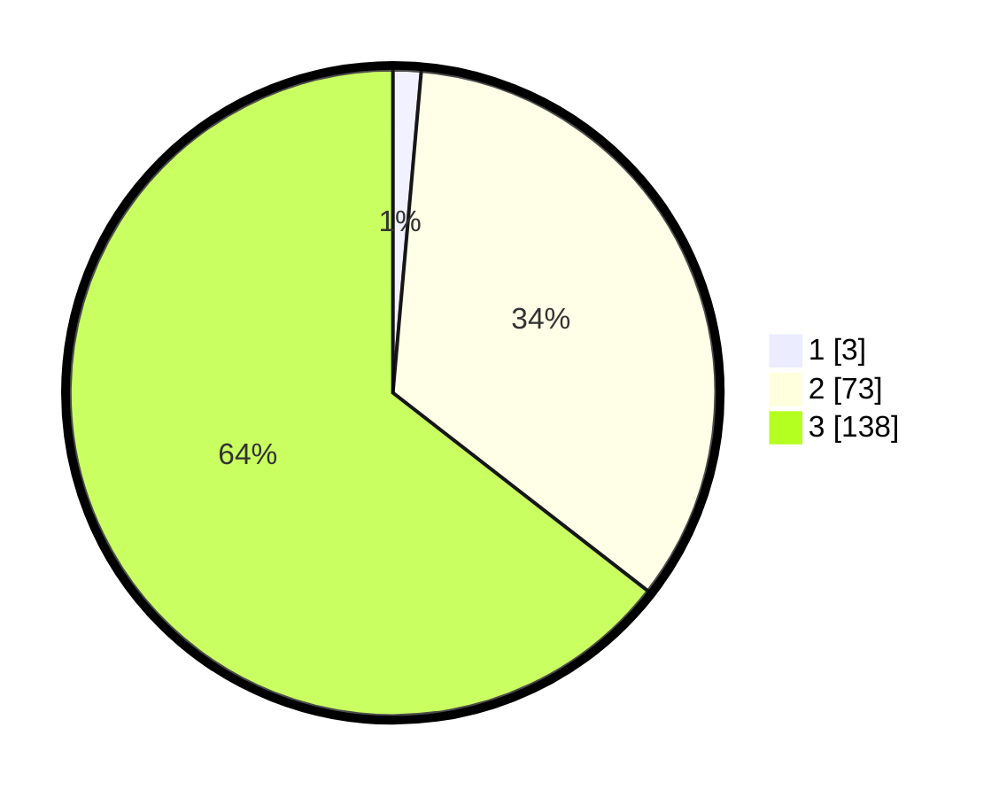

# Hasil

## Grafik

## Tabel

| No. | Nama Paslon    | Suara | Suara (raw) | Persentase |
|:--- |:-------------- | -----:| -----------:| ----------:|
| 1   | ANIES MUHAIMIN | 3     | [3][p-1]    | 1,40       |
| 2   | PRABOWO GIBRAN | 73    | [73][p-2]   | 34,11      |
| 3   | GANJAR MAHFUD  | 138   | [138][p-3]  | 64,49      |

[p-1]: https://github.com/gigit-pemilu/pemilu-2024-33-jawa-tengah/blob/main/pilpres/hitung-suara/sub/33-jawa-tengah/sub/15-grobogan/sub/06-pulokulon/sub/2012-karangharjo/sub/013-tps/sub/paslon-1.txt
[p-2]: https://github.com/gigit-pemilu/pemilu-2024-33-jawa-tengah/blob/main/pilpres/hitung-suara/sub/33-jawa-tengah/sub/15-grobogan/sub/06-pulokulon/sub/2012-karangharjo/sub/013-tps/sub/paslon-2.txt
[p-3]: https://github.com/gigit-pemilu/pemilu-2024-33-jawa-tengah/blob/main/pilpres/hitung-suara/sub/33-jawa-tengah/sub/15-grobogan/sub/06-pulokulon/sub/2012-karangharjo/sub/013-tps/sub/paslon-3.txt

## Foto C Plano

https://sirekap-obj-formc.kpu.go.id/96ae/pemilu/ppwp/33/15/06/20/12/3315062012013-20240214-235350--48c5bf8b-cab0-4a11-b4bf-10364e4fa986.jpg

https://sirekap-obj-formc.kpu.go.id/96ae/pemilu/ppwp/33/15/06/20/12/3315062012013-20240214-235415--378722db-75c7-4a4e-aef7-5093620c8303.jpg

https://sirekap-obj-formc.kpu.go.id/96ae/pemilu/ppwp/33/15/06/20/12/3315062012013-20240214-235421--5b142060-ad8c-479d-bdc7-7884959f742a.jpg

## Metadata

| Key        | Value               |
| ---------- | ------------------- |
| Time Stamp | 2024-02-15 12:00:28 |

