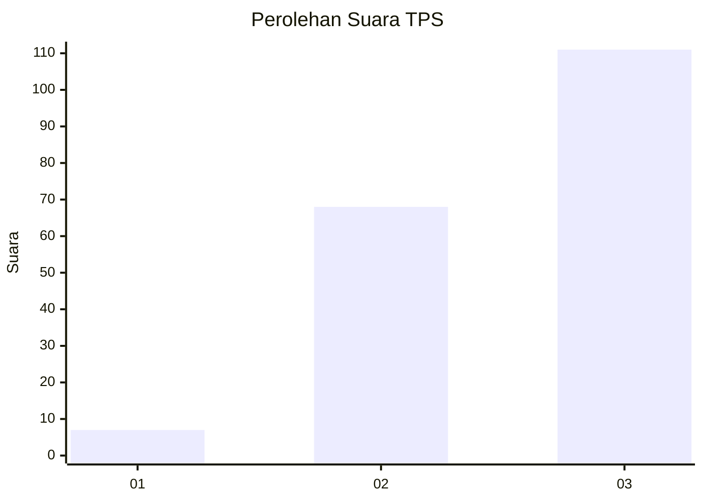
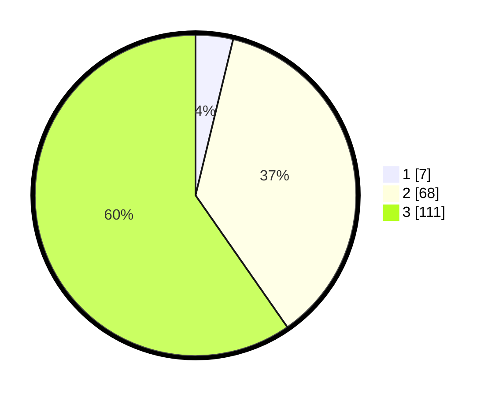

# Hasil

## Grafik

## Tabel

| No. | Nama Paslon    | Suara | Suara (raw) | Persentase |
|:--- |:-------------- | -----:| -----------:| ----------:|
| 1   | ANIES MUHAIMIN | 7     | [7][p-1]    | 3,76       |
| 2   | PRABOWO GIBRAN | 68    | [68][p-2]   | 36,56      |
| 3   | GANJAR MAHFUD  | 111   | [111][p-3]  | 59,68      |

[p-1]: https://github.com/gigit-pemilu/pemilu-2024-33-jawa-tengah/blob/main/pilpres/hitung-suara/sub/33-jawa-tengah/sub/15-grobogan/sub/06-pulokulon/sub/2012-karangharjo/sub/019-tps/sub/paslon-1.txt
[p-2]: https://github.com/gigit-pemilu/pemilu-2024-33-jawa-tengah/blob/main/pilpres/hitung-suara/sub/33-jawa-tengah/sub/15-grobogan/sub/06-pulokulon/sub/2012-karangharjo/sub/019-tps/sub/paslon-2.txt
[p-3]: https://github.com/gigit-pemilu/pemilu-2024-33-jawa-tengah/blob/main/pilpres/hitung-suara/sub/33-jawa-tengah/sub/15-grobogan/sub/06-pulokulon/sub/2012-karangharjo/sub/019-tps/sub/paslon-3.txt

## Foto C Plano

https://sirekap-obj-formc.kpu.go.id/1efa/pemilu/ppwp/33/15/06/20/12/3315062012019-20240214-141706--8f76c8a1-097d-420f-abca-3cd494cd9de1.jpg

https://sirekap-obj-formc.kpu.go.id/1efa/pemilu/ppwp/33/15/06/20/12/3315062012019-20240214-141829--ef317912-baec-4fe1-ae9a-4cc3dcb457f2.jpg

https://sirekap-obj-formc.kpu.go.id/1efa/pemilu/ppwp/33/15/06/20/12/3315062012019-20240214-141920--66cbc559-841b-411c-aa0b-5cf2889d75b6.jpg

## Metadata

| Key        | Value               |
| ---------- | ------------------- |
| Time Stamp | 2024-02-15 00:41:44 |

