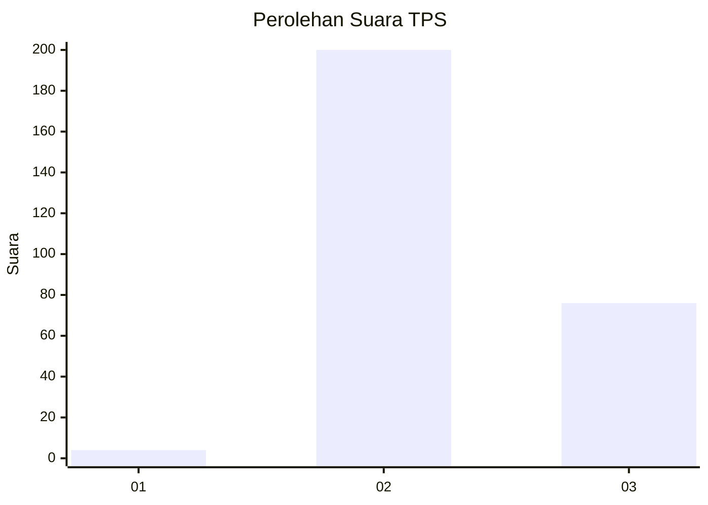
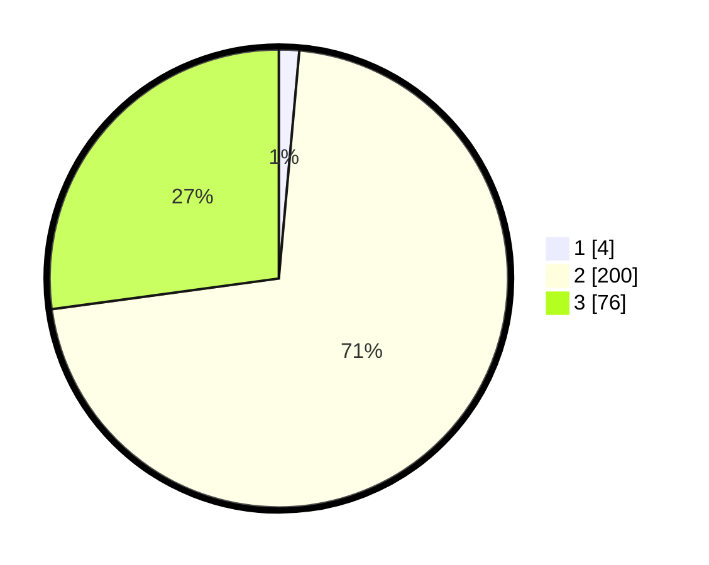

# Hasil

## Grafik

## Tabel

| No. | Nama Paslon    | Suara | Suara (raw) | Persentase |
|:--- |:-------------- | -----:| -----------:| ----------:|
| 1   | ANIES MUHAIMIN | 4     | [4][p-1]    | 1,43       |
| 2   | PRABOWO GIBRAN | 200   | [200][p-2]  | 71,43      |
| 3   | GANJAR MAHFUD  | 76    | [76][p-3]   | 27,14      |

[p-1]: https://github.com/gigit-pemilu/pemilu-2024-33-jawa-tengah/blob/main/pilpres/hitung-suara/sub/33-jawa-tengah/sub/15-grobogan/sub/06-pulokulon/sub/2013-sembungharjo/sub/007-tps/sub/paslon-1.txt
[p-2]: https://github.com/gigit-pemilu/pemilu-2024-33-jawa-tengah/blob/main/pilpres/hitung-suara/sub/33-jawa-tengah/sub/15-grobogan/sub/06-pulokulon/sub/2013-sembungharjo/sub/007-tps/sub/paslon-2.txt
[p-3]: https://github.com/gigit-pemilu/pemilu-2024-33-jawa-tengah/blob/main/pilpres/hitung-suara/sub/33-jawa-tengah/sub/15-grobogan/sub/06-pulokulon/sub/2013-sembungharjo/sub/007-tps/sub/paslon-3.txt

## Foto C Plano

https://sirekap-obj-formc.kpu.go.id/2fc7/pemilu/ppwp/33/15/06/20/13/3315062013007-20240214-211758--5b0d56b1-9d13-41a3-b120-aece31d42e41.jpg

https://sirekap-obj-formc.kpu.go.id/2fc7/pemilu/ppwp/33/15/06/20/13/3315062013007-20240214-212342--53bbf407-4c1a-4158-9154-8cbc43eea799.jpg

https://sirekap-obj-formc.kpu.go.id/2fc7/pemilu/ppwp/33/15/06/20/13/3315062013007-20240214-212413--e1c1a7ac-d83d-4dbb-9aab-63f16434c4b0.jpg

## Metadata

| Key        | Value               |
| ---------- | ------------------- |
| Time Stamp | 2024-02-15 12:00:28 |

