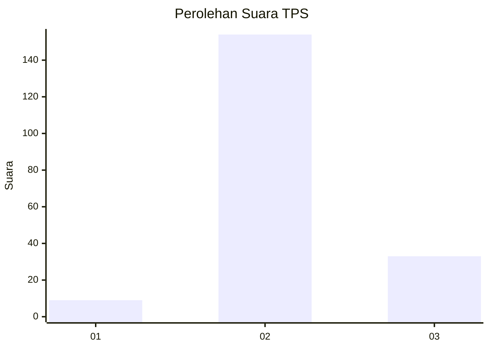
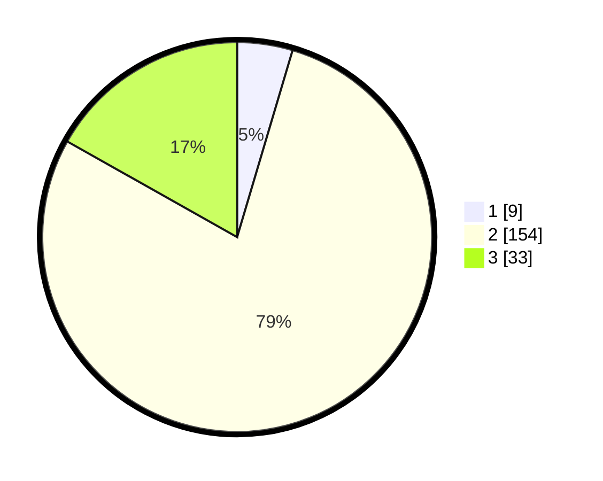

# Hasil

## Grafik

## Tabel

| No. | Nama Paslon    | Suara | Suara (raw) | Persentase |
|:--- |:-------------- | -----:| -----------:| ----------:|
| 1   | ANIES MUHAIMIN | 9     | [9][p-1]    | 4,59       |
| 2   | PRABOWO GIBRAN | 154   | [154][p-2]  | 78,57      |
| 3   | GANJAR MAHFUD  | 33    | [33][p-3]   | 16,84      |

[p-1]: https://github.com/gigit-pemilu/pemilu-2024-33-jawa-tengah/blob/main/pilpres/hitung-suara/sub/33-jawa-tengah/sub/15-grobogan/sub/07-kradenan/sub/2001-sengonwetan/sub/005-tps/sub/paslon-1.txt
[p-2]: https://github.com/gigit-pemilu/pemilu-2024-33-jawa-tengah/blob/main/pilpres/hitung-suara/sub/33-jawa-tengah/sub/15-grobogan/sub/07-kradenan/sub/2001-sengonwetan/sub/005-tps/sub/paslon-2.txt
[p-3]: https://github.com/gigit-pemilu/pemilu-2024-33-jawa-tengah/blob/main/pilpres/hitung-suara/sub/33-jawa-tengah/sub/15-grobogan/sub/07-kradenan/sub/2001-sengonwetan/sub/005-tps/sub/paslon-3.txt

## Foto C Plano

https://sirekap-obj-formc.kpu.go.id/5ef7/pemilu/ppwp/33/15/07/20/01/3315072001005-20240214-203002--9c732667-6659-458e-9ff6-6b8efc7ba099.jpg

https://sirekap-obj-formc.kpu.go.id/5ef7/pemilu/ppwp/33/15/07/20/01/3315072001005-20240214-203728--3ba65999-866d-433f-b297-185472da8622.jpg

https://sirekap-obj-formc.kpu.go.id/5ef7/pemilu/ppwp/33/15/07/20/01/3315072001005-20240214-195713--8aaca596-929f-4400-89a3-a476d49a0e1b.jpg

## Metadata

| Key        | Value               |
| ---------- | ------------------- |
| Time Stamp | 2024-02-15 12:00:28 |

