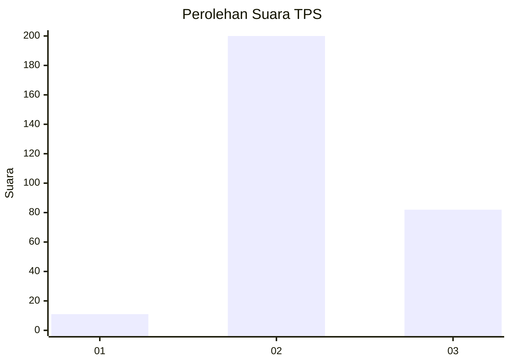
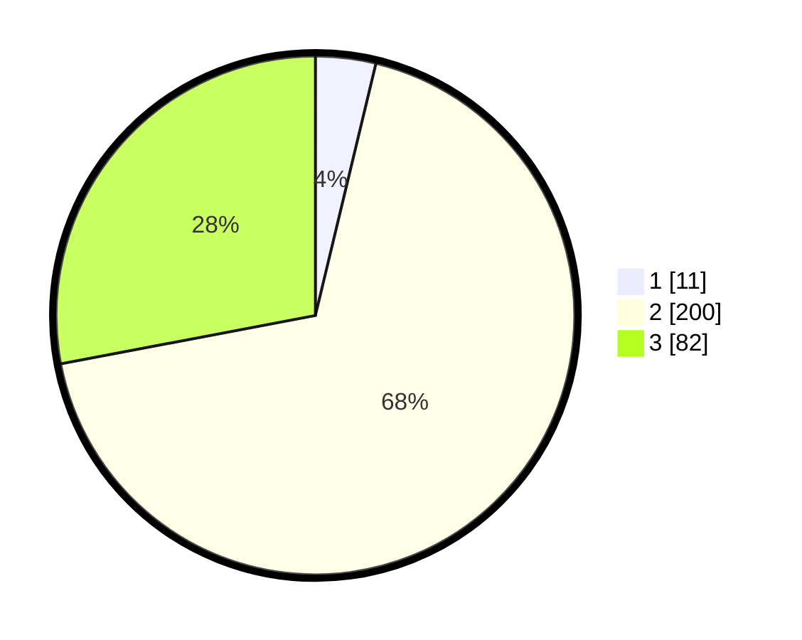

# Hasil

## Grafik

## Tabel

| No. | Nama Paslon    | Suara | Suara (raw) | Persentase |
|:--- |:-------------- | -----:| -----------:| ----------:|
| 1   | ANIES MUHAIMIN | 11    | [11][p-1]   | 3,75       |
| 2   | PRABOWO GIBRAN | 200   | [200][p-2]  | 68,26      |
| 3   | GANJAR MAHFUD  | 82    | [82][p-3]   | 27,99      |

[p-1]: https://github.com/gigit-pemilu/pemilu-2024-33-jawa-tengah/blob/main/pilpres/hitung-suara/sub/33-jawa-tengah/sub/15-grobogan/sub/07-kradenan/sub/2004-kradenan/sub/021-tps/sub/paslon-1.txt
[p-2]: https://github.com/gigit-pemilu/pemilu-2024-33-jawa-tengah/blob/main/pilpres/hitung-suara/sub/33-jawa-tengah/sub/15-grobogan/sub/07-kradenan/sub/2004-kradenan/sub/021-tps/sub/paslon-2.txt
[p-3]: https://github.com/gigit-pemilu/pemilu-2024-33-jawa-tengah/blob/main/pilpres/hitung-suara/sub/33-jawa-tengah/sub/15-grobogan/sub/07-kradenan/sub/2004-kradenan/sub/021-tps/sub/paslon-3.txt

## Foto C Plano

https://sirekap-obj-formc.kpu.go.id/3b3e/pemilu/ppwp/33/15/07/20/04/3315072004021-20240214-212914--d515d36c-b931-4500-90d0-cb2e25efaae9.jpg

https://sirekap-obj-formc.kpu.go.id/3b3e/pemilu/ppwp/33/15/07/20/04/3315072004021-20240214-213402--3300e97f-503e-4b58-87ae-1c6aef3866f2.jpg

https://sirekap-obj-formc.kpu.go.id/3b3e/pemilu/ppwp/33/15/07/20/04/3315072004021-20240214-213529--cb30fd3a-205c-40ca-bd6c-5e32f16fe1e8.jpg

## Metadata

| Key        | Value               |
| ---------- | ------------------- |
| Time Stamp | 2024-02-15 15:00:29 |

