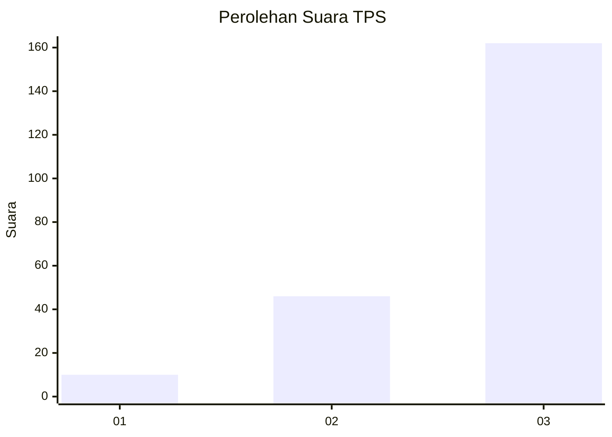
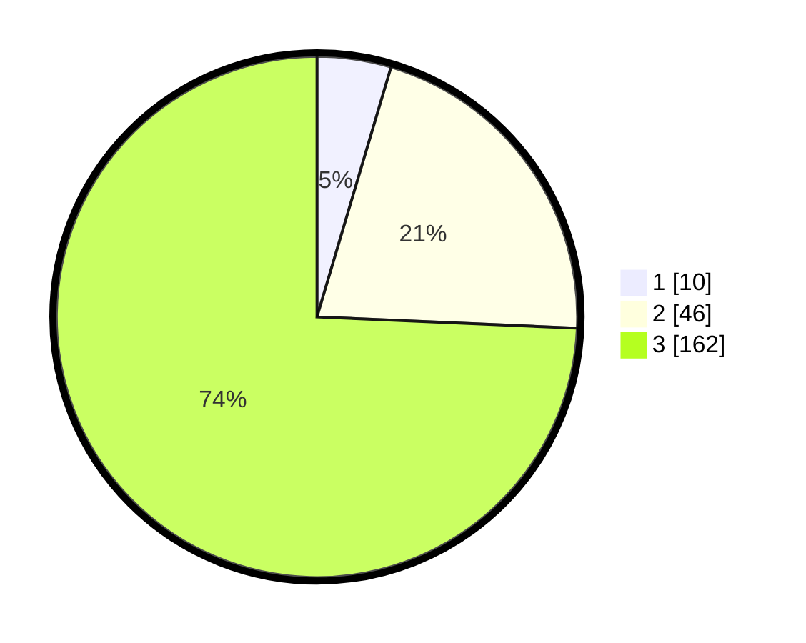

# Hasil

## Grafik

## Tabel

| No. | Nama Paslon    | Suara | Suara (raw) | Persentase |
|:--- |:-------------- | -----:| -----------:| ----------:|
| 1   | ANIES MUHAIMIN | 10    | [10][p-1]   | 4,59       |
| 2   | PRABOWO GIBRAN | 46    | [46][p-2]   | 21,10      |
| 3   | GANJAR MAHFUD  | 162   | [162][p-3]  | 74,31      |

[p-1]: https://github.com/gigit-pemilu/pemilu-2024/blob/main/pilpres/hitung-suara/sub/33-jawa-tengah/sub/15-grobogan/sub/08-gabus/sub/2001-keyongan/sub/008-tps/sub/paslon-1.txt
[p-2]: https://github.com/gigit-pemilu/pemilu-2024/blob/main/pilpres/hitung-suara/sub/33-jawa-tengah/sub/15-grobogan/sub/08-gabus/sub/2001-keyongan/sub/008-tps/sub/paslon-2.txt
[p-3]: https://github.com/gigit-pemilu/pemilu-2024/blob/main/pilpres/hitung-suara/sub/33-jawa-tengah/sub/15-grobogan/sub/08-gabus/sub/2001-keyongan/sub/008-tps/sub/paslon-3.txt

## Foto C Plano

https://sirekap-obj-formc.kpu.go.id/6392/pemilu/ppwp/33/15/08/20/01/3315082001008-20240216-103044--56608eab-23d4-423b-ae2f-a14511445fd2.jpg

https://sirekap-obj-formc.kpu.go.id/6392/pemilu/ppwp/33/15/08/20/01/3315082001008-20240215-011320--a3fa991c-dfdf-48a4-be6f-aa8bac1ea134.jpg

https://sirekap-obj-formc.kpu.go.id/6392/pemilu/ppwp/33/15/08/20/01/3315082001008-20240216-105302--e2145567-4fe5-465d-a5ae-19a167bea3c2.jpg

## Metadata

| Key        | Value               |
| ---------- | ------------------- |
| Time Stamp | 2024-02-16 11:00:29 |

