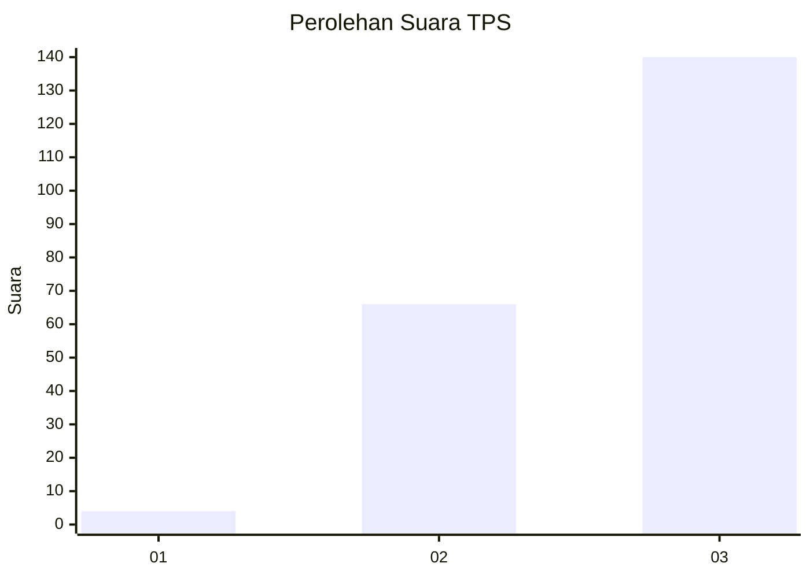
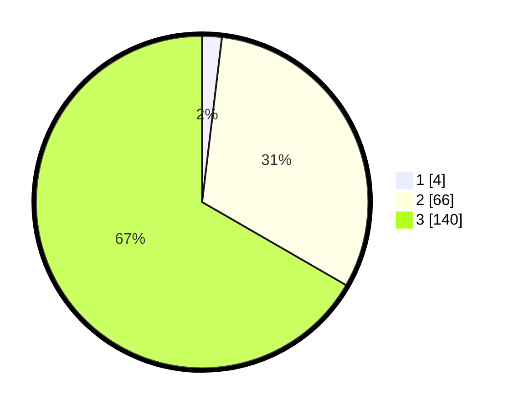

# Hasil

## Grafik

## Tabel

| No. | Nama Paslon    | Suara | Suara (raw) | Persentase |
|:--- |:-------------- | -----:| -----------:| ----------:|
| 1   | ANIES MUHAIMIN | 4     | [4][p-1]    | 1,90       |
| 2   | PRABOWO GIBRAN | 66    | [66][p-2]   | 31,43      |
| 3   | GANJAR MAHFUD  | 140   | [140][p-3]  | 66,67      |

[p-1]: https://github.com/gigit-pemilu/pemilu-2024-33-jawa-tengah/blob/main/pilpres/hitung-suara/sub/33-jawa-tengah/sub/15-grobogan/sub/08-gabus/sub/2001-keyongan/sub/013-tps/sub/paslon-1.txt
[p-2]: https://github.com/gigit-pemilu/pemilu-2024-33-jawa-tengah/blob/main/pilpres/hitung-suara/sub/33-jawa-tengah/sub/15-grobogan/sub/08-gabus/sub/2001-keyongan/sub/013-tps/sub/paslon-2.txt
[p-3]: https://github.com/gigit-pemilu/pemilu-2024-33-jawa-tengah/blob/main/pilpres/hitung-suara/sub/33-jawa-tengah/sub/15-grobogan/sub/08-gabus/sub/2001-keyongan/sub/013-tps/sub/paslon-3.txt

## Foto C Plano

https://sirekap-obj-formc.kpu.go.id/079c/pemilu/ppwp/33/15/08/20/01/3315082001013-20240214-141028--7b91fc62-2525-4b74-8e4e-7bda800df3a0.jpg

https://sirekap-obj-formc.kpu.go.id/079c/pemilu/ppwp/33/15/08/20/01/3315082001013-20240216-133310--e1820b0a-1e62-4b19-aa4b-f0fc794cbd11.jpg

https://sirekap-obj-formc.kpu.go.id/079c/pemilu/ppwp/33/15/08/20/01/3315082001013-20240216-133401--9498eeb1-e4e4-4f69-b2e9-3201885e90bb.jpg

## Metadata

| Key        | Value               |
| ---------- | ------------------- |
| Time Stamp | 2024-02-16 14:00:34 |

