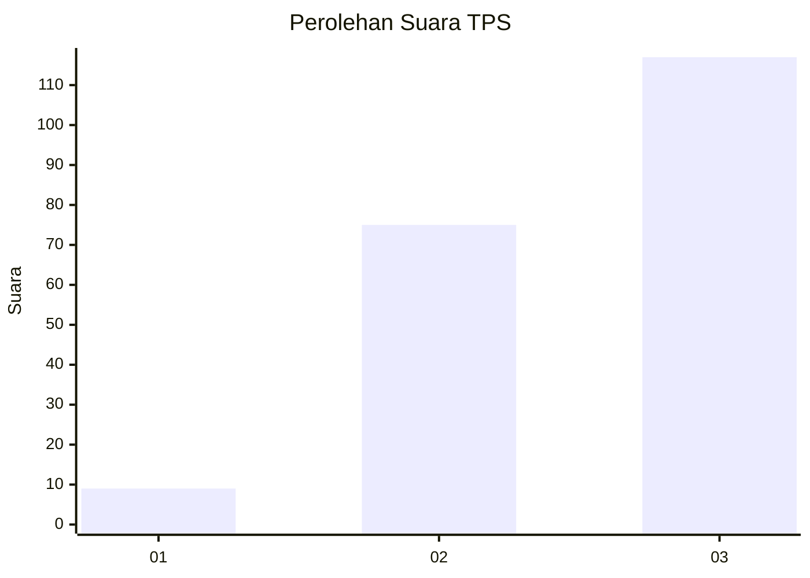
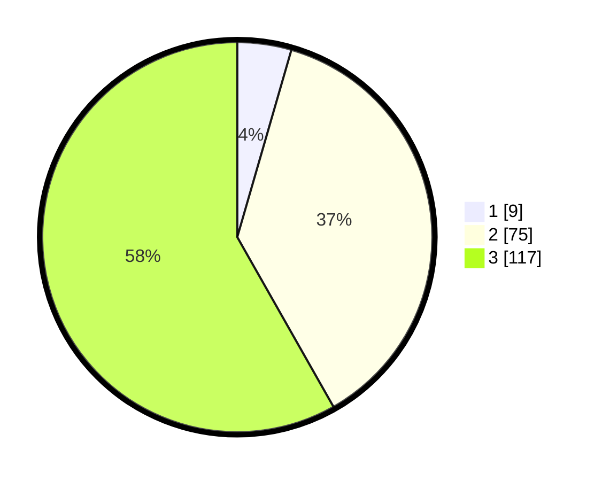

# Hasil

## Grafik

## Tabel

| No. | Nama Paslon    | Suara | Suara (raw) | Persentase |
|:--- |:-------------- | -----:| -----------:| ----------:|
| 1   | ANIES MUHAIMIN | 9     | [9][p-1]    | 4,48       |
| 2   | PRABOWO GIBRAN | 75    | [75][p-2]   | 37,31      |
| 3   | GANJAR MAHFUD  | 117   | [117][p-3]  | 58,21      |

[p-1]: https://github.com/gigit-pemilu/pemilu-2024-33-jawa-tengah/blob/main/pilpres/hitung-suara/sub/33-jawa-tengah/sub/15-grobogan/sub/08-gabus/sub/2006-tlogotirto/sub/013-tps/sub/paslon-1.txt
[p-2]: https://github.com/gigit-pemilu/pemilu-2024-33-jawa-tengah/blob/main/pilpres/hitung-suara/sub/33-jawa-tengah/sub/15-grobogan/sub/08-gabus/sub/2006-tlogotirto/sub/013-tps/sub/paslon-2.txt
[p-3]: https://github.com/gigit-pemilu/pemilu-2024-33-jawa-tengah/blob/main/pilpres/hitung-suara/sub/33-jawa-tengah/sub/15-grobogan/sub/08-gabus/sub/2006-tlogotirto/sub/013-tps/sub/paslon-3.txt

## Foto C Plano

https://sirekap-obj-formc.kpu.go.id/3293/pemilu/ppwp/33/15/08/20/06/3315082006013-20240214-213410--73adf75d-4c9b-44a9-bba3-db17b54f8dcb.jpg

https://sirekap-obj-formc.kpu.go.id/3293/pemilu/ppwp/33/15/08/20/06/3315082006013-20240216-130856--0f61b531-6c1d-4102-819f-ef8666a5c642.jpg

https://sirekap-obj-formc.kpu.go.id/3293/pemilu/ppwp/33/15/08/20/06/3315082006013-20240216-130901--c0fac325-d105-421e-bd43-19c8b036ea3b.jpg

## Metadata

| Key        | Value               |
| ---------- | ------------------- |
| Time Stamp | 2024-02-17 14:56:33 |

