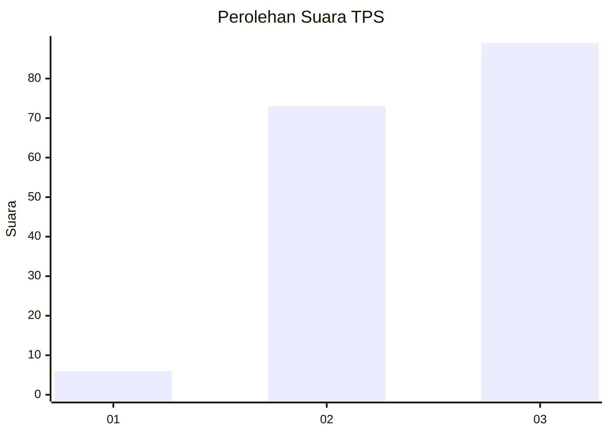
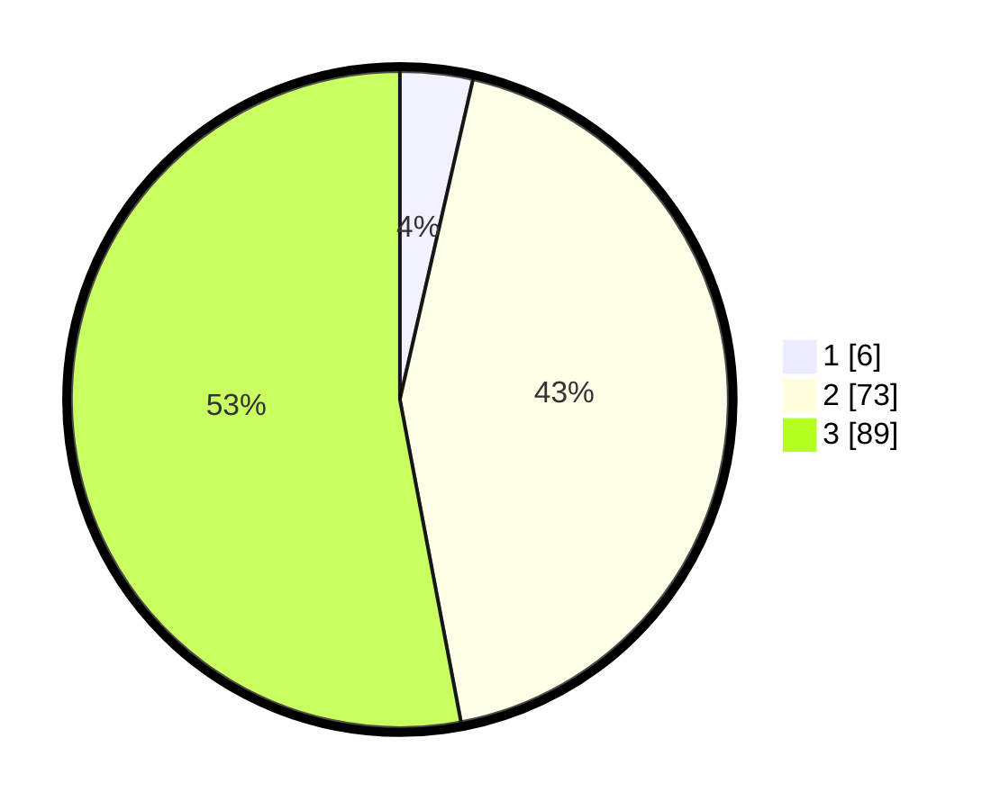

# Hasil

## Grafik

## Tabel

| No. | Nama Paslon    | Suara | Suara (raw) | Persentase |
|:--- |:-------------- | -----:| -----------:| ----------:|
| 1   | ANIES MUHAIMIN | 6     | [6][p-1]    | 3,57       |
| 2   | PRABOWO GIBRAN | 73    | [73][p-2]   | 43,45      |
| 3   | GANJAR MAHFUD  | 89    | [89][p-3]   | 52,98      |

[p-1]: https://github.com/gigit-pemilu/pemilu-2024/blob/main/pilpres/hitung-suara/sub/33-jawa-tengah/sub/15-grobogan/sub/08-gabus/sub/2007-gabus/sub/011-tps/sub/paslon-1.txt
[p-2]: https://github.com/gigit-pemilu/pemilu-2024/blob/main/pilpres/hitung-suara/sub/33-jawa-tengah/sub/15-grobogan/sub/08-gabus/sub/2007-gabus/sub/011-tps/sub/paslon-2.txt
[p-3]: https://github.com/gigit-pemilu/pemilu-2024/blob/main/pilpres/hitung-suara/sub/33-jawa-tengah/sub/15-grobogan/sub/08-gabus/sub/2007-gabus/sub/011-tps/sub/paslon-3.txt

## Foto C Plano

https://sirekap-obj-formc.kpu.go.id/4e88/pemilu/ppwp/33/15/08/20/07/3315082007011-20240216-085140--ff4d2aad-a2d8-4e90-a111-260be75d9bc0.jpg

https://sirekap-obj-formc.kpu.go.id/4e88/pemilu/ppwp/33/15/08/20/07/3315082007011-20240214-212856--32ed5e76-76d1-4765-9d14-fdef1c609481.jpg

https://sirekap-obj-formc.kpu.go.id/4e88/pemilu/ppwp/33/15/08/20/07/3315082007011-20240214-213004--aa0a5775-bebc-4db4-b443-be6958b4aec2.jpg

## Metadata

| Key        | Value               |
| ---------- | ------------------- |
| Time Stamp | 2024-02-16 09:00:28 |

