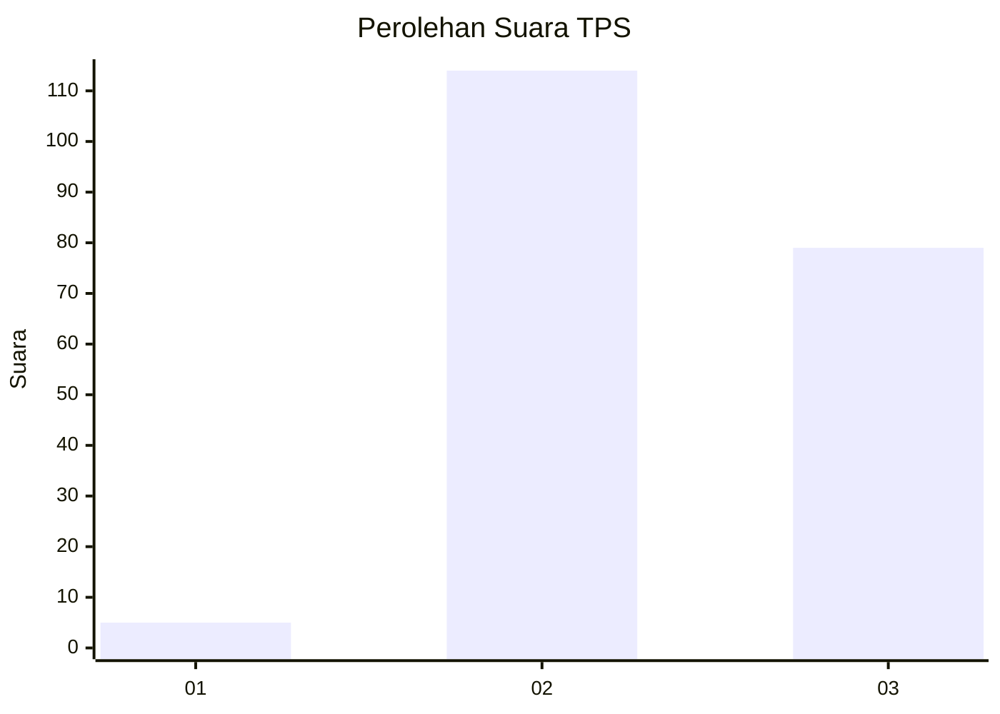
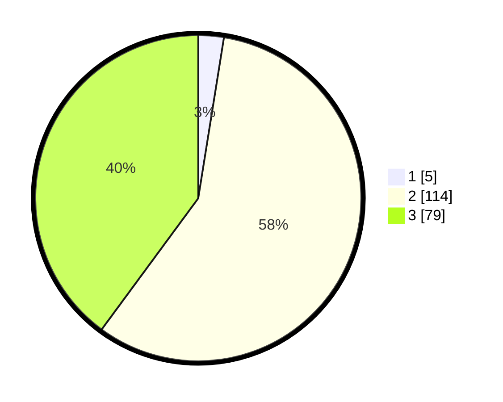

# Hasil

## Grafik

## Tabel

| No. | Nama Paslon    | Suara | Suara (raw) | Persentase |
|:--- |:-------------- | -----:| -----------:| ----------:|
| 1   | ANIES MUHAIMIN | 5     | [5][p-1]    | 2,53       |
| 2   | PRABOWO GIBRAN | 114   | [114][p-2]  | 57,58      |
| 3   | GANJAR MAHFUD  | 79    | [79][p-3]   | 39,90      |

[p-1]: https://github.com/gigit-pemilu/pemilu-2024/blob/main/pilpres/hitung-suara/sub/33-jawa-tengah/sub/15-grobogan/sub/09-ngaringan/sub/2001-sendangrejo/sub/008-tps/sub/paslon-1.txt
[p-2]: https://github.com/gigit-pemilu/pemilu-2024/blob/main/pilpres/hitung-suara/sub/33-jawa-tengah/sub/15-grobogan/sub/09-ngaringan/sub/2001-sendangrejo/sub/008-tps/sub/paslon-2.txt
[p-3]: https://github.com/gigit-pemilu/pemilu-2024/blob/main/pilpres/hitung-suara/sub/33-jawa-tengah/sub/15-grobogan/sub/09-ngaringan/sub/2001-sendangrejo/sub/008-tps/sub/paslon-3.txt

## Foto C Plano

https://sirekap-obj-formc.kpu.go.id/7db9/pemilu/ppwp/33/15/09/20/01/3315092001008-20240214-204133--a249619d-9b3d-4759-a504-2db3f2e9767b.jpg

https://sirekap-obj-formc.kpu.go.id/7db9/pemilu/ppwp/33/15/09/20/01/3315092001008-20240214-204336--041a3b55-5fe1-48fe-8b74-067c71ee8130.jpg

https://sirekap-obj-formc.kpu.go.id/7db9/pemilu/ppwp/33/15/09/20/01/3315092001008-20240214-203949--4a8ed0b8-39cb-4855-8165-b54a0e88d712.jpg

## Metadata

| Key        | Value               |
| ---------- | ------------------- |
| Time Stamp | 2024-02-15 00:41:44 |

