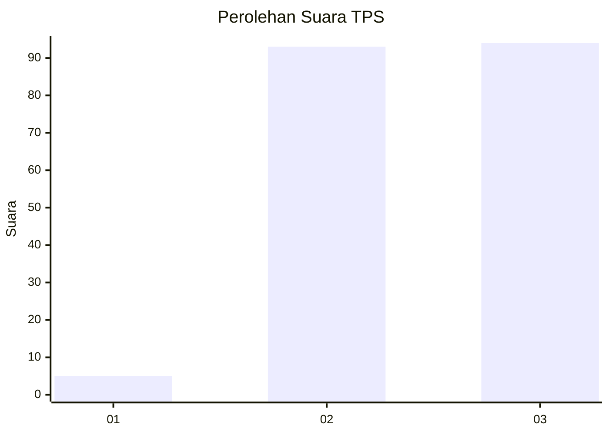
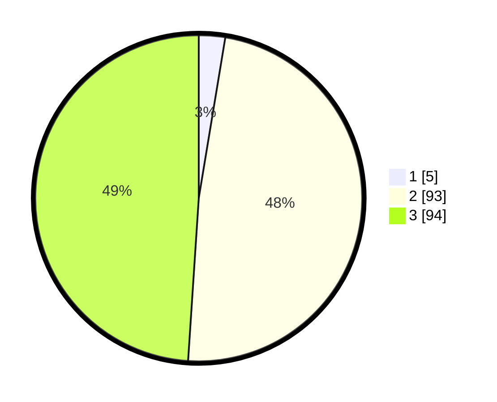

# Hasil

## Grafik

## Tabel

| No. | Nama Paslon    | Suara | Suara (raw) | Persentase |
|:--- |:-------------- | -----:| -----------:| ----------:|
| 1   | ANIES MUHAIMIN | 5     | [5][p-1]    | 2,60       |
| 2   | PRABOWO GIBRAN | 93    | [93][p-2]   | 48,44      |
| 3   | GANJAR MAHFUD  | 94    | [94][p-3]   | 48,96      |

[p-1]: https://github.com/gigit-pemilu/pemilu-2024/blob/main/pilpres/hitung-suara/sub/33-jawa-tengah/sub/15-grobogan/sub/09-ngaringan/sub/2002-sarirejo/sub/001-tps/sub/paslon-1.txt
[p-2]: https://github.com/gigit-pemilu/pemilu-2024/blob/main/pilpres/hitung-suara/sub/33-jawa-tengah/sub/15-grobogan/sub/09-ngaringan/sub/2002-sarirejo/sub/001-tps/sub/paslon-2.txt
[p-3]: https://github.com/gigit-pemilu/pemilu-2024/blob/main/pilpres/hitung-suara/sub/33-jawa-tengah/sub/15-grobogan/sub/09-ngaringan/sub/2002-sarirejo/sub/001-tps/sub/paslon-3.txt

## Foto C Plano

https://sirekap-obj-formc.kpu.go.id/dd93/pemilu/ppwp/33/15/09/20/02/3315092002001-20240214-141831--7674d2bd-0748-4b5e-a226-fd2869d50fdd.jpg

https://sirekap-obj-formc.kpu.go.id/dd93/pemilu/ppwp/33/15/09/20/02/3315092002001-20240214-141918--70506b4e-b08a-499c-b140-1945f16b5cc1.jpg

https://sirekap-obj-formc.kpu.go.id/dd93/pemilu/ppwp/33/15/09/20/02/3315092002001-20240215-065654--b1b13f4f-4e43-4027-99b3-94c787d5e69f.jpg

## Metadata

| Key        | Value               |
| ---------- | ------------------- |
| Time Stamp | 2024-02-15 12:00:28 |

