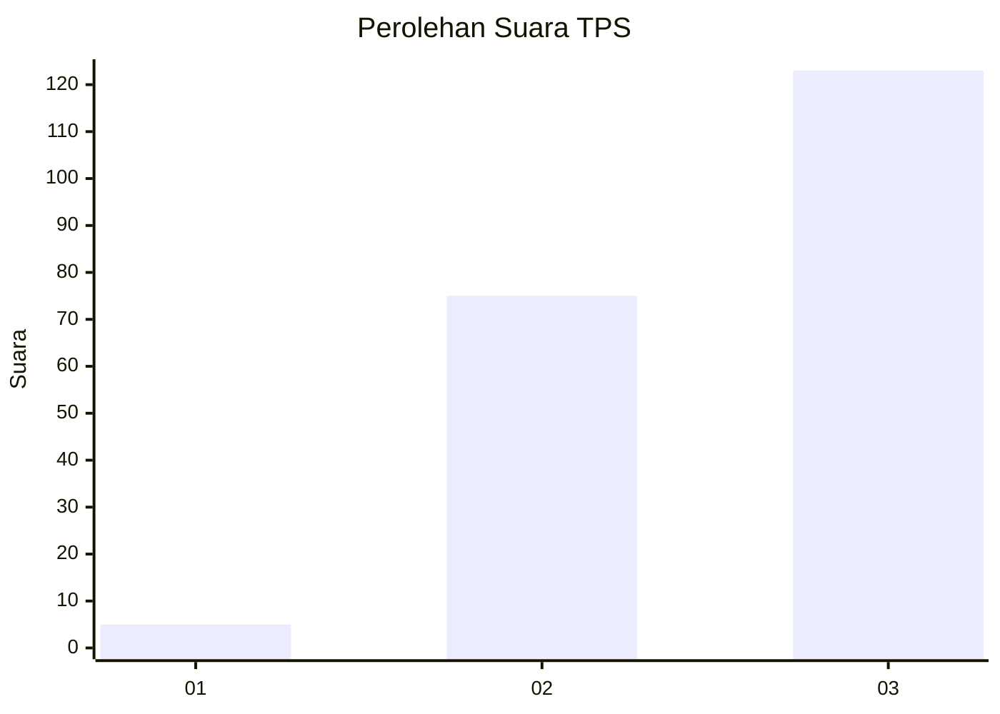
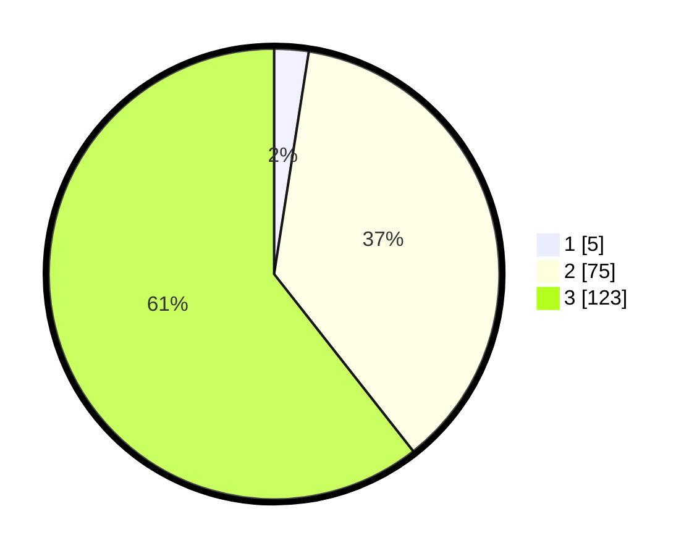

# Hasil

## Grafik

## Tabel

| No. | Nama Paslon    | Suara | Suara (raw) | Persentase |
|:--- |:-------------- | -----:| -----------:| ----------:|
| 1   | ANIES MUHAIMIN | 5     | [5][p-1]    | 2,46       |
| 2   | PRABOWO GIBRAN | 75    | [75][p-2]   | 36,95      |
| 3   | GANJAR MAHFUD  | 123   | [123][p-3]  | 60,59      |

[p-1]: https://github.com/gigit-pemilu/pemilu-2024/blob/main/pilpres/hitung-suara/sub/33-jawa-tengah/sub/15-grobogan/sub/09-ngaringan/sub/2002-sarirejo/sub/005-tps/sub/paslon-1.txt
[p-2]: https://github.com/gigit-pemilu/pemilu-2024/blob/main/pilpres/hitung-suara/sub/33-jawa-tengah/sub/15-grobogan/sub/09-ngaringan/sub/2002-sarirejo/sub/005-tps/sub/paslon-2.txt
[p-3]: https://github.com/gigit-pemilu/pemilu-2024/blob/main/pilpres/hitung-suara/sub/33-jawa-tengah/sub/15-grobogan/sub/09-ngaringan/sub/2002-sarirejo/sub/005-tps/sub/paslon-3.txt

## Foto C Plano

https://sirekap-obj-formc.kpu.go.id/f51b/pemilu/ppwp/33/15/09/20/02/3315092002005-20240215-011542--e86a4575-6b6b-4dbc-8a62-6f303a7e082e.jpg

https://sirekap-obj-formc.kpu.go.id/f51b/pemilu/ppwp/33/15/09/20/02/3315092002005-20240215-012722--019d6249-ce78-4423-9497-fb22721adb47.jpg

https://sirekap-obj-formc.kpu.go.id/f51b/pemilu/ppwp/33/15/09/20/02/3315092002005-20240215-012845--ccde103c-d1cd-43a3-a82c-c686c8a04b94.jpg

## Metadata

| Key        | Value               |
| ---------- | ------------------- |
| Time Stamp | 2024-02-17 16:00:02 |

