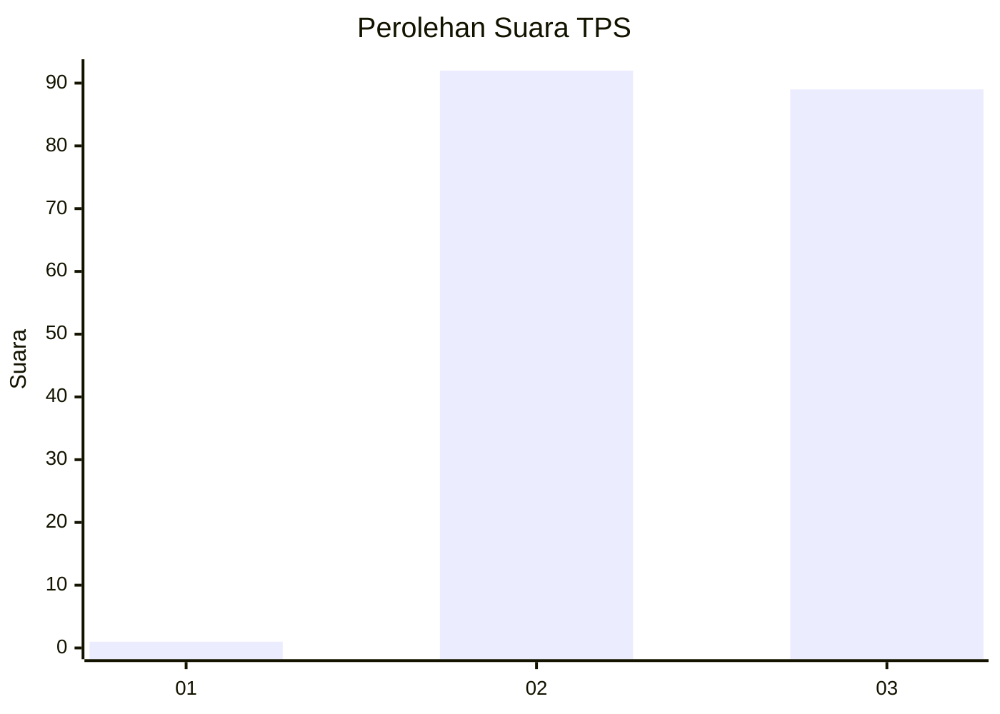
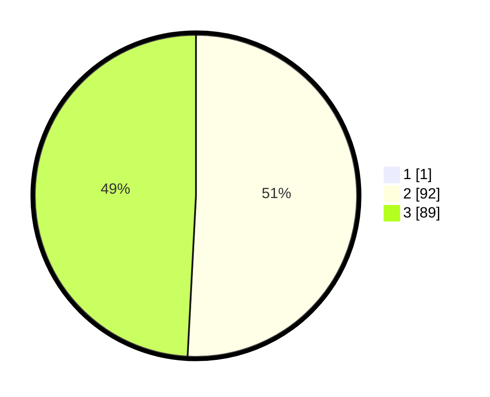

# Hasil

## Grafik

## Tabel

| No. | Nama Paslon    | Suara | Suara (raw) | Persentase |
|:--- |:-------------- | -----:| -----------:| ----------:|
| 1   | ANIES MUHAIMIN | 1     | [1][p-1]    | 0,55       |
| 2   | PRABOWO GIBRAN | 92    | [92][p-2]   | 50,55      |
| 3   | GANJAR MAHFUD  | 89    | [89][p-3]   | 48,90      |

[p-1]: https://github.com/gigit-pemilu/pemilu-2024/blob/main/pilpres/hitung-suara/sub/33-jawa-tengah/sub/15-grobogan/sub/09-ngaringan/sub/2003-kalangdosari/sub/001-tps/sub/paslon-1.txt
[p-2]: https://github.com/gigit-pemilu/pemilu-2024/blob/main/pilpres/hitung-suara/sub/33-jawa-tengah/sub/15-grobogan/sub/09-ngaringan/sub/2003-kalangdosari/sub/001-tps/sub/paslon-2.txt
[p-3]: https://github.com/gigit-pemilu/pemilu-2024/blob/main/pilpres/hitung-suara/sub/33-jawa-tengah/sub/15-grobogan/sub/09-ngaringan/sub/2003-kalangdosari/sub/001-tps/sub/paslon-3.txt

## Foto C Plano

https://sirekap-obj-formc.kpu.go.id/04c1/pemilu/ppwp/33/15/09/20/03/3315092003001-20240214-141413--00120c54-f453-47d4-87c4-6a436e745c90.jpg

https://sirekap-obj-formc.kpu.go.id/04c1/pemilu/ppwp/33/15/09/20/03/3315092003001-20240214-141418--ffede1e1-0ad8-4418-a0e5-5db9ead4fd21.jpg

https://sirekap-obj-formc.kpu.go.id/04c1/pemilu/ppwp/33/15/09/20/03/3315092003001-20240214-141421--ae905c12-2aeb-4972-9703-f8cab2daf686.jpg

## Metadata

| Key        | Value               |
| ---------- | ------------------- |
| Time Stamp | 2024-02-15 00:41:44 |

