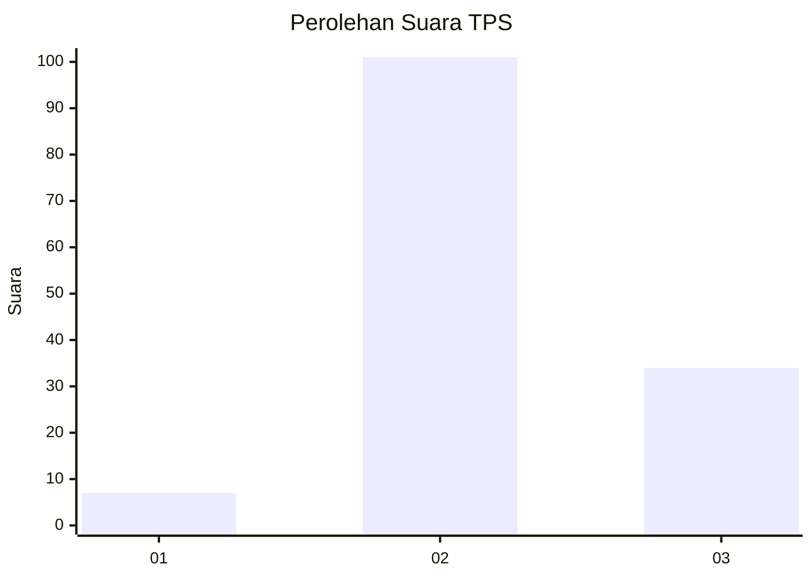
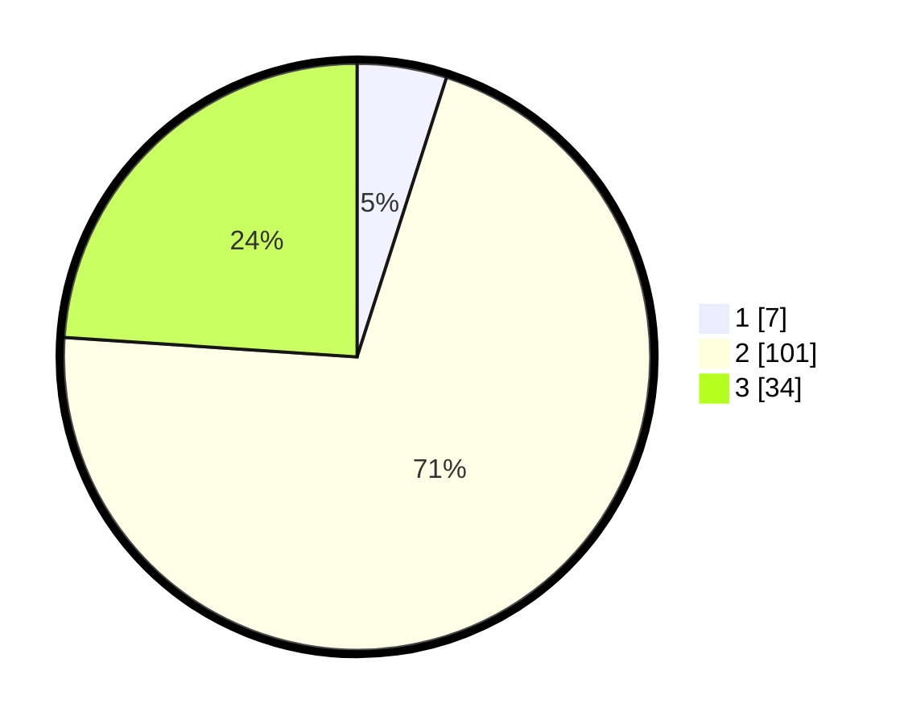

# Hasil

## Grafik

## Tabel

| No. | Nama Paslon    | Suara | Suara (raw) | Persentase |
|:--- |:-------------- | -----:| -----------:| ----------:|
| 1   | ANIES MUHAIMIN | 7     | [7][p-1]    | 4,93       |
| 2   | PRABOWO GIBRAN | 101   | [101][p-2]  | 71,13      |
| 3   | GANJAR MAHFUD  | 34    | [34][p-3]   | 23,94      |

[p-1]: https://github.com/gigit-pemilu/pemilu-2024/blob/main/pilpres/hitung-suara/sub/33-jawa-tengah/sub/15-grobogan/sub/09-ngaringan/sub/2004-kalanglundo/sub/005-tps/sub/paslon-1.txt
[p-2]: https://github.com/gigit-pemilu/pemilu-2024/blob/main/pilpres/hitung-suara/sub/33-jawa-tengah/sub/15-grobogan/sub/09-ngaringan/sub/2004-kalanglundo/sub/005-tps/sub/paslon-2.txt
[p-3]: https://github.com/gigit-pemilu/pemilu-2024/blob/main/pilpres/hitung-suara/sub/33-jawa-tengah/sub/15-grobogan/sub/09-ngaringan/sub/2004-kalanglundo/sub/005-tps/sub/paslon-3.txt

## Foto C Plano

https://sirekap-obj-formc.kpu.go.id/8963/pemilu/ppwp/33/15/09/20/04/3315092004005-20240216-095046--0919c4ce-7d5d-4aad-9a8e-0e0338c03efa.jpg

https://sirekap-obj-formc.kpu.go.id/8963/pemilu/ppwp/33/15/09/20/04/3315092004005-20240215-074554--619f6b76-80fa-4066-8762-f0fa76ed5ac7.jpg

https://sirekap-obj-formc.kpu.go.id/8963/pemilu/ppwp/33/15/09/20/04/3315092004005-20240216-094431--b51dd3cf-7bd8-45b8-a8f2-6be3b04e77ae.jpg

## Metadata

| Key        | Value               |
| ---------- | ------------------- |
| Time Stamp | 2024-02-16 10:00:28 |

