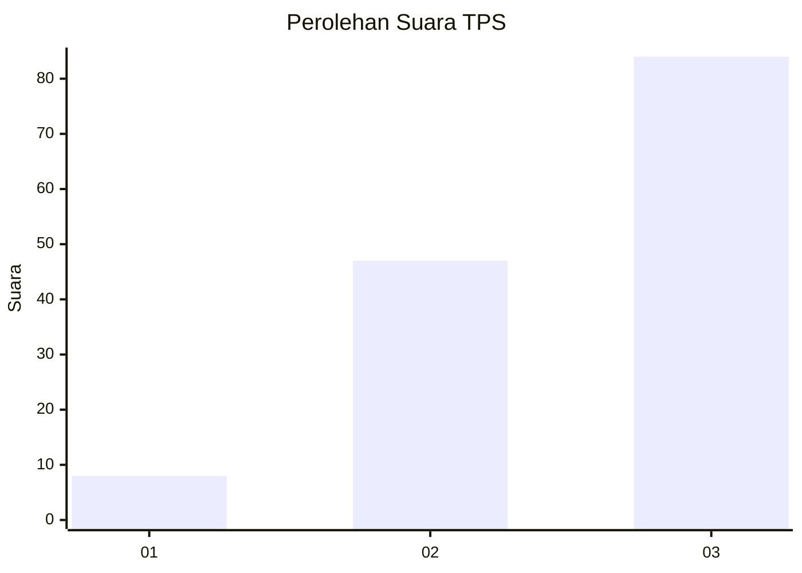
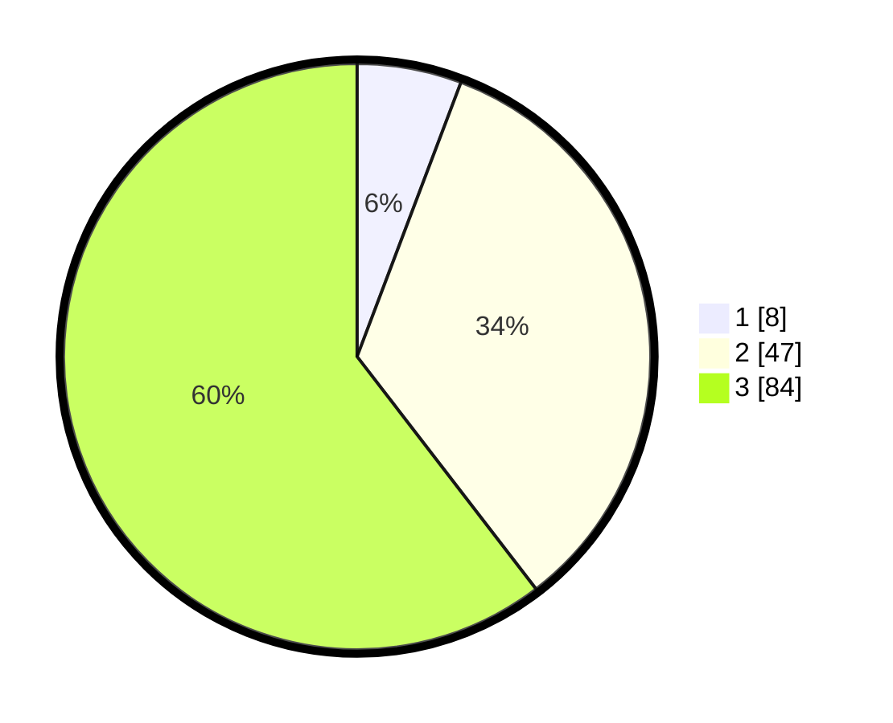

# Hasil

## Grafik

## Tabel

| No. | Nama Paslon    | Suara | Suara (raw) | Persentase |
|:--- |:-------------- | -----:| -----------:| ----------:|
| 1   | ANIES MUHAIMIN | 8     | [8][p-1]    | 5,76       |
| 2   | PRABOWO GIBRAN | 47    | [47][p-2]   | 33,81      |
| 3   | GANJAR MAHFUD  | 84    | [84][p-3]   | 60,43      |

[p-1]: https://github.com/gigit-pemilu/pemilu-2024-33-jawa-tengah/blob/main/pilpres/hitung-suara/sub/33-jawa-tengah/sub/15-grobogan/sub/09-ngaringan/sub/2005-truwolu/sub/022-tps/sub/paslon-1.txt
[p-2]: https://github.com/gigit-pemilu/pemilu-2024-33-jawa-tengah/blob/main/pilpres/hitung-suara/sub/33-jawa-tengah/sub/15-grobogan/sub/09-ngaringan/sub/2005-truwolu/sub/022-tps/sub/paslon-2.txt
[p-3]: https://github.com/gigit-pemilu/pemilu-2024-33-jawa-tengah/blob/main/pilpres/hitung-suara/sub/33-jawa-tengah/sub/15-grobogan/sub/09-ngaringan/sub/2005-truwolu/sub/022-tps/sub/paslon-3.txt

## Foto C Plano

https://sirekap-obj-formc.kpu.go.id/dadc/pemilu/ppwp/33/15/09/20/05/3315092005022-20240214-155303--8f72a230-62c2-4452-b8c4-c80ef341108a.jpg

https://sirekap-obj-formc.kpu.go.id/dadc/pemilu/ppwp/33/15/09/20/05/3315092005022-20240214-155405--aaec6bdb-3ea2-425e-9766-5d2340815e2f.jpg

https://sirekap-obj-formc.kpu.go.id/dadc/pemilu/ppwp/33/15/09/20/05/3315092005022-20240214-204558--263a85bc-861f-46f6-8e2c-e0a8c9f7036f.jpg

## Metadata

| Key        | Value               |
| ---------- | ------------------- |
| Time Stamp | 2024-02-14 21:46:01 |

