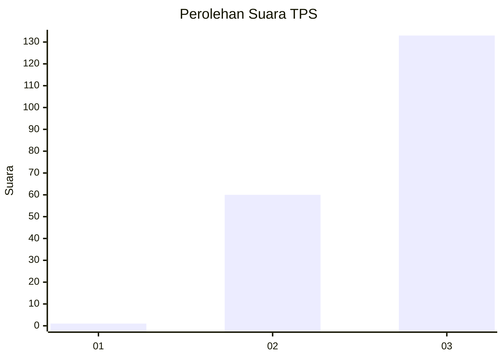
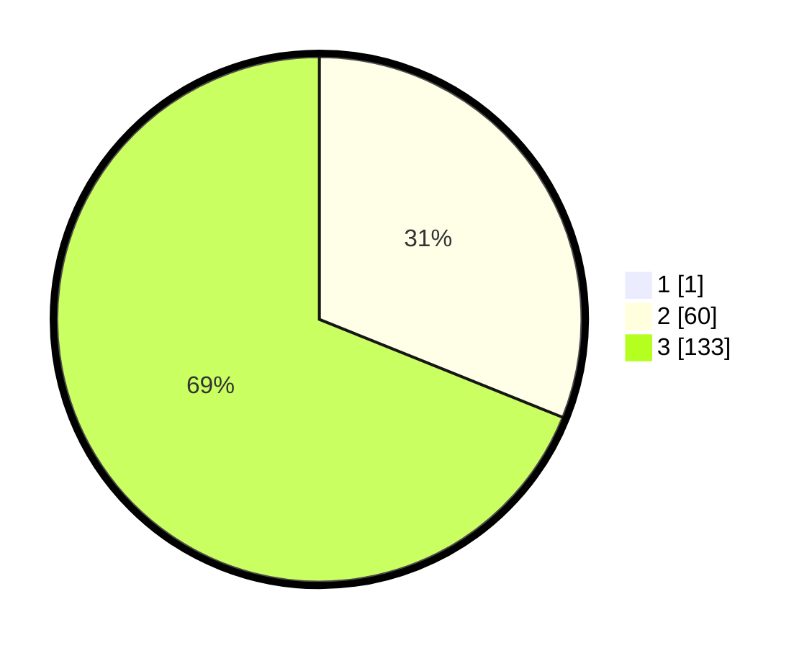

# Hasil

## Grafik

## Tabel

| No. | Nama Paslon    | Suara | Suara (raw) | Persentase |
|:--- |:-------------- | -----:| -----------:| ----------:|
| 1   | ANIES MUHAIMIN | 1     | [1][p-1]    | 0,52       |
| 2   | PRABOWO GIBRAN | 60    | [60][p-2]   | 30,93      |
| 3   | GANJAR MAHFUD  | 133   | [133][p-3]  | 68,56      |

[p-1]: https://github.com/gigit-pemilu/pemilu-2024/blob/main/pilpres/hitung-suara/sub/33-jawa-tengah/sub/15-grobogan/sub/09-ngaringan/sub/2011-tanjungharjo/sub/013-tps/sub/paslon-1.txt
[p-2]: https://github.com/gigit-pemilu/pemilu-2024/blob/main/pilpres/hitung-suara/sub/33-jawa-tengah/sub/15-grobogan/sub/09-ngaringan/sub/2011-tanjungharjo/sub/013-tps/sub/paslon-2.txt
[p-3]: https://github.com/gigit-pemilu/pemilu-2024/blob/main/pilpres/hitung-suara/sub/33-jawa-tengah/sub/15-grobogan/sub/09-ngaringan/sub/2011-tanjungharjo/sub/013-tps/sub/paslon-3.txt

## Foto C Plano

https://sirekap-obj-formc.kpu.go.id/cc81/pemilu/ppwp/33/15/09/20/11/3315092011013-20240214-141505--f12e34b0-5b6c-4fa8-97a3-995b545daaf3.jpg

https://sirekap-obj-formc.kpu.go.id/cc81/pemilu/ppwp/33/15/09/20/11/3315092011013-20240214-141709--a3217f4d-03c4-422f-b1a8-6518fde25771.jpg

https://sirekap-obj-formc.kpu.go.id/cc81/pemilu/ppwp/33/15/09/20/11/3315092011013-20240214-141742--af1296fd-8f8e-4a81-9e05-c69da429c075.jpg

## Metadata

| Key        | Value               |
| ---------- | ------------------- |
| Time Stamp | 2024-02-15 12:00:28 |

