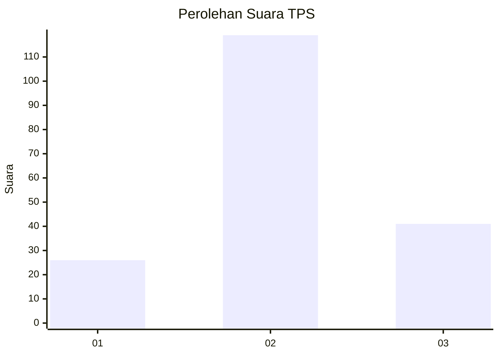
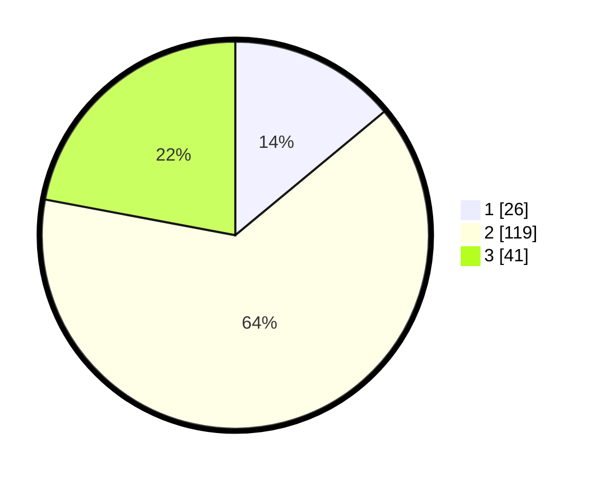

# Hasil

## Grafik

## Tabel

| No. | Nama Paslon    | Suara | Suara (raw) | Persentase |
|:--- |:-------------- | -----:| -----------:| ----------:|
| 1   | ANIES MUHAIMIN | 26    | [26][p-1]   | 13,98      |
| 2   | PRABOWO GIBRAN | 119   | [119][p-2]  | 63,98      |
| 3   | GANJAR MAHFUD  | 41    | [41][p-3]   | 22,04      |

[p-1]: https://github.com/gigit-pemilu/pemilu-2024-33-jawa-tengah/blob/main/pilpres/hitung-suara/sub/33-jawa-tengah/sub/15-grobogan/sub/10-wirosari/sub/1006-wirosari/sub/003-tps/sub/paslon-1.txt
[p-2]: https://github.com/gigit-pemilu/pemilu-2024-33-jawa-tengah/blob/main/pilpres/hitung-suara/sub/33-jawa-tengah/sub/15-grobogan/sub/10-wirosari/sub/1006-wirosari/sub/003-tps/sub/paslon-2.txt
[p-3]: https://github.com/gigit-pemilu/pemilu-2024-33-jawa-tengah/blob/main/pilpres/hitung-suara/sub/33-jawa-tengah/sub/15-grobogan/sub/10-wirosari/sub/1006-wirosari/sub/003-tps/sub/paslon-3.txt

## Foto C Plano

https://sirekap-obj-formc.kpu.go.id/f3aa/pemilu/ppwp/33/15/10/10/06/3315101006003-20240214-233331--2d46ce35-47ca-4494-a076-74e96882b83a.jpg

https://sirekap-obj-formc.kpu.go.id/f3aa/pemilu/ppwp/33/15/10/10/06/3315101006003-20240214-233540--eb879d54-dcf6-4ff5-a83c-3647f6749cde.jpg

https://sirekap-obj-formc.kpu.go.id/f3aa/pemilu/ppwp/33/15/10/10/06/3315101006003-20240215-000054--cd5ad407-f926-492e-9cfb-9311607071e2.jpg

## Metadata

| Key        | Value               |
| ---------- | ------------------- |
| Time Stamp | 2024-02-17 16:00:02 |

