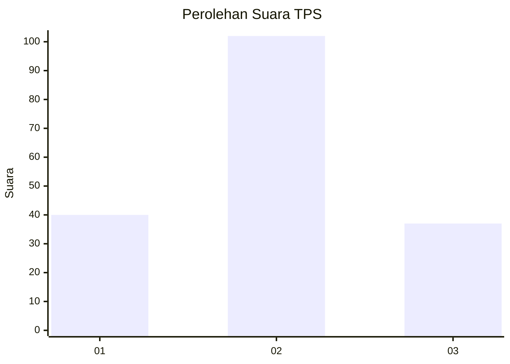
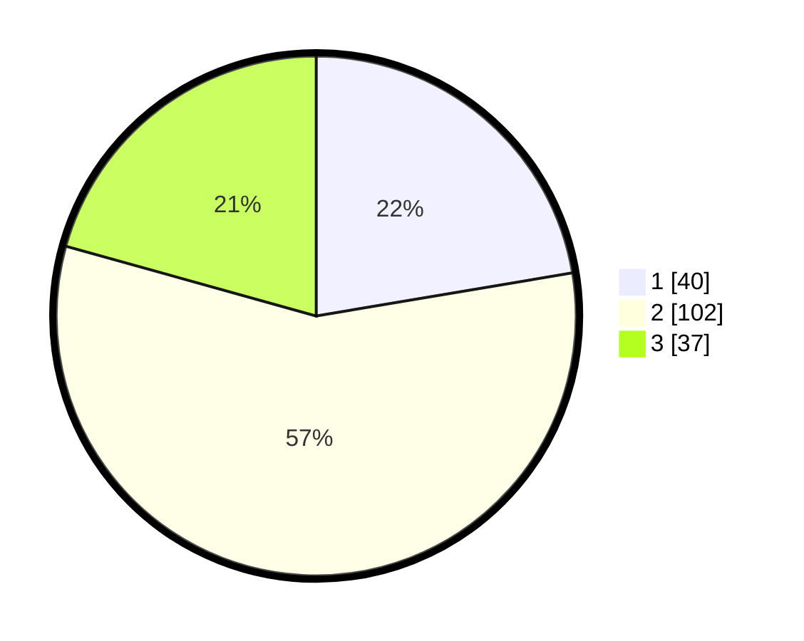

# Hasil

## Grafik

## Tabel

| No. | Nama Paslon    | Suara | Suara (raw) | Persentase |
|:--- |:-------------- | -----:| -----------:| ----------:|
| 1   | ANIES MUHAIMIN | 40    | [40][p-1]   | 22,35      |
| 2   | PRABOWO GIBRAN | 102   | [102][p-2]  | 56,98      |
| 3   | GANJAR MAHFUD  | 37    | [37][p-3]   | 20,67      |

[p-1]: https://github.com/gigit-pemilu/pemilu-2024-33-jawa-tengah/blob/main/pilpres/hitung-suara/sub/33-jawa-tengah/sub/15-grobogan/sub/10-wirosari/sub/1006-wirosari/sub/004-tps/sub/paslon-1.txt
[p-2]: https://github.com/gigit-pemilu/pemilu-2024-33-jawa-tengah/blob/main/pilpres/hitung-suara/sub/33-jawa-tengah/sub/15-grobogan/sub/10-wirosari/sub/1006-wirosari/sub/004-tps/sub/paslon-2.txt
[p-3]: https://github.com/gigit-pemilu/pemilu-2024-33-jawa-tengah/blob/main/pilpres/hitung-suara/sub/33-jawa-tengah/sub/15-grobogan/sub/10-wirosari/sub/1006-wirosari/sub/004-tps/sub/paslon-3.txt

## Foto C Plano

https://sirekap-obj-formc.kpu.go.id/81d7/pemilu/ppwp/33/15/10/10/06/3315101006004-20240214-232900--efbbff2e-4ad9-42f5-b877-51cb8b7574a1.jpg

https://sirekap-obj-formc.kpu.go.id/81d7/pemilu/ppwp/33/15/10/10/06/3315101006004-20240215-002748--be19b5cd-3889-41a9-b24d-566f5e30470c.jpg

https://sirekap-obj-formc.kpu.go.id/81d7/pemilu/ppwp/33/15/10/10/06/3315101006004-20240215-113936--78e5939e-e51d-4f31-91a7-91ad82e8183f.jpg

## Metadata

| Key        | Value               |
| ---------- | ------------------- |
| Time Stamp | 2024-02-15 19:00:26 |

