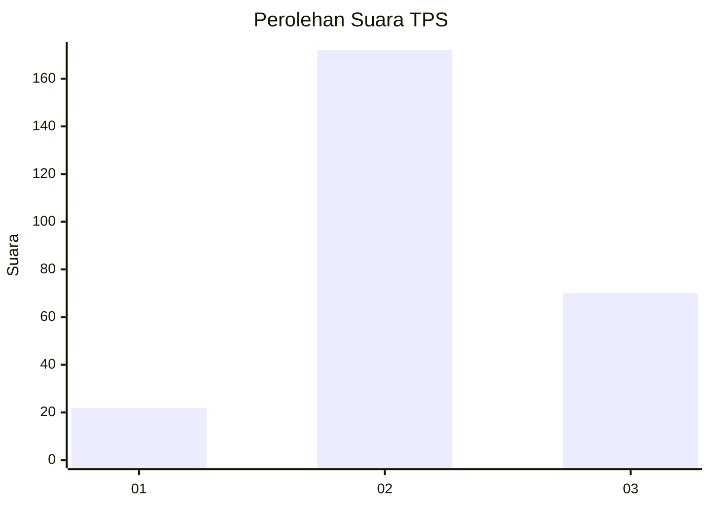
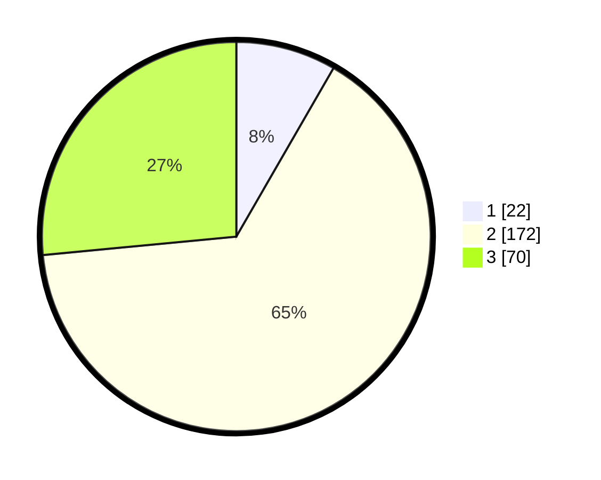

# Hasil

## Grafik

## Tabel

| No. | Nama Paslon    | Suara | Suara (raw) | Persentase |
|:--- |:-------------- | -----:| -----------:| ----------:|
| 1   | ANIES MUHAIMIN | 22    | [22][p-1]   | 8,33       |
| 2   | PRABOWO GIBRAN | 172   | [172][p-2]  | 65,15      |
| 3   | GANJAR MAHFUD  | 70    | [70][p-3]   | 26,52      |

[p-1]: https://github.com/gigit-pemilu/pemilu-2024-33-jawa-tengah/blob/main/pilpres/hitung-suara/sub/33-jawa-tengah/sub/15-grobogan/sub/10-wirosari/sub/2010-gedangan/sub/006-tps/sub/paslon-1.txt
[p-2]: https://github.com/gigit-pemilu/pemilu-2024-33-jawa-tengah/blob/main/pilpres/hitung-suara/sub/33-jawa-tengah/sub/15-grobogan/sub/10-wirosari/sub/2010-gedangan/sub/006-tps/sub/paslon-2.txt
[p-3]: https://github.com/gigit-pemilu/pemilu-2024-33-jawa-tengah/blob/main/pilpres/hitung-suara/sub/33-jawa-tengah/sub/15-grobogan/sub/10-wirosari/sub/2010-gedangan/sub/006-tps/sub/paslon-3.txt

## Foto C Plano

https://sirekap-obj-formc.kpu.go.id/508c/pemilu/ppwp/33/15/10/20/10/3315102010006-20240216-093815--4272542c-ef56-46bd-a5f7-a7bbdb3f4707.jpg

https://sirekap-obj-formc.kpu.go.id/508c/pemilu/ppwp/33/15/10/20/10/3315102010006-20240214-222239--4d3d95dc-be9d-4b54-b785-94e1c39b6f5a.jpg

https://sirekap-obj-formc.kpu.go.id/508c/pemilu/ppwp/33/15/10/20/10/3315102010006-20240214-222309--8f58d7cd-0ced-4ecd-83bd-6877566ff5e9.jpg

## Metadata

| Key        | Value               |
| ---------- | ------------------- |
| Time Stamp | 2024-02-16 10:00:28 |

