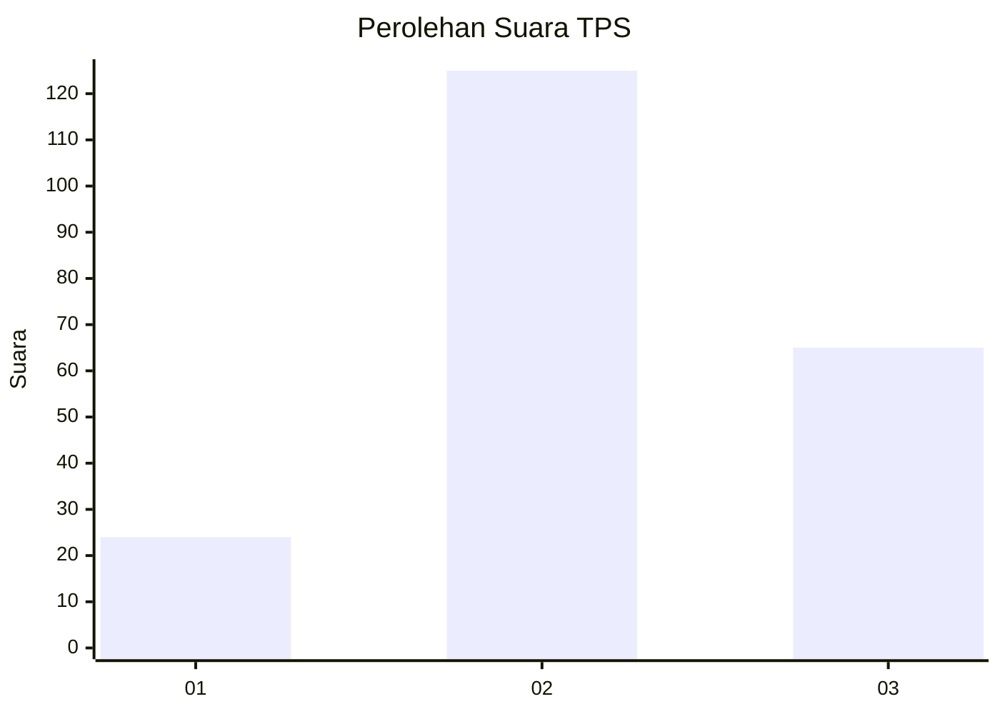
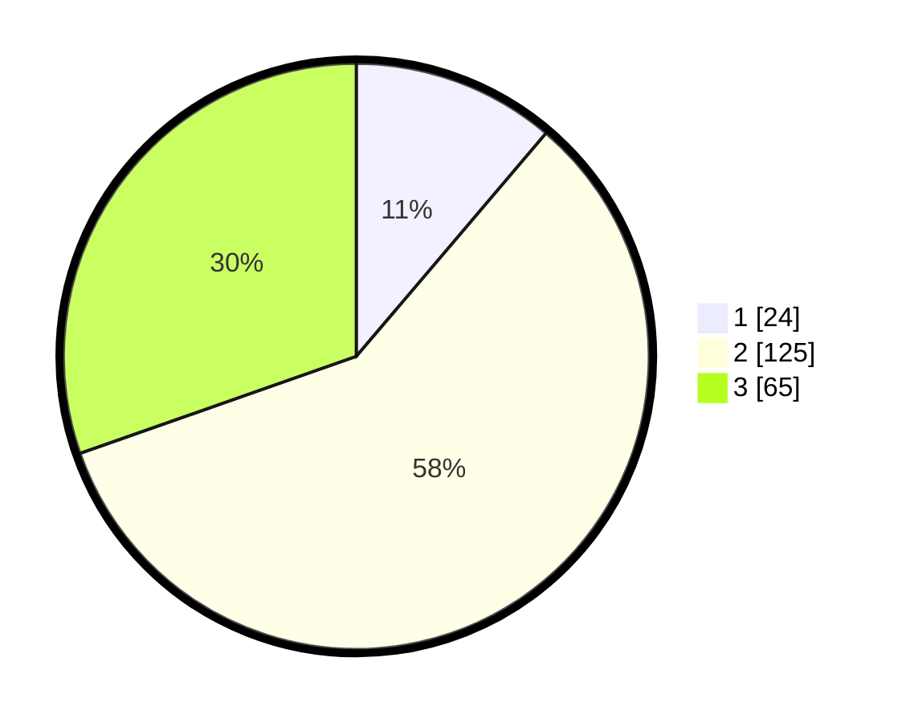

# Hasil

## Grafik

## Tabel

| No. | Nama Paslon    | Suara | Suara (raw) | Persentase |
|:--- |:-------------- | -----:| -----------:| ----------:|
| 1   | ANIES MUHAIMIN | 24    | [24][p-1]   | 11,21      |
| 2   | PRABOWO GIBRAN | 125   | [125][p-2]  | 58,41      |
| 3   | GANJAR MAHFUD  | 65    | [65][p-3]   | 30,37      |

[p-1]: https://github.com/gigit-pemilu/pemilu-2024-33-jawa-tengah/blob/main/pilpres/hitung-suara/sub/33-jawa-tengah/sub/15-grobogan/sub/11-tawangharjo/sub/2001-mayahan/sub/005-tps/sub/paslon-1.txt
[p-2]: https://github.com/gigit-pemilu/pemilu-2024-33-jawa-tengah/blob/main/pilpres/hitung-suara/sub/33-jawa-tengah/sub/15-grobogan/sub/11-tawangharjo/sub/2001-mayahan/sub/005-tps/sub/paslon-2.txt
[p-3]: https://github.com/gigit-pemilu/pemilu-2024-33-jawa-tengah/blob/main/pilpres/hitung-suara/sub/33-jawa-tengah/sub/15-grobogan/sub/11-tawangharjo/sub/2001-mayahan/sub/005-tps/sub/paslon-3.txt

## Foto C Plano

https://sirekap-obj-formc.kpu.go.id/52f4/pemilu/ppwp/33/15/11/20/01/3315112001005-20240214-203657--0c757978-bbfd-4c11-b798-c77fdc2f2a89.jpg

https://sirekap-obj-formc.kpu.go.id/52f4/pemilu/ppwp/33/15/11/20/01/3315112001005-20240214-203706--f3c50e2a-0fb4-4a34-8816-9c951f1d08db.jpg

https://sirekap-obj-formc.kpu.go.id/52f4/pemilu/ppwp/33/15/11/20/01/3315112001005-20240214-230101--4341474e-e547-4a81-95be-3666e4131b14.jpg

## Metadata

| Key        | Value               |
| ---------- | ------------------- |
| Time Stamp | 2024-02-15 12:00:28 |

