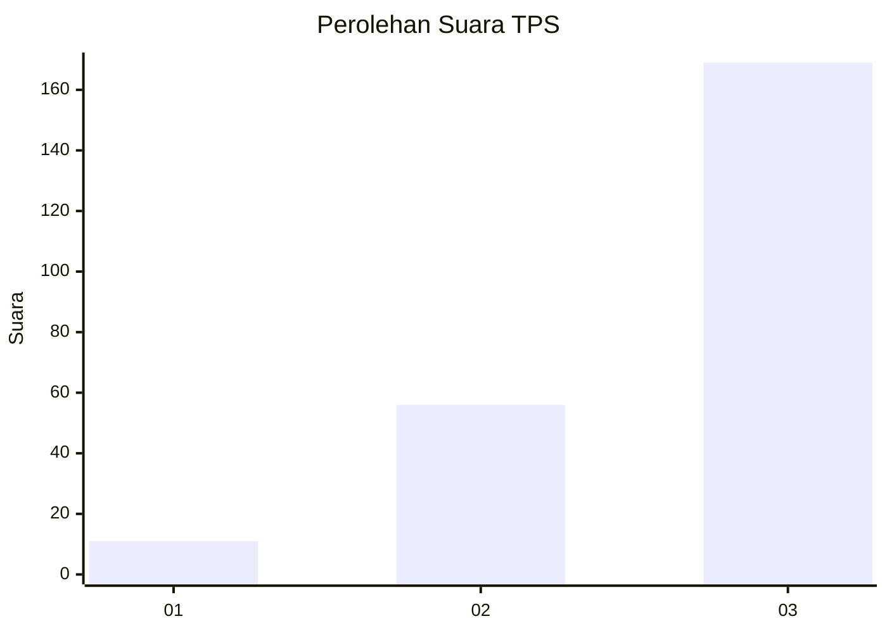
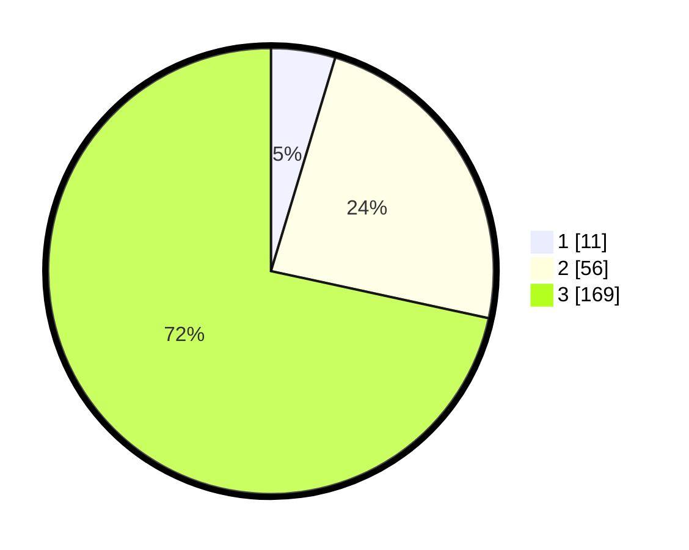

# Hasil

## Grafik

## Tabel

| No. | Nama Paslon    | Suara | Suara (raw) | Persentase |
|:--- |:-------------- | -----:| -----------:| ----------:|
| 1   | ANIES MUHAIMIN | 11    | [11][p-1]   | 4,66       |
| 2   | PRABOWO GIBRAN | 56    | [56][p-2]   | 23,73      |
| 3   | GANJAR MAHFUD  | 169   | [169][p-3]  | 71,61      |

[p-1]: https://github.com/gigit-pemilu/pemilu-2024/blob/main/pilpres/hitung-suara/sub/33-jawa-tengah/sub/15-grobogan/sub/11-tawangharjo/sub/2007-pojok/sub/011-tps/sub/paslon-1.txt
[p-2]: https://github.com/gigit-pemilu/pemilu-2024/blob/main/pilpres/hitung-suara/sub/33-jawa-tengah/sub/15-grobogan/sub/11-tawangharjo/sub/2007-pojok/sub/011-tps/sub/paslon-2.txt
[p-3]: https://github.com/gigit-pemilu/pemilu-2024/blob/main/pilpres/hitung-suara/sub/33-jawa-tengah/sub/15-grobogan/sub/11-tawangharjo/sub/2007-pojok/sub/011-tps/sub/paslon-3.txt

## Foto C Plano

https://sirekap-obj-formc.kpu.go.id/e22a/pemilu/ppwp/33/15/11/20/07/3315112007011-20240214-155246--16040b09-b166-4612-bb3b-9d3d0107d460.jpg

https://sirekap-obj-formc.kpu.go.id/e22a/pemilu/ppwp/33/15/11/20/07/3315112007011-20240214-155542--edcd29a5-b6ba-499b-9b53-3eac94e9eb24.jpg

https://sirekap-obj-formc.kpu.go.id/e22a/pemilu/ppwp/33/15/11/20/07/3315112007011-20240214-155417--4d236524-3486-467d-a405-726d11480abf.jpg

## Metadata

| Key        | Value               |
| ---------- | ------------------- |
| Time Stamp | 2024-02-15 15:00:29 |

