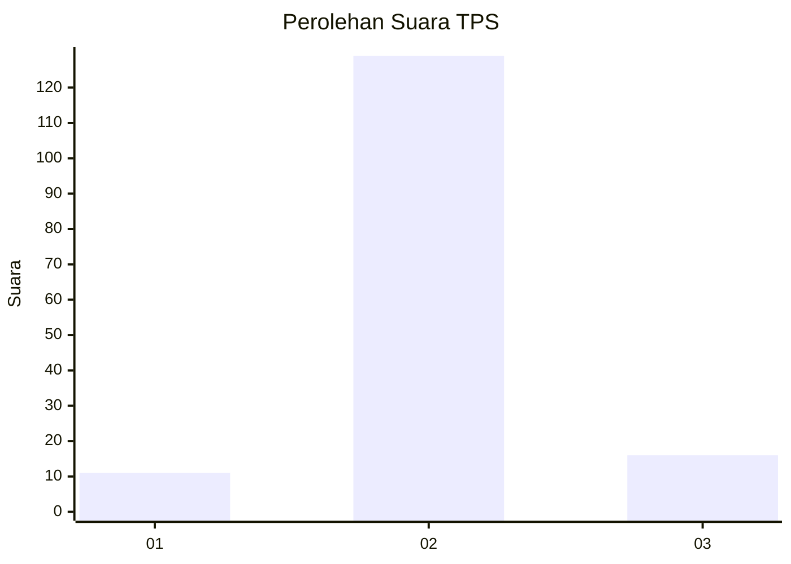
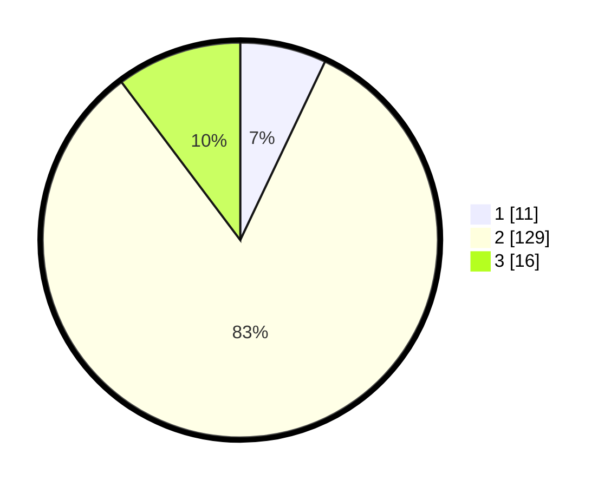

# Hasil

## Grafik

## Tabel

| No. | Nama Paslon    | Suara | Suara (raw) | Persentase |
|:--- |:-------------- | -----:| -----------:| ----------:|
| 1   | ANIES MUHAIMIN | 11    | [11][p-1]   | 7,05       |
| 2   | PRABOWO GIBRAN | 129   | [129][p-2]  | 82,69      |
| 3   | GANJAR MAHFUD  | 16    | [16][p-3]   | 10,26      |

[p-1]: https://github.com/gigit-pemilu/pemilu-2024-33-jawa-tengah/blob/main/pilpres/hitung-suara/sub/33-jawa-tengah/sub/15-grobogan/sub/11-tawangharjo/sub/2010-kemadohbatur/sub/009-tps/sub/paslon-1.txt
[p-2]: https://github.com/gigit-pemilu/pemilu-2024-33-jawa-tengah/blob/main/pilpres/hitung-suara/sub/33-jawa-tengah/sub/15-grobogan/sub/11-tawangharjo/sub/2010-kemadohbatur/sub/009-tps/sub/paslon-2.txt
[p-3]: https://github.com/gigit-pemilu/pemilu-2024-33-jawa-tengah/blob/main/pilpres/hitung-suara/sub/33-jawa-tengah/sub/15-grobogan/sub/11-tawangharjo/sub/2010-kemadohbatur/sub/009-tps/sub/paslon-3.txt

## Foto C Plano

https://sirekap-obj-formc.kpu.go.id/a9cd/pemilu/ppwp/33/15/11/20/10/3315112010009-20240215-130650--a9cbe5bf-b9e7-4bed-9432-36a850c3fd50.jpg

https://sirekap-obj-formc.kpu.go.id/a9cd/pemilu/ppwp/33/15/11/20/10/3315112010009-20240215-124357--2dde0e22-0964-42c1-aec5-c4064445fe99.jpg

https://sirekap-obj-formc.kpu.go.id/a9cd/pemilu/ppwp/33/15/11/20/10/3315112010009-20240215-124922--24687e23-003b-4532-b3b8-442bf69b4223.jpg

## Metadata

| Key        | Value               |
| ---------- | ------------------- |
| Time Stamp | 2024-02-15 19:30:26 |

