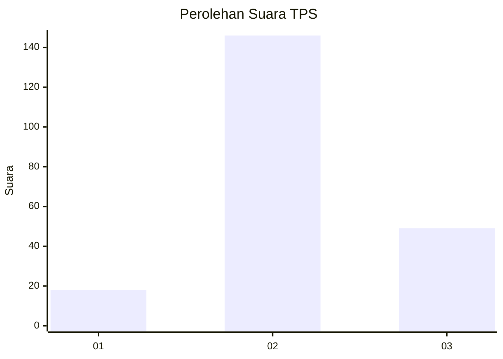
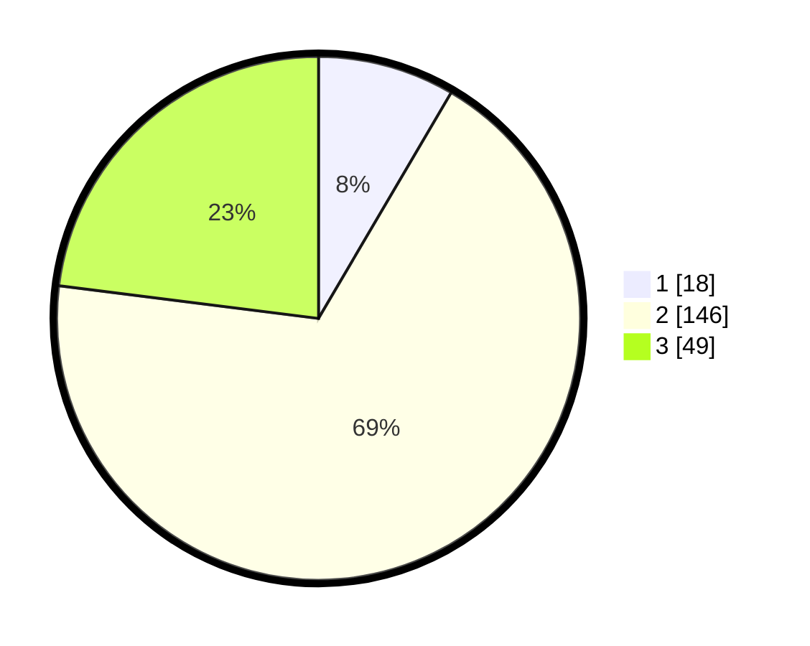

# Hasil

## Grafik

## Tabel

| No. | Nama Paslon    | Suara | Suara (raw) | Persentase |
|:--- |:-------------- | -----:| -----------:| ----------:|
| 1   | ANIES MUHAIMIN | 18    | [18][p-1]   | 8,45       |
| 2   | PRABOWO GIBRAN | 146   | [146][p-2]  | 68,54      |
| 3   | GANJAR MAHFUD  | 49    | [49][p-3]   | 23,00      |

[p-1]: https://github.com/gigit-pemilu/pemilu-2024-33-jawa-tengah/blob/main/pilpres/hitung-suara/sub/33-jawa-tengah/sub/15-grobogan/sub/12-grobogan/sub/1001-grobogan/sub/007-tps/sub/paslon-1.txt
[p-2]: https://github.com/gigit-pemilu/pemilu-2024-33-jawa-tengah/blob/main/pilpres/hitung-suara/sub/33-jawa-tengah/sub/15-grobogan/sub/12-grobogan/sub/1001-grobogan/sub/007-tps/sub/paslon-2.txt
[p-3]: https://github.com/gigit-pemilu/pemilu-2024-33-jawa-tengah/blob/main/pilpres/hitung-suara/sub/33-jawa-tengah/sub/15-grobogan/sub/12-grobogan/sub/1001-grobogan/sub/007-tps/sub/paslon-3.txt

## Foto C Plano

https://sirekap-obj-formc.kpu.go.id/969e/pemilu/ppwp/33/15/12/10/01/3315121001007-20240216-155642--c187ceb0-ea32-4003-9671-8661b63024e9.jpg

https://sirekap-obj-formc.kpu.go.id/969e/pemilu/ppwp/33/15/12/10/01/3315121001007-20240216-155724--2e1e717f-e90c-43e1-9f3f-25f2e41f55ce.jpg

https://sirekap-obj-formc.kpu.go.id/969e/pemilu/ppwp/33/15/12/10/01/3315121001007-20240216-154334--1a919789-ff44-401a-8d41-36293ed20dd9.jpg

## Metadata

| Key        | Value               |
| ---------- | ------------------- |
| Time Stamp | 2024-02-16 16:25:10 |

