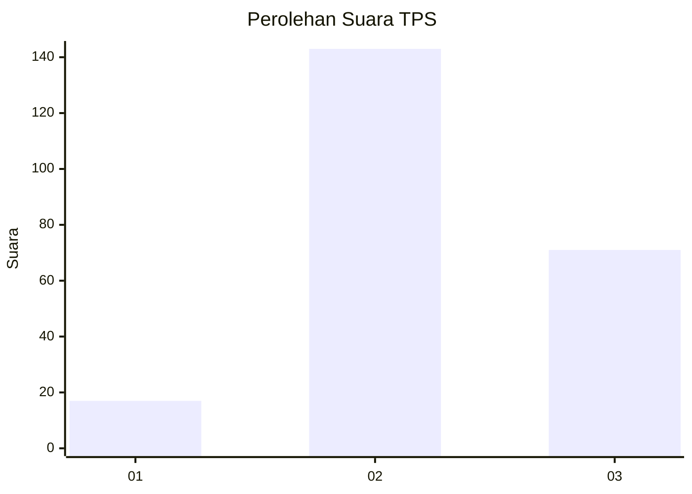
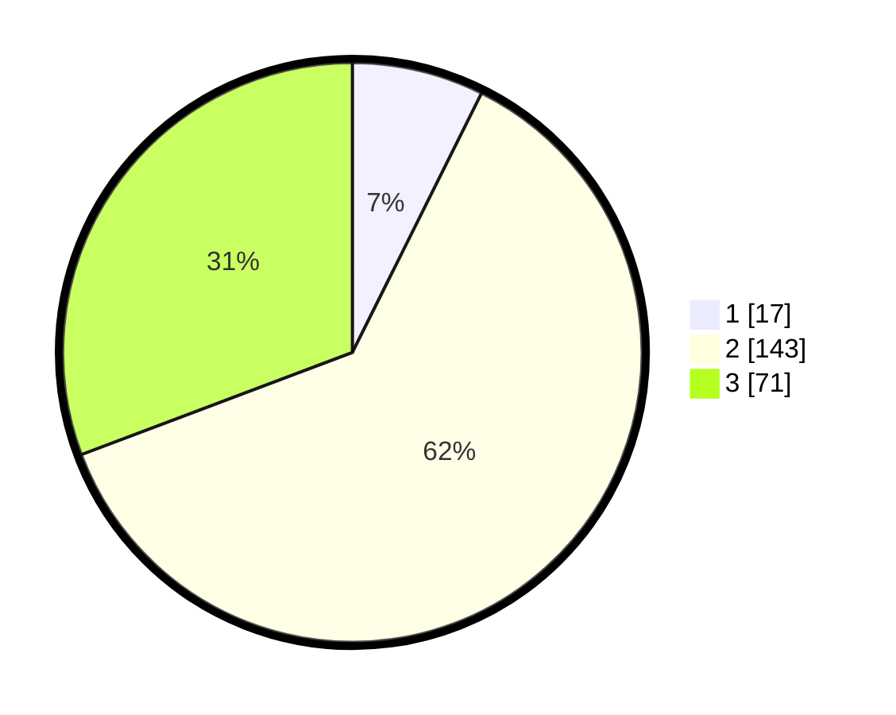

# Hasil

## Grafik

## Tabel

| No. | Nama Paslon    | Suara | Suara (raw) | Persentase |
|:--- |:-------------- | -----:| -----------:| ----------:|
| 1   | ANIES MUHAIMIN | 17    | [17][p-1]   | 7,36       |
| 2   | PRABOWO GIBRAN | 143   | [143][p-2]  | 61,90      |
| 3   | GANJAR MAHFUD  | 71    | [71][p-3]   | 30,74      |

[p-1]: https://github.com/gigit-pemilu/pemilu-2024/blob/main/pilpres/hitung-suara/sub/33-jawa-tengah/sub/15-grobogan/sub/12-grobogan/sub/2004-tanggungharjo/sub/004-tps/sub/paslon-1.txt
[p-2]: https://github.com/gigit-pemilu/pemilu-2024/blob/main/pilpres/hitung-suara/sub/33-jawa-tengah/sub/15-grobogan/sub/12-grobogan/sub/2004-tanggungharjo/sub/004-tps/sub/paslon-2.txt
[p-3]: https://github.com/gigit-pemilu/pemilu-2024/blob/main/pilpres/hitung-suara/sub/33-jawa-tengah/sub/15-grobogan/sub/12-grobogan/sub/2004-tanggungharjo/sub/004-tps/sub/paslon-3.txt

## Foto C Plano

https://sirekap-obj-formc.kpu.go.id/fb06/pemilu/ppwp/33/15/12/20/04/3315122004004-20240214-220711--9dcc8bfd-32a4-485f-8f7b-13bbc84e13d0.jpg

https://sirekap-obj-formc.kpu.go.id/fb06/pemilu/ppwp/33/15/12/20/04/3315122004004-20240214-220853--dc45b01c-d83b-4614-9318-6b91a58a5ab5.jpg

https://sirekap-obj-formc.kpu.go.id/fb06/pemilu/ppwp/33/15/12/20/04/3315122004004-20240214-221051--9ff3d850-ddc7-4f6b-b491-a2bcdc84d105.jpg

## Metadata

| Key        | Value               |
| ---------- | ------------------- |
| Time Stamp | 2024-02-15 12:00:28 |

