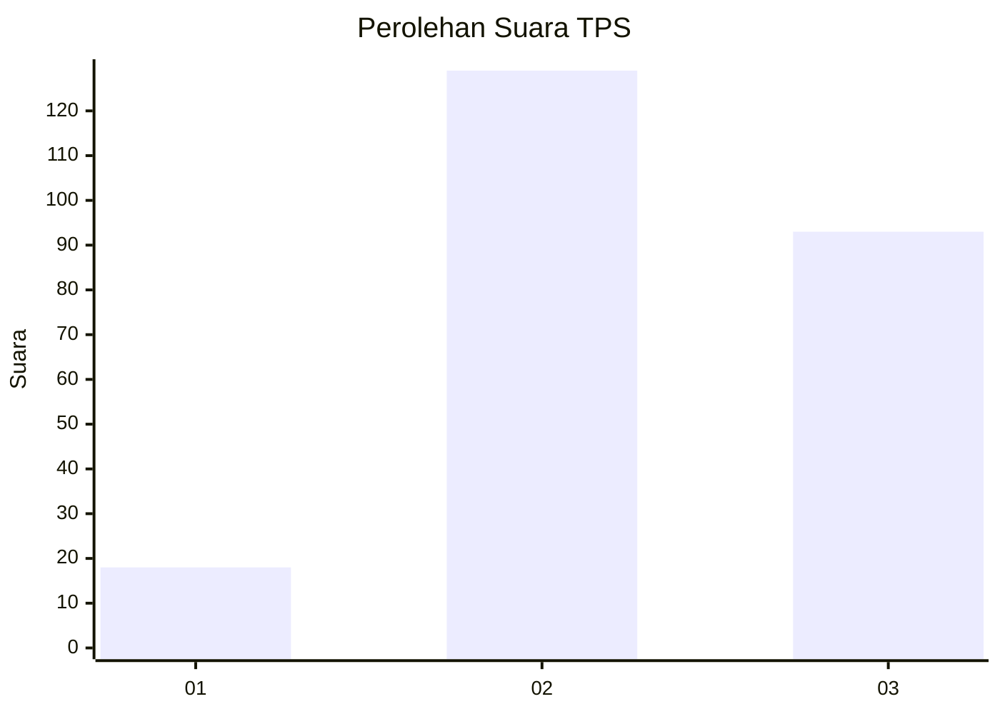
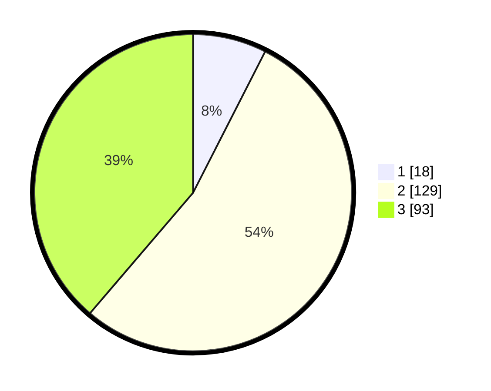

# Hasil

## Grafik

## Tabel

| No. | Nama Paslon    | Suara | Suara (raw) | Persentase |
|:--- |:-------------- | -----:| -----------:| ----------:|
| 1   | ANIES MUHAIMIN | 18    | [18][p-1]   | 7,50       |
| 2   | PRABOWO GIBRAN | 129   | [129][p-2]  | 53,75      |
| 3   | GANJAR MAHFUD  | 93    | [93][p-3]   | 38,75      |

[p-1]: https://github.com/gigit-pemilu/pemilu-2024/blob/main/pilpres/hitung-suara/sub/33-jawa-tengah/sub/15-grobogan/sub/13-purwodadi/sub/1003-danyang/sub/002-tps/sub/paslon-1.txt
[p-2]: https://github.com/gigit-pemilu/pemilu-2024/blob/main/pilpres/hitung-suara/sub/33-jawa-tengah/sub/15-grobogan/sub/13-purwodadi/sub/1003-danyang/sub/002-tps/sub/paslon-2.txt
[p-3]: https://github.com/gigit-pemilu/pemilu-2024/blob/main/pilpres/hitung-suara/sub/33-jawa-tengah/sub/15-grobogan/sub/13-purwodadi/sub/1003-danyang/sub/002-tps/sub/paslon-3.txt

## Foto C Plano

https://sirekap-obj-formc.kpu.go.id/fb9e/pemilu/ppwp/33/15/13/10/03/3315131003002-20240214-203032--51c9eb51-7908-45ea-8d90-63c03d9d7ca1.jpg

https://sirekap-obj-formc.kpu.go.id/fb9e/pemilu/ppwp/33/15/13/10/03/3315131003002-20240214-203327--90641964-7f12-42e3-ad7c-bb2bd197fd1f.jpg

https://sirekap-obj-formc.kpu.go.id/fb9e/pemilu/ppwp/33/15/13/10/03/3315131003002-20240214-203433--90e10555-439e-4b47-a2b7-815a6244ce7f.jpg

## Metadata

| Key        | Value               |
| ---------- | ------------------- |
| Time Stamp | 2024-02-16 01:00:27 |

