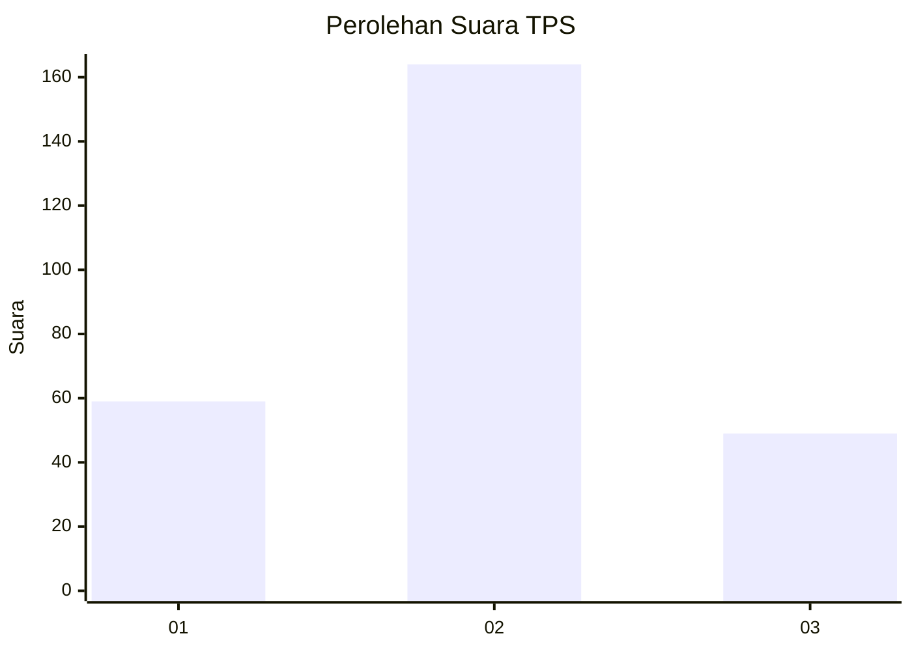
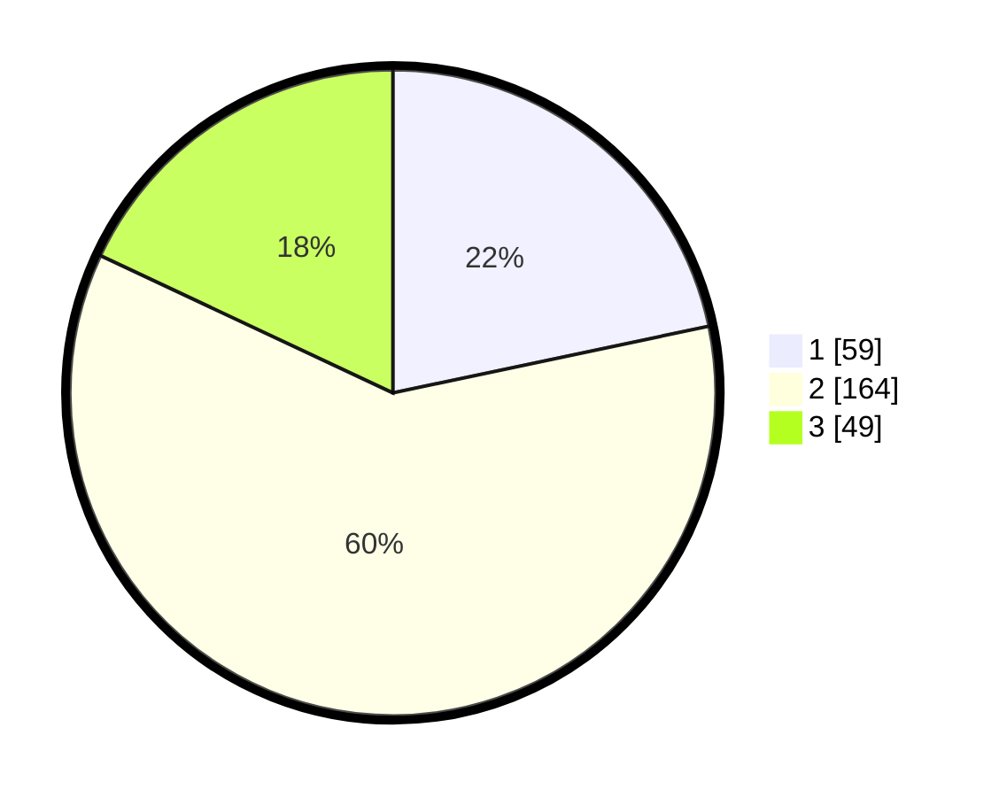

# Hasil

## Grafik

## Tabel

| No. | Nama Paslon    | Suara | Suara (raw) | Persentase |
|:--- |:-------------- | -----:| -----------:| ----------:|
| 1   | ANIES MUHAIMIN | 59    | [59][p-1]   | 21,69      |
| 2   | PRABOWO GIBRAN | 164   | [164][p-2]  | 60,29      |
| 3   | GANJAR MAHFUD  | 49    | [49][p-3]   | 18,01      |

[p-1]: https://github.com/gigit-pemilu/pemilu-2024-33-jawa-tengah/blob/main/pilpres/hitung-suara/sub/33-jawa-tengah/sub/15-grobogan/sub/13-purwodadi/sub/1012-purwodadi/sub/055-tps/sub/paslon-1.txt
[p-2]: https://github.com/gigit-pemilu/pemilu-2024-33-jawa-tengah/blob/main/pilpres/hitung-suara/sub/33-jawa-tengah/sub/15-grobogan/sub/13-purwodadi/sub/1012-purwodadi/sub/055-tps/sub/paslon-2.txt
[p-3]: https://github.com/gigit-pemilu/pemilu-2024-33-jawa-tengah/blob/main/pilpres/hitung-suara/sub/33-jawa-tengah/sub/15-grobogan/sub/13-purwodadi/sub/1012-purwodadi/sub/055-tps/sub/paslon-3.txt

## Foto C Plano

https://sirekap-obj-formc.kpu.go.id/4e61/pemilu/ppwp/33/15/13/10/12/3315131012055-20240221-142122--752858b5-b12d-4d59-83e0-ae1c4e15d252.jpg

https://sirekap-obj-formc.kpu.go.id/4e61/pemilu/ppwp/33/15/13/10/12/3315131012055-20240220-190512--6056d1d0-b601-4709-b29e-061f0d44067f.jpg

https://sirekap-obj-formc.kpu.go.id/4e61/pemilu/ppwp/33/15/13/10/12/3315131012055-20240220-190631--ee8fd648-3daf-452d-a364-8db76bebe91e.jpg

## Metadata

| Key        | Value               |
| ---------- | ------------------- |
| Time Stamp | 2024-02-24 22:31:28 |

