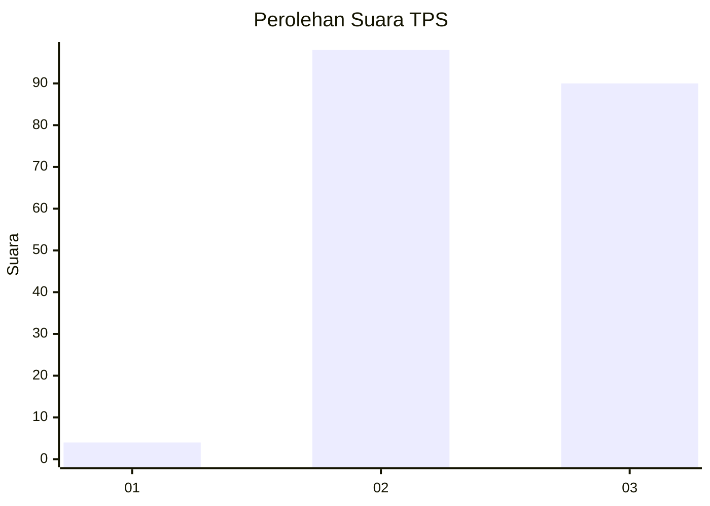
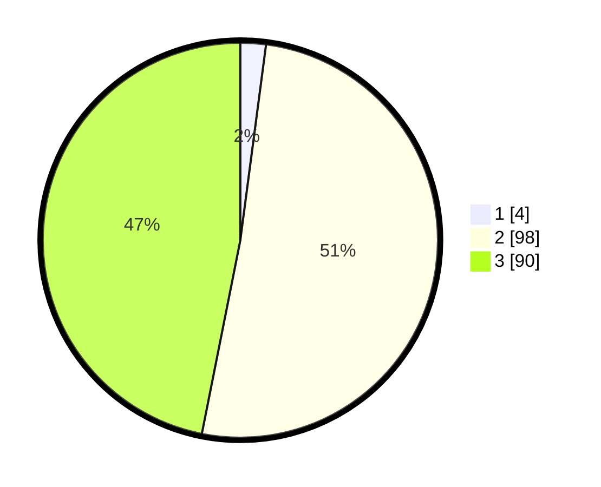

# Hasil

## Grafik

## Tabel

| No. | Nama Paslon    | Suara | Suara (raw) | Persentase |
|:--- |:-------------- | -----:| -----------:| ----------:|
| 1   | ANIES MUHAIMIN | 4     | [4][p-1]    | 2,08       |
| 2   | PRABOWO GIBRAN | 98    | [98][p-2]   | 51,04      |
| 3   | GANJAR MAHFUD  | 90    | [90][p-3]   | 46,88      |

[p-1]: https://github.com/gigit-pemilu/pemilu-2024/blob/main/pilpres/hitung-suara/sub/33-jawa-tengah/sub/15-grobogan/sub/13-purwodadi/sub/2007-nambuhan/sub/005-tps/sub/paslon-1.txt
[p-2]: https://github.com/gigit-pemilu/pemilu-2024/blob/main/pilpres/hitung-suara/sub/33-jawa-tengah/sub/15-grobogan/sub/13-purwodadi/sub/2007-nambuhan/sub/005-tps/sub/paslon-2.txt
[p-3]: https://github.com/gigit-pemilu/pemilu-2024/blob/main/pilpres/hitung-suara/sub/33-jawa-tengah/sub/15-grobogan/sub/13-purwodadi/sub/2007-nambuhan/sub/005-tps/sub/paslon-3.txt

## Foto C Plano

https://sirekap-obj-formc.kpu.go.id/b867/pemilu/ppwp/33/15/13/20/07/3315132007005-20240214-220609--7e76cd59-d795-46cf-afc6-23b456f41b3a.jpg

https://sirekap-obj-formc.kpu.go.id/b867/pemilu/ppwp/33/15/13/20/07/3315132007005-20240214-220621--5a5053ed-6ed4-464f-9b67-5b82ebac1ec2.jpg

https://sirekap-obj-formc.kpu.go.id/b867/pemilu/ppwp/33/15/13/20/07/3315132007005-20240214-220705--a5d853c3-451c-4983-aa97-740c3a1b7432.jpg

## Metadata

| Key        | Value               |
| ---------- | ------------------- |
| Time Stamp | 2024-02-15 19:00:26 |

