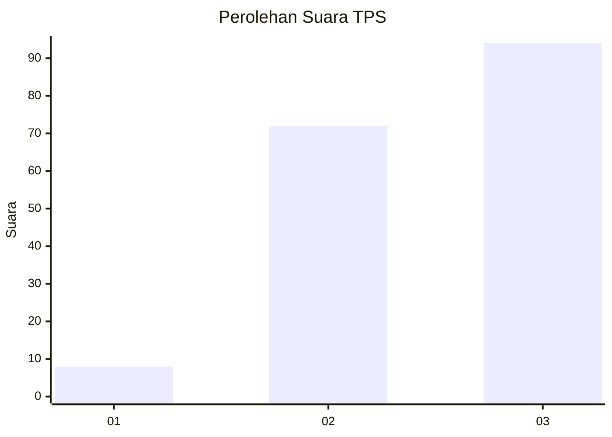
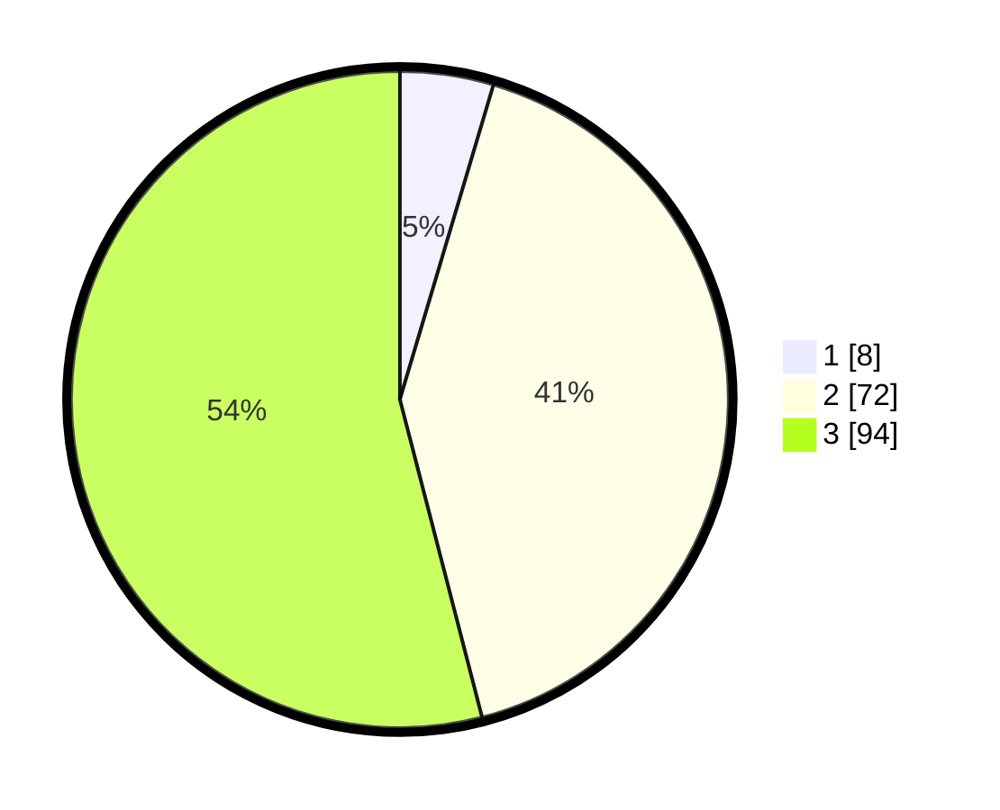

# Hasil

## Grafik

## Tabel

| No. | Nama Paslon    | Suara | Suara (raw) | Persentase |
|:--- |:-------------- | -----:| -----------:| ----------:|
| 1   | ANIES MUHAIMIN | 8     | [8][p-1]    | 4,60       |
| 2   | PRABOWO GIBRAN | 72    | [72][p-2]   | 41,38      |
| 3   | GANJAR MAHFUD  | 94    | [94][p-3]   | 54,02      |

[p-1]: https://github.com/gigit-pemilu/pemilu-2024/blob/main/pilpres/hitung-suara/sub/33-jawa-tengah/sub/15-grobogan/sub/13-purwodadi/sub/2015-cingkrong/sub/005-tps/sub/paslon-1.txt
[p-2]: https://github.com/gigit-pemilu/pemilu-2024/blob/main/pilpres/hitung-suara/sub/33-jawa-tengah/sub/15-grobogan/sub/13-purwodadi/sub/2015-cingkrong/sub/005-tps/sub/paslon-2.txt
[p-3]: https://github.com/gigit-pemilu/pemilu-2024/blob/main/pilpres/hitung-suara/sub/33-jawa-tengah/sub/15-grobogan/sub/13-purwodadi/sub/2015-cingkrong/sub/005-tps/sub/paslon-3.txt

## Foto C Plano

https://sirekap-obj-formc.kpu.go.id/15ac/pemilu/ppwp/33/15/13/20/15/3315132015005-20240216-144126--5494ba1a-9d56-4e55-af85-51439a16e8b6.jpg

https://sirekap-obj-formc.kpu.go.id/15ac/pemilu/ppwp/33/15/13/20/15/3315132015005-20240215-121205--8366213b-b98a-451a-b9a1-35bd237c323f.jpg

https://sirekap-obj-formc.kpu.go.id/15ac/pemilu/ppwp/33/15/13/20/15/3315132015005-20240215-121316--a178e3f9-4eeb-4821-90a9-15bac1b53e91.jpg

## Metadata

| Key        | Value               |
| ---------- | ------------------- |
| Time Stamp | 2024-02-16 16:25:10 |

