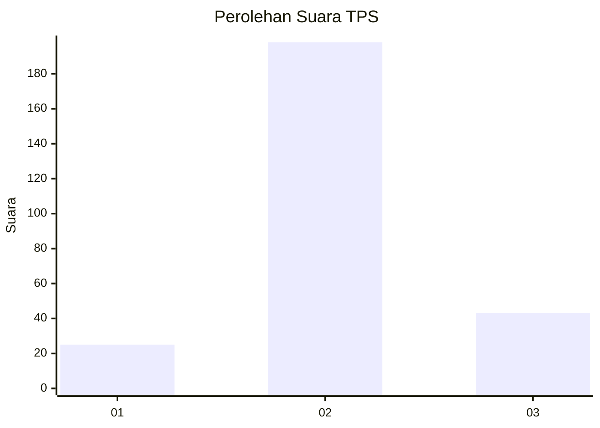
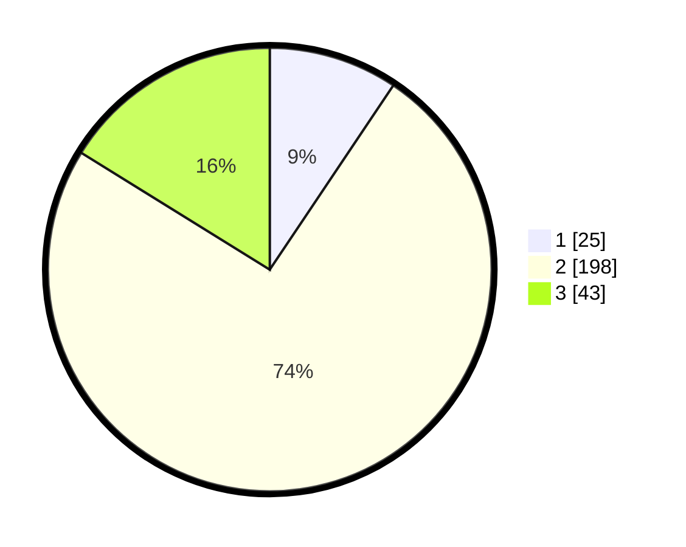

# Hasil

## Grafik

## Tabel

| No. | Nama Paslon    | Suara | Suara (raw) | Persentase |
|:--- |:-------------- | -----:| -----------:| ----------:|
| 1   | ANIES MUHAIMIN | 25    | [25][p-1]   | 9,40       |
| 2   | PRABOWO GIBRAN | 198   | [198][p-2]  | 74,44      |
| 3   | GANJAR MAHFUD  | 43    | [43][p-3]   | 16,17      |

[p-1]: https://github.com/gigit-pemilu/pemilu-2024/blob/main/pilpres/hitung-suara/sub/33-jawa-tengah/sub/15-grobogan/sub/13-purwodadi/sub/2017-putat/sub/009-tps/sub/paslon-1.txt
[p-2]: https://github.com/gigit-pemilu/pemilu-2024/blob/main/pilpres/hitung-suara/sub/33-jawa-tengah/sub/15-grobogan/sub/13-purwodadi/sub/2017-putat/sub/009-tps/sub/paslon-2.txt
[p-3]: https://github.com/gigit-pemilu/pemilu-2024/blob/main/pilpres/hitung-suara/sub/33-jawa-tengah/sub/15-grobogan/sub/13-purwodadi/sub/2017-putat/sub/009-tps/sub/paslon-3.txt

## Foto C Plano

https://sirekap-obj-formc.kpu.go.id/6c69/pemilu/ppwp/33/15/13/20/17/3315132017009-20240215-005408--c5fca9aa-0e57-4844-bda7-72da99e0f6b7.jpg

https://sirekap-obj-formc.kpu.go.id/6c69/pemilu/ppwp/33/15/13/20/17/3315132017009-20240215-010207--7de940ee-6951-4c0c-820e-0275c955327a.jpg

https://sirekap-obj-formc.kpu.go.id/6c69/pemilu/ppwp/33/15/13/20/17/3315132017009-20240215-010334--8998d88b-2dbd-45fb-98c1-8fc368eaed4a.jpg

## Metadata

| Key        | Value               |
| ---------- | ------------------- |
| Time Stamp | 2024-02-15 15:30:25 |

