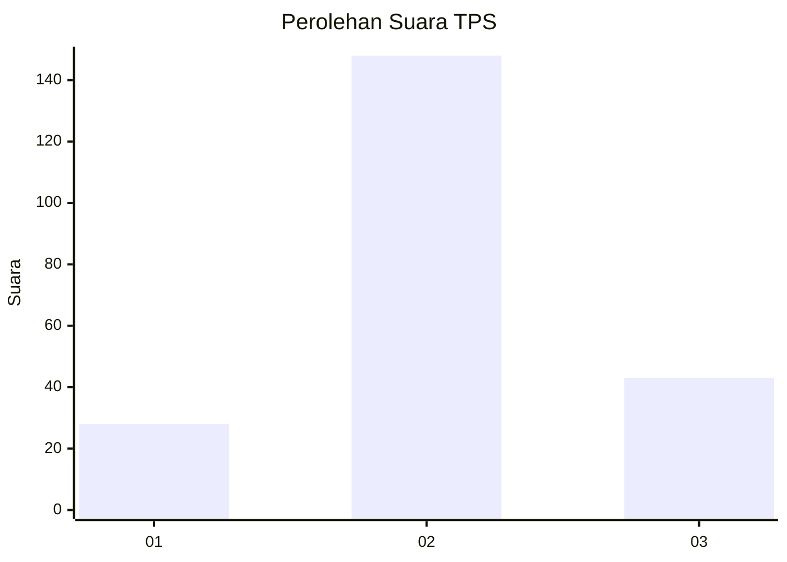
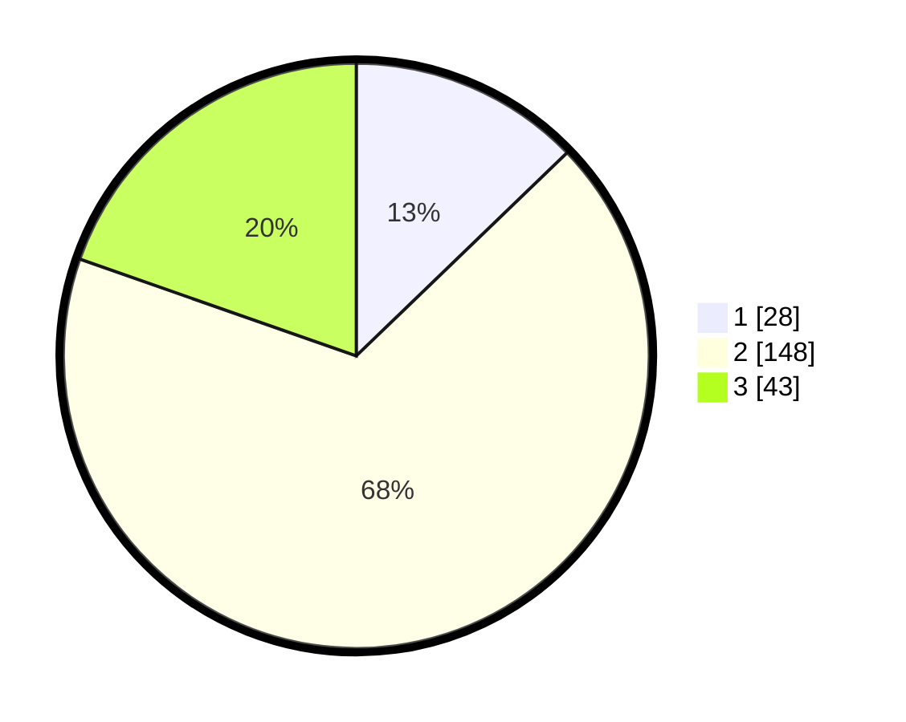

# Hasil

## Grafik

## Tabel

| No. | Nama Paslon    | Suara | Suara (raw) | Persentase |
|:--- |:-------------- | -----:| -----------:| ----------:|
| 1   | ANIES MUHAIMIN | 28    | [28][p-1]   | 12,79      |
| 2   | PRABOWO GIBRAN | 148   | [148][p-2]  | 67,58      |
| 3   | GANJAR MAHFUD  | 43    | [43][p-3]   | 19,63      |

[p-1]: https://github.com/gigit-pemilu/pemilu-2024/blob/main/pilpres/hitung-suara/sub/33-jawa-tengah/sub/15-grobogan/sub/14-brati/sub/2001-menduran/sub/001-tps/sub/paslon-1.txt
[p-2]: https://github.com/gigit-pemilu/pemilu-2024/blob/main/pilpres/hitung-suara/sub/33-jawa-tengah/sub/15-grobogan/sub/14-brati/sub/2001-menduran/sub/001-tps/sub/paslon-2.txt
[p-3]: https://github.com/gigit-pemilu/pemilu-2024/blob/main/pilpres/hitung-suara/sub/33-jawa-tengah/sub/15-grobogan/sub/14-brati/sub/2001-menduran/sub/001-tps/sub/paslon-3.txt

## Foto C Plano

https://sirekap-obj-formc.kpu.go.id/5bc2/pemilu/ppwp/33/15/14/20/01/3315142001001-20240214-185741--3762da12-d58d-4aa5-b528-ae561fd48276.jpg

https://sirekap-obj-formc.kpu.go.id/5bc2/pemilu/ppwp/33/15/14/20/01/3315142001001-20240215-120229--20d3b77e-1d37-4b92-b98c-07153aac8767.jpg

https://sirekap-obj-formc.kpu.go.id/5bc2/pemilu/ppwp/33/15/14/20/01/3315142001001-20240215-120336--64e6e026-afb7-4a5e-8065-d1106a77029b.jpg

## Metadata

| Key        | Value               |
| ---------- | ------------------- |
| Time Stamp | 2024-02-16 16:25:10 |

