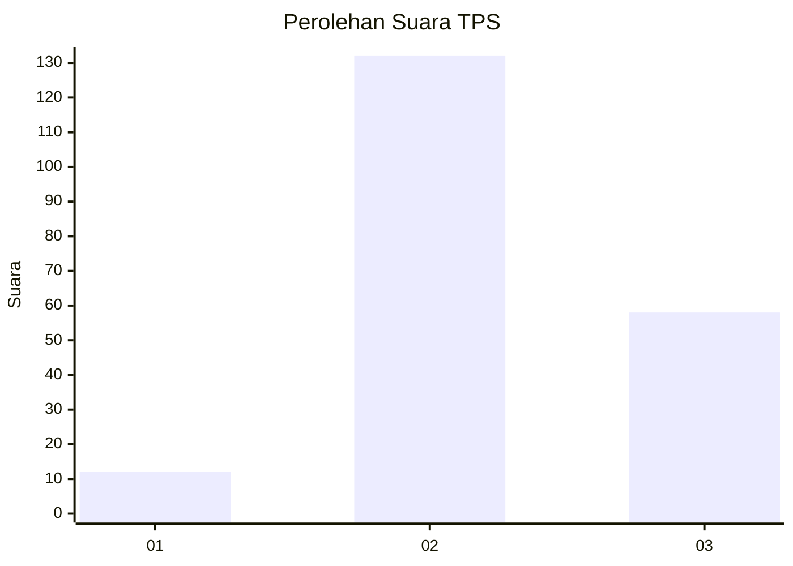
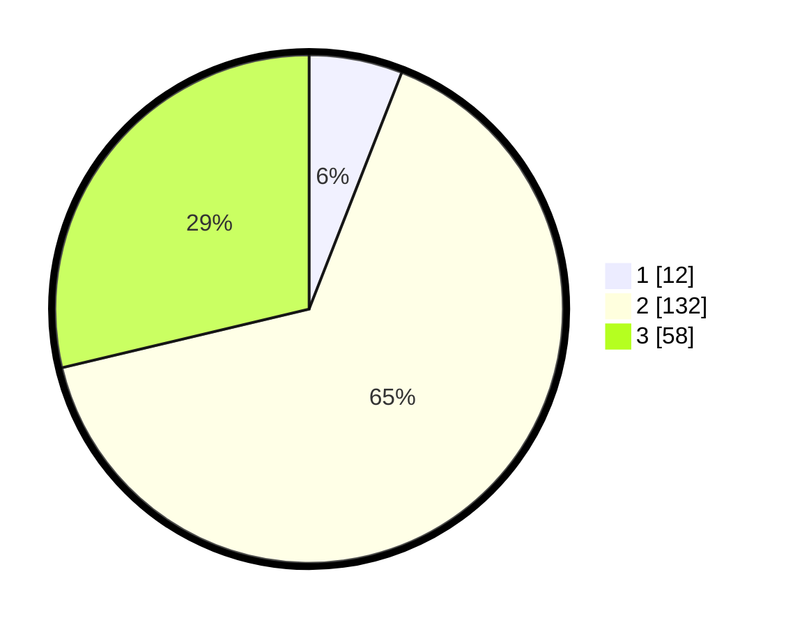

# Hasil

## Grafik

## Tabel

| No. | Nama Paslon    | Suara | Suara (raw) | Persentase |
|:--- |:-------------- | -----:| -----------:| ----------:|
| 1   | ANIES MUHAIMIN | 12    | [12][p-1]   | 5,94       |
| 2   | PRABOWO GIBRAN | 132   | [132][p-2]  | 65,35      |
| 3   | GANJAR MAHFUD  | 58    | [58][p-3]   | 28,71      |

[p-1]: https://github.com/gigit-pemilu/pemilu-2024/blob/main/pilpres/hitung-suara/sub/33-jawa-tengah/sub/15-grobogan/sub/14-brati/sub/2001-menduran/sub/004-tps/sub/paslon-1.txt
[p-2]: https://github.com/gigit-pemilu/pemilu-2024/blob/main/pilpres/hitung-suara/sub/33-jawa-tengah/sub/15-grobogan/sub/14-brati/sub/2001-menduran/sub/004-tps/sub/paslon-2.txt
[p-3]: https://github.com/gigit-pemilu/pemilu-2024/blob/main/pilpres/hitung-suara/sub/33-jawa-tengah/sub/15-grobogan/sub/14-brati/sub/2001-menduran/sub/004-tps/sub/paslon-3.txt

## Foto C Plano

https://sirekap-obj-formc.kpu.go.id/b344/pemilu/ppwp/33/15/14/20/01/3315142001004-20240215-015201--bd5141e1-649d-45a1-9ddd-51ca4f381acc.jpg

https://sirekap-obj-formc.kpu.go.id/b344/pemilu/ppwp/33/15/14/20/01/3315142001004-20240215-015148--ac25bce8-b99a-4923-97f8-984df4078cea.jpg

https://sirekap-obj-formc.kpu.go.id/b344/pemilu/ppwp/33/15/14/20/01/3315142001004-20240215-015231--aafb7bad-f722-4299-8c14-532e6a8cc20e.jpg

## Metadata

| Key        | Value               |
| ---------- | ------------------- |
| Time Stamp | 2024-02-15 12:00:28 |

