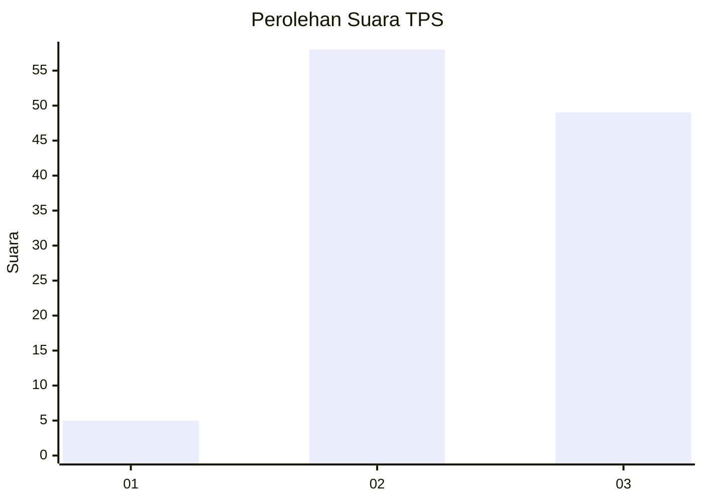
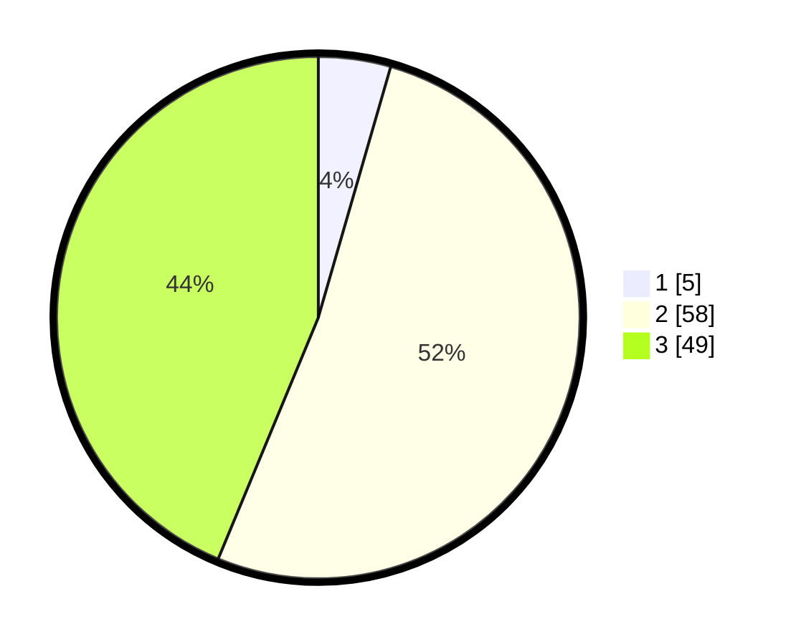

# Hasil

## Grafik

## Tabel

| No. | Nama Paslon    | Suara | Suara (raw) | Persentase |
|:--- |:-------------- | -----:| -----------:| ----------:|
| 1   | ANIES MUHAIMIN | 5     | [5][p-1]    | 4,46       |
| 2   | PRABOWO GIBRAN | 58    | [58][p-2]   | 51,79      |
| 3   | GANJAR MAHFUD  | 49    | [49][p-3]   | 43,75      |

[p-1]: https://github.com/gigit-pemilu/pemilu-2024/blob/main/pilpres/hitung-suara/sub/33-jawa-tengah/sub/15-grobogan/sub/14-brati/sub/2005-tirem/sub/018-tps/sub/paslon-1.txt
[p-2]: https://github.com/gigit-pemilu/pemilu-2024/blob/main/pilpres/hitung-suara/sub/33-jawa-tengah/sub/15-grobogan/sub/14-brati/sub/2005-tirem/sub/018-tps/sub/paslon-2.txt
[p-3]: https://github.com/gigit-pemilu/pemilu-2024/blob/main/pilpres/hitung-suara/sub/33-jawa-tengah/sub/15-grobogan/sub/14-brati/sub/2005-tirem/sub/018-tps/sub/paslon-3.txt

## Foto C Plano

https://sirekap-obj-formc.kpu.go.id/e706/pemilu/ppwp/33/15/14/20/05/3315142005018-20240216-074343--13f6be91-f8cc-4bca-94f0-3f7824f0779d.jpg

https://sirekap-obj-formc.kpu.go.id/e706/pemilu/ppwp/33/15/14/20/05/3315142005018-20240216-074435--d5662f42-7792-4fe2-8157-8cccfc8e5bb0.jpg

https://sirekap-obj-formc.kpu.go.id/e706/pemilu/ppwp/33/15/14/20/05/3315142005018-20240215-020921--0e7c24a6-9fd7-4c63-9117-7faddd7a6209.jpg

## Metadata

| Key        | Value               |
| ---------- | ------------------- |
| Time Stamp | 2024-02-17 14:45:18 |

