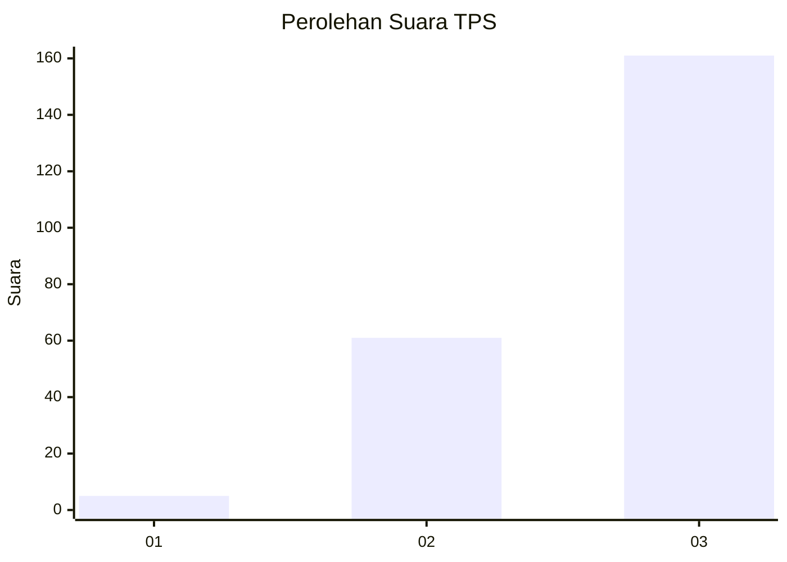
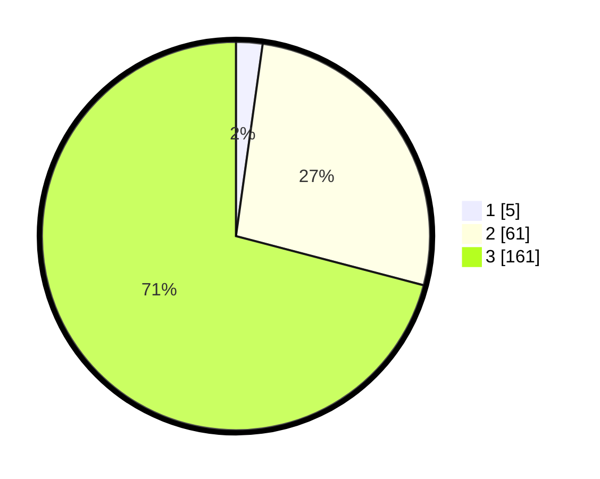

# Hasil

## Grafik

## Tabel

| No. | Nama Paslon    | Suara | Suara (raw) | Persentase |
|:--- |:-------------- | -----:| -----------:| ----------:|
| 1   | ANIES MUHAIMIN | 5     | [5][p-1]    | 2,20       |
| 2   | PRABOWO GIBRAN | 61    | [61][p-2]   | 26,87      |
| 3   | GANJAR MAHFUD  | 161   | [161][p-3]  | 70,93      |

[p-1]: https://github.com/gigit-pemilu/pemilu-2024-33-jawa-tengah/blob/main/pilpres/hitung-suara/sub/33-jawa-tengah/sub/15-grobogan/sub/14-brati/sub/2006-karangsari/sub/001-tps/sub/paslon-1.txt
[p-2]: https://github.com/gigit-pemilu/pemilu-2024-33-jawa-tengah/blob/main/pilpres/hitung-suara/sub/33-jawa-tengah/sub/15-grobogan/sub/14-brati/sub/2006-karangsari/sub/001-tps/sub/paslon-2.txt
[p-3]: https://github.com/gigit-pemilu/pemilu-2024-33-jawa-tengah/blob/main/pilpres/hitung-suara/sub/33-jawa-tengah/sub/15-grobogan/sub/14-brati/sub/2006-karangsari/sub/001-tps/sub/paslon-3.txt

## Foto C Plano

https://sirekap-obj-formc.kpu.go.id/d923/pemilu/ppwp/33/15/14/20/06/3315142006001-20240215-145838--f74b5eec-792f-4ff9-9a56-8e9a163d5913.jpg

https://sirekap-obj-formc.kpu.go.id/d923/pemilu/ppwp/33/15/14/20/06/3315142006001-20240215-150112--f7f04789-7797-43bc-8b42-305880747df1.jpg

https://sirekap-obj-formc.kpu.go.id/d923/pemilu/ppwp/33/15/14/20/06/3315142006001-20240215-150213--8cfb45d2-6378-4390-b717-352301c79919.jpg

## Metadata

| Key        | Value               |
| ---------- | ------------------- |
| Time Stamp | 2024-02-16 16:25:10 |

