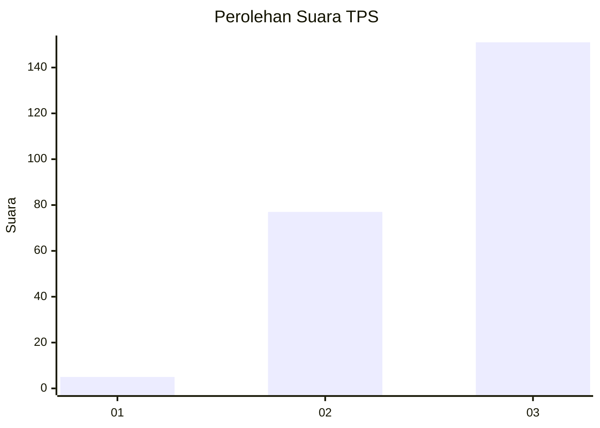
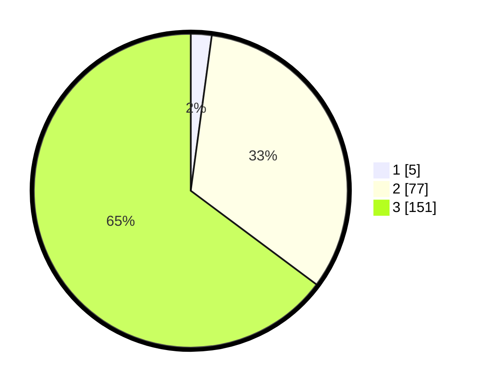

# Hasil

## Grafik

## Tabel

| No. | Nama Paslon    | Suara | Suara (raw) | Persentase |
|:--- |:-------------- | -----:| -----------:| ----------:|
| 1   | ANIES MUHAIMIN | 5     | [5][p-1]    | 2,15       |
| 2   | PRABOWO GIBRAN | 77    | [77][p-2]   | 33,05      |
| 3   | GANJAR MAHFUD  | 151   | [151][p-3]  | 64,81      |

[p-1]: https://github.com/gigit-pemilu/pemilu-2024-33-jawa-tengah/blob/main/pilpres/hitung-suara/sub/33-jawa-tengah/sub/15-grobogan/sub/14-brati/sub/2006-karangsari/sub/012-tps/sub/paslon-1.txt
[p-2]: https://github.com/gigit-pemilu/pemilu-2024-33-jawa-tengah/blob/main/pilpres/hitung-suara/sub/33-jawa-tengah/sub/15-grobogan/sub/14-brati/sub/2006-karangsari/sub/012-tps/sub/paslon-2.txt
[p-3]: https://github.com/gigit-pemilu/pemilu-2024-33-jawa-tengah/blob/main/pilpres/hitung-suara/sub/33-jawa-tengah/sub/15-grobogan/sub/14-brati/sub/2006-karangsari/sub/012-tps/sub/paslon-3.txt

## Foto C Plano

https://sirekap-obj-formc.kpu.go.id/8a3f/pemilu/ppwp/33/15/14/20/06/3315142006012-20240214-222616--b6cc293b-5888-4c58-85a3-20fc3bcd48c4.jpg

https://sirekap-obj-formc.kpu.go.id/8a3f/pemilu/ppwp/33/15/14/20/06/3315142006012-20240214-222802--22051419-2451-4fe0-8aff-0980246ed828.jpg

https://sirekap-obj-formc.kpu.go.id/8a3f/pemilu/ppwp/33/15/14/20/06/3315142006012-20240214-222842--ba58448f-d5bc-44ae-8c8c-b0aa5a8a180c.jpg

## Metadata

| Key        | Value               |
| ---------- | ------------------- |
| Time Stamp | 2024-02-15 12:00:28 |

