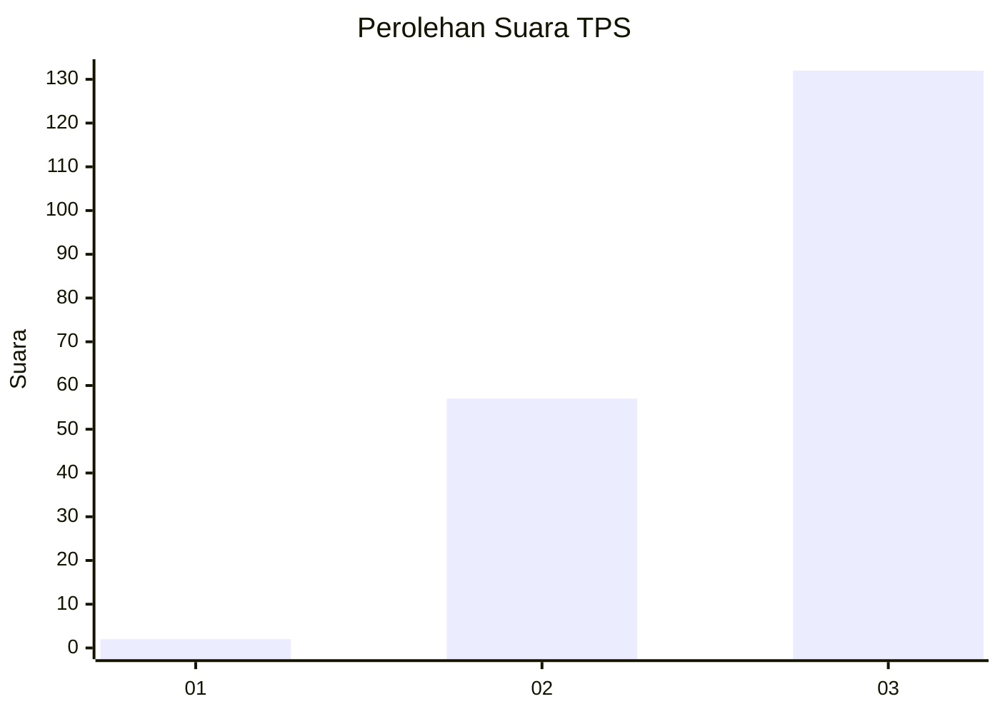
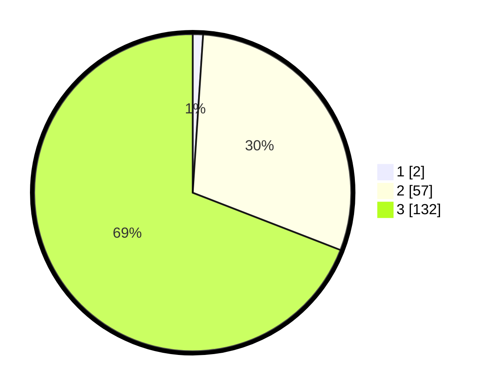

# Hasil

## Grafik

## Tabel

| No. | Nama Paslon    | Suara | Suara (raw) | Persentase |
|:--- |:-------------- | -----:| -----------:| ----------:|
| 1   | ANIES MUHAIMIN | 2     | [2][p-1]    | 1,05       |
| 2   | PRABOWO GIBRAN | 57    | [57][p-2]   | 29,84      |
| 3   | GANJAR MAHFUD  | 132   | [132][p-3]  | 69,11      |

[p-1]: https://github.com/gigit-pemilu/pemilu-2024-33-jawa-tengah/blob/main/pilpres/hitung-suara/sub/33-jawa-tengah/sub/15-grobogan/sub/14-brati/sub/2006-karangsari/sub/015-tps/sub/paslon-1.txt
[p-2]: https://github.com/gigit-pemilu/pemilu-2024-33-jawa-tengah/blob/main/pilpres/hitung-suara/sub/33-jawa-tengah/sub/15-grobogan/sub/14-brati/sub/2006-karangsari/sub/015-tps/sub/paslon-2.txt
[p-3]: https://github.com/gigit-pemilu/pemilu-2024-33-jawa-tengah/blob/main/pilpres/hitung-suara/sub/33-jawa-tengah/sub/15-grobogan/sub/14-brati/sub/2006-karangsari/sub/015-tps/sub/paslon-3.txt

## Foto C Plano

https://sirekap-obj-formc.kpu.go.id/1737/pemilu/ppwp/33/15/14/20/06/3315142006015-20240214-214453--607457eb-969a-417f-9a0c-e65fdf459c06.jpg

https://sirekap-obj-formc.kpu.go.id/1737/pemilu/ppwp/33/15/14/20/06/3315142006015-20240214-214552--82159ae8-1844-4fa7-ab0f-a37ecaba80f9.jpg

https://sirekap-obj-formc.kpu.go.id/1737/pemilu/ppwp/33/15/14/20/06/3315142006015-20240214-214642--d824f5b8-fc4c-4116-81f0-8824562eea11.jpg

## Metadata

| Key        | Value               |
| ---------- | ------------------- |
| Time Stamp | 2024-02-15 12:00:28 |

