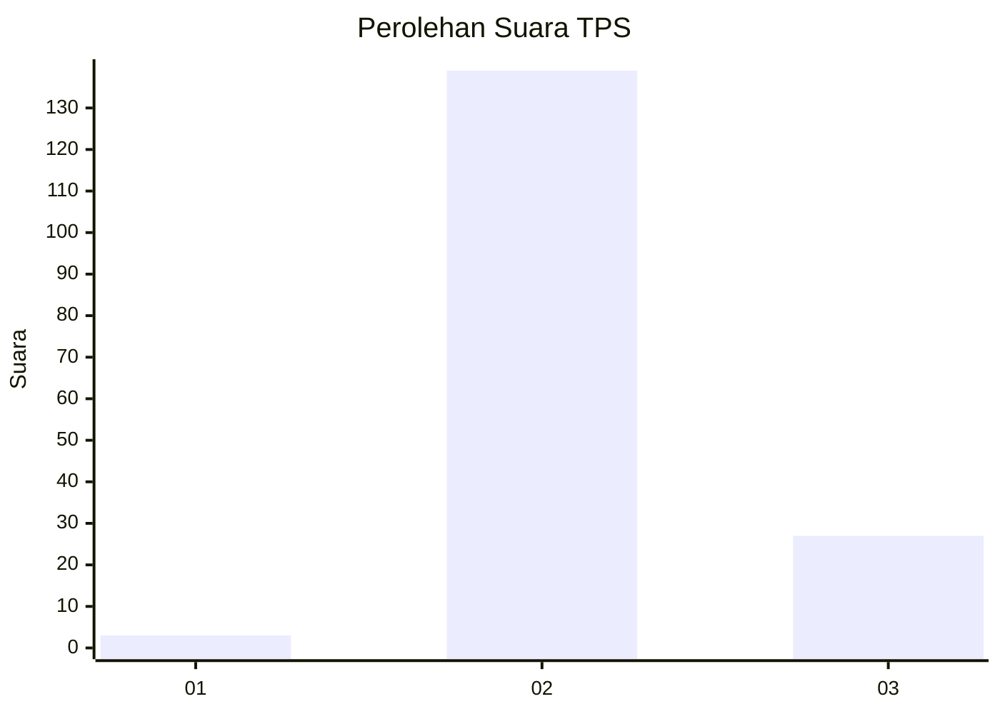
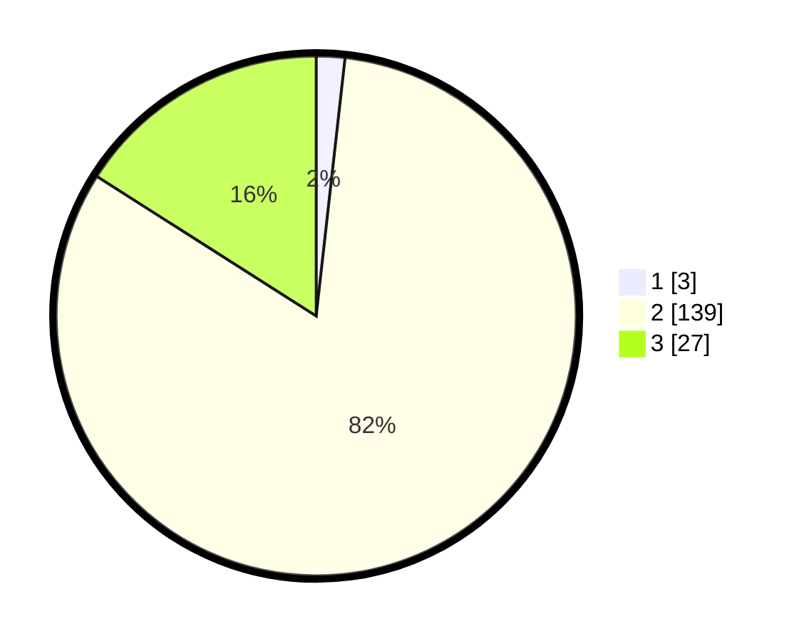

# Hasil

## Grafik

## Tabel

| No. | Nama Paslon    | Suara | Suara (raw) | Persentase |
|:--- |:-------------- | -----:| -----------:| ----------:|
| 1   | ANIES MUHAIMIN | 3     | [3][p-1]    | 1,78       |
| 2   | PRABOWO GIBRAN | 139   | [139][p-2]  | 82,25      |
| 3   | GANJAR MAHFUD  | 27    | [27][p-3]   | 15,98      |

[p-1]: https://github.com/gigit-pemilu/pemilu-2024-33-jawa-tengah/blob/main/pilpres/hitung-suara/sub/33-jawa-tengah/sub/15-grobogan/sub/15-klambu/sub/2001-kandangrejo/sub/001-tps/sub/paslon-1.txt
[p-2]: https://github.com/gigit-pemilu/pemilu-2024-33-jawa-tengah/blob/main/pilpres/hitung-suara/sub/33-jawa-tengah/sub/15-grobogan/sub/15-klambu/sub/2001-kandangrejo/sub/001-tps/sub/paslon-2.txt
[p-3]: https://github.com/gigit-pemilu/pemilu-2024-33-jawa-tengah/blob/main/pilpres/hitung-suara/sub/33-jawa-tengah/sub/15-grobogan/sub/15-klambu/sub/2001-kandangrejo/sub/001-tps/sub/paslon-3.txt

## Foto C Plano

https://sirekap-obj-formc.kpu.go.id/ba2a/pemilu/ppwp/33/15/15/20/01/3315152001001-20240216-210053--ac7c8c76-dfbe-45da-b5f2-c9e88e38efff.jpg

https://sirekap-obj-formc.kpu.go.id/ba2a/pemilu/ppwp/33/15/15/20/01/3315152001001-20240216-210209--e8bb0c15-4b8e-445d-bdd4-67440339b944.jpg

https://sirekap-obj-formc.kpu.go.id/ba2a/pemilu/ppwp/33/15/15/20/01/3315152001001-20240216-210541--c27d784f-f5eb-4ed5-8d49-2de7358a0c4b.jpg

## Metadata

| Key        | Value               |
| ---------- | ------------------- |
| Time Stamp | 2024-02-16 23:00:00 |

