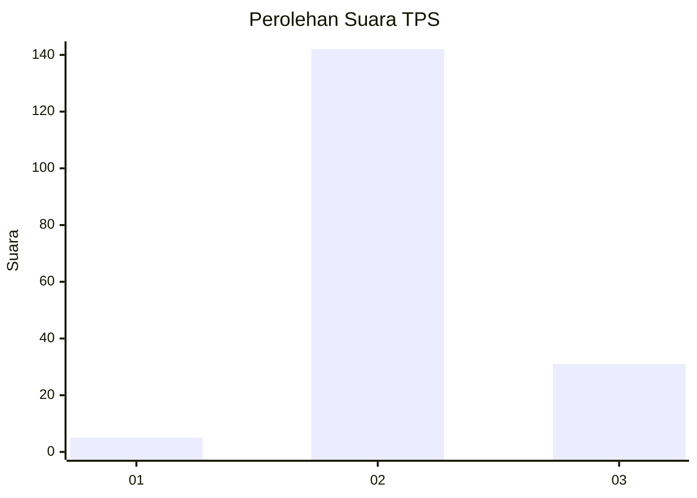

# Hasil

## Grafik

## Tabel

| No. | Nama Paslon    | Suara | Suara (raw) | Persentase |
|:--- |:-------------- | -----:| -----------:| ----------:|
| 1   | ANIES MUHAIMIN | 5     | [5][p-1]    | 2,81       |
| 2   | PRABOWO GIBRAN | 142   | [142][p-2]  | 79,78      |
| 3   | GANJAR MAHFUD  | 31    | [31][p-3]   | 17,42      |

[p-1]: https://github.com/gigit-pemilu/pemilu-2024/blob/main/pilpres/hitung-suara/sub/33-jawa-tengah/sub/15-grobogan/sub/15-klambu/sub/2001-kandangrejo/sub/005-tps/sub/paslon-1.txt
[p-2]: https://github.com/gigit-pemilu/pemilu-2024/blob/main/pilpres/hitung-suara/sub/33-jawa-tengah/sub/15-grobogan/sub/15-klambu/sub/2001-kandangrejo/sub/005-tps/sub/paslon-2.txt
[p-3]: https://github.com/gigit-pemilu/pemilu-2024/blob/main/pilpres/hitung-suara/sub/33-jawa-tengah/sub/15-grobogan/sub/15-klambu/sub/2001-kandangrejo/sub/005-tps/sub/paslon-3.txt

## Foto C Plano

https://sirekap-obj-formc.kpu.go.id/0780/pemilu/ppwp/33/15/15/20/01/3315152001005-20240214-212502--77bd3585-9f4c-43e0-a77e-c833570a2fc2.jpg

https://sirekap-obj-formc.kpu.go.id/0780/pemilu/ppwp/33/15/15/20/01/3315152001005-20240214-212511--1cabddb8-fc6b-4f2a-8214-1777792fd687.jpg

https://sirekap-obj-formc.kpu.go.id/0780/pemilu/ppwp/33/15/15/20/01/3315152001005-20240214-212515--f8503fac-3a92-4bb2-8d5d-e795a77a9e71.jpg

## Metadata

| Key        | Value               |
| ---------- | ------------------- |
| Time Stamp | 2024-02-15 00:41:44 |

