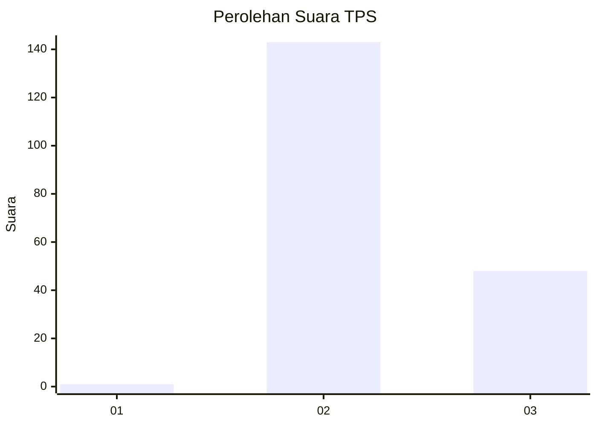
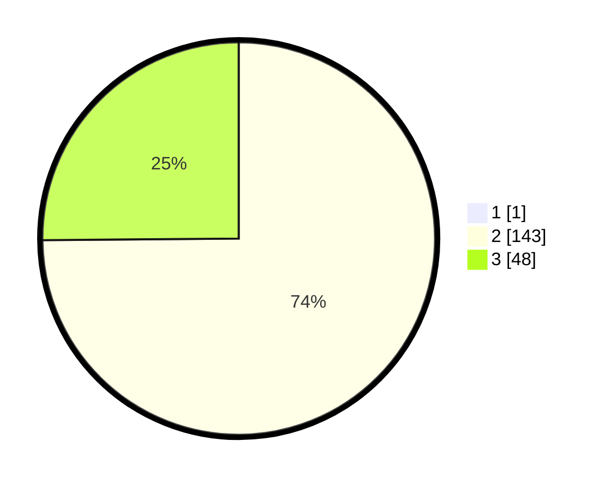

# Hasil

## Grafik

## Tabel

| No. | Nama Paslon    | Suara | Suara (raw) | Persentase |
|:--- |:-------------- | -----:| -----------:| ----------:|
| 1   | ANIES MUHAIMIN | 1     | [1][p-1]    | 0,52       |
| 2   | PRABOWO GIBRAN | 143   | [143][p-2]  | 74,48      |
| 3   | GANJAR MAHFUD  | 48    | [48][p-3]   | 25,00      |

[p-1]: https://github.com/gigit-pemilu/pemilu-2024-33-jawa-tengah/blob/main/pilpres/hitung-suara/sub/33-jawa-tengah/sub/15-grobogan/sub/15-klambu/sub/2001-kandangrejo/sub/006-tps/sub/paslon-1.txt
[p-2]: https://github.com/gigit-pemilu/pemilu-2024-33-jawa-tengah/blob/main/pilpres/hitung-suara/sub/33-jawa-tengah/sub/15-grobogan/sub/15-klambu/sub/2001-kandangrejo/sub/006-tps/sub/paslon-2.txt
[p-3]: https://github.com/gigit-pemilu/pemilu-2024-33-jawa-tengah/blob/main/pilpres/hitung-suara/sub/33-jawa-tengah/sub/15-grobogan/sub/15-klambu/sub/2001-kandangrejo/sub/006-tps/sub/paslon-3.txt

## Foto C Plano

https://sirekap-obj-formc.kpu.go.id/7c49/pemilu/ppwp/33/15/15/20/01/3315152001006-20240214-234333--a72fea83-d298-4698-930b-b06d8d9e4819.jpg

https://sirekap-obj-formc.kpu.go.id/7c49/pemilu/ppwp/33/15/15/20/01/3315152001006-20240214-234348--0b5f1e0c-4379-4ccc-abb2-f72d899e8df7.jpg

https://sirekap-obj-formc.kpu.go.id/7c49/pemilu/ppwp/33/15/15/20/01/3315152001006-20240214-234356--0c233fc2-6cda-4430-a8d0-26b075f5a266.jpg

## Metadata

| Key        | Value               |
| ---------- | ------------------- |
| Time Stamp | 2024-02-20 11:00:00 |

