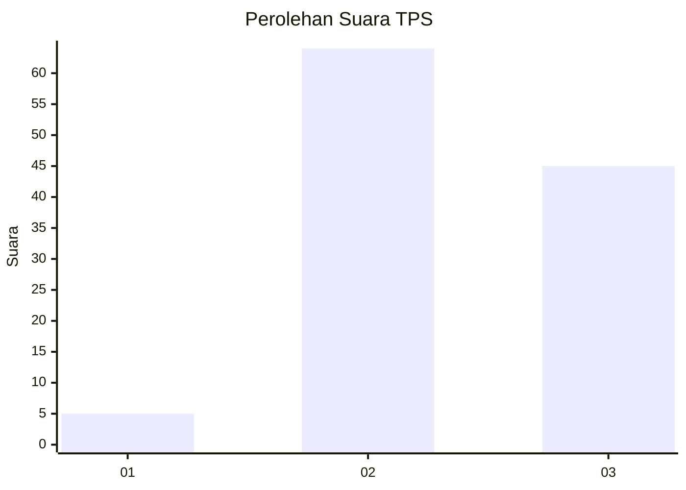
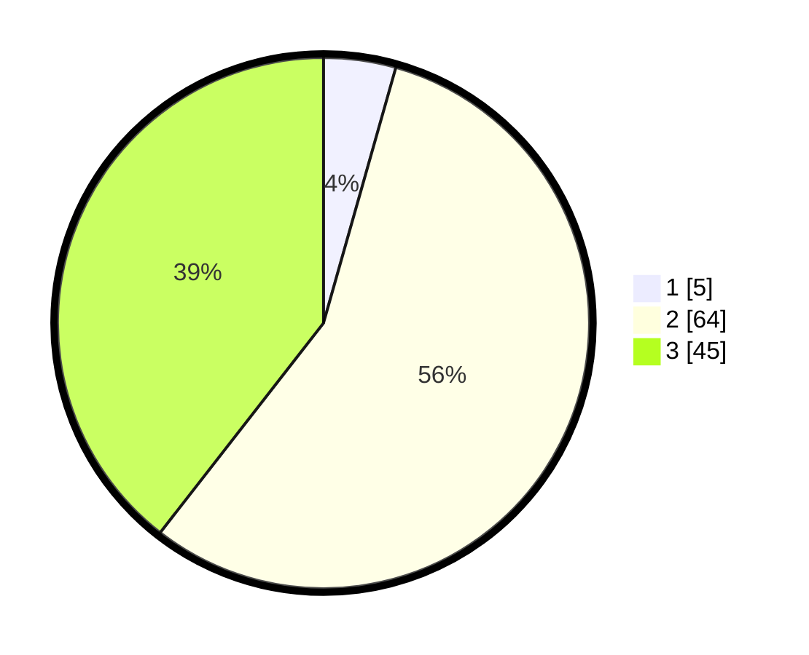

# Hasil

## Grafik

## Tabel

| No. | Nama Paslon    | Suara | Suara (raw) | Persentase |
|:--- |:-------------- | -----:| -----------:| ----------:|
| 1   | ANIES MUHAIMIN | 5     | [5][p-1]    | 4,39       |
| 2   | PRABOWO GIBRAN | 64    | [64][p-2]   | 56,14      |
| 3   | GANJAR MAHFUD  | 45    | [45][p-3]   | 39,47      |

[p-1]: https://github.com/gigit-pemilu/pemilu-2024/blob/main/pilpres/hitung-suara/sub/33-jawa-tengah/sub/15-grobogan/sub/15-klambu/sub/2003-taruman/sub/016-tps/sub/paslon-1.txt
[p-2]: https://github.com/gigit-pemilu/pemilu-2024/blob/main/pilpres/hitung-suara/sub/33-jawa-tengah/sub/15-grobogan/sub/15-klambu/sub/2003-taruman/sub/016-tps/sub/paslon-2.txt
[p-3]: https://github.com/gigit-pemilu/pemilu-2024/blob/main/pilpres/hitung-suara/sub/33-jawa-tengah/sub/15-grobogan/sub/15-klambu/sub/2003-taruman/sub/016-tps/sub/paslon-3.txt

## Foto C Plano

https://sirekap-obj-formc.kpu.go.id/637e/pemilu/ppwp/33/15/15/20/03/3315152003016-20240217-181500--d64673f9-2357-4864-b073-9018929dac57.jpg

https://sirekap-obj-formc.kpu.go.id/637e/pemilu/ppwp/33/15/15/20/03/3315152003016-20240217-171630--7c746781-b05c-4945-998b-bb6f463544a4.jpg

https://sirekap-obj-formc.kpu.go.id/637e/pemilu/ppwp/33/15/15/20/03/3315152003016-20240217-171817--2b1ec3ea-6558-40df-8fe6-4f3f8f218d4a.jpg

## Metadata

| Key        | Value               |
| ---------- | ------------------- |
| Time Stamp | 2024-02-17 18:30:00 |

