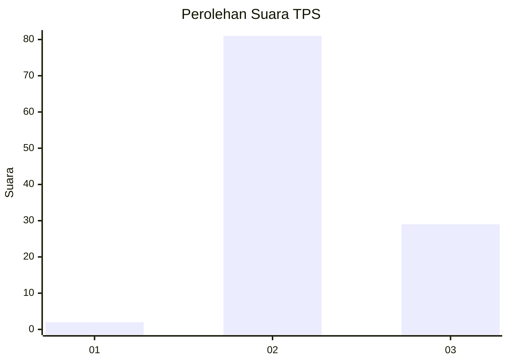
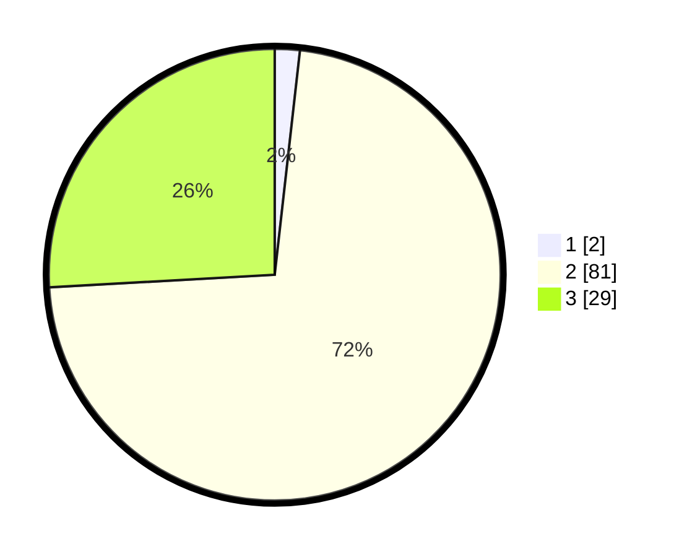

# Hasil

## Grafik

## Tabel

| No. | Nama Paslon    | Suara | Suara (raw) | Persentase |
|:--- |:-------------- | -----:| -----------:| ----------:|
| 1   | ANIES MUHAIMIN | 2     | [2][p-1]    | 1,79       |
| 2   | PRABOWO GIBRAN | 81    | [81][p-2]   | 72,32      |
| 3   | GANJAR MAHFUD  | 29    | [29][p-3]   | 25,89      |

[p-1]: https://github.com/gigit-pemilu/pemilu-2024/blob/main/pilpres/hitung-suara/sub/33-jawa-tengah/sub/15-grobogan/sub/15-klambu/sub/2003-taruman/sub/017-tps/sub/paslon-1.txt
[p-2]: https://github.com/gigit-pemilu/pemilu-2024/blob/main/pilpres/hitung-suara/sub/33-jawa-tengah/sub/15-grobogan/sub/15-klambu/sub/2003-taruman/sub/017-tps/sub/paslon-2.txt
[p-3]: https://github.com/gigit-pemilu/pemilu-2024/blob/main/pilpres/hitung-suara/sub/33-jawa-tengah/sub/15-grobogan/sub/15-klambu/sub/2003-taruman/sub/017-tps/sub/paslon-3.txt

## Foto C Plano

https://sirekap-obj-formc.kpu.go.id/761d/pemilu/ppwp/33/15/15/20/03/3315152003017-20240215-004610--7cceb767-f9b7-4541-be0c-8c6cab6c35a2.jpg

https://sirekap-obj-formc.kpu.go.id/761d/pemilu/ppwp/33/15/15/20/03/3315152003017-20240215-000722--4dba5be8-f11a-41a3-bc08-06e48205c04b.jpg

https://sirekap-obj-formc.kpu.go.id/761d/pemilu/ppwp/33/15/15/20/03/3315152003017-20240215-000851--5e875f8b-c5b7-4757-813a-7d17a072a2d7.jpg

## Metadata

| Key        | Value               |
| ---------- | ------------------- |
| Time Stamp | 2024-02-20 11:00:00 |

