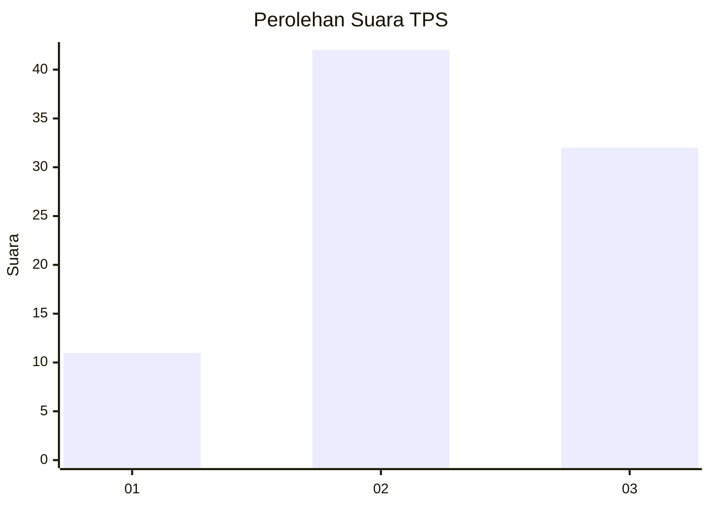
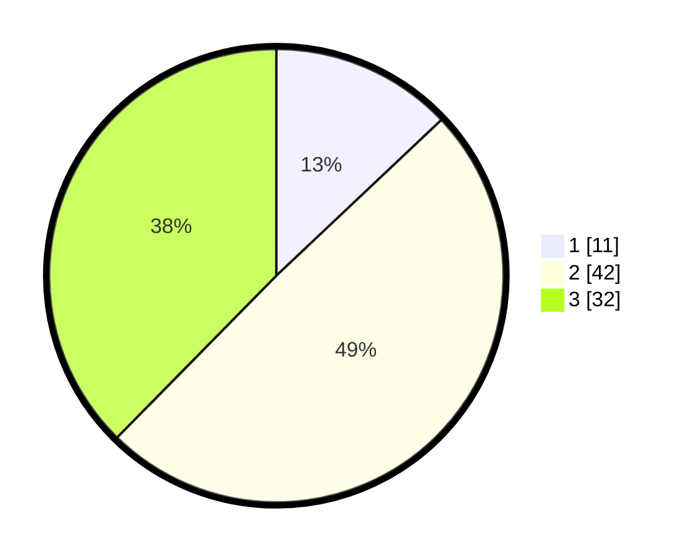

# Hasil

## Grafik

## Tabel

| No. | Nama Paslon    | Suara | Suara (raw) | Persentase |
|:--- |:-------------- | -----:| -----------:| ----------:|
| 1   | ANIES MUHAIMIN | 11    | [11][p-1]   | 12,94      |
| 2   | PRABOWO GIBRAN | 42    | [42][p-2]   | 49,41      |
| 3   | GANJAR MAHFUD  | 32    | [32][p-3]   | 37,65      |

[p-1]: https://github.com/gigit-pemilu/pemilu-2024-33-jawa-tengah/blob/main/pilpres/hitung-suara/sub/33-jawa-tengah/sub/15-grobogan/sub/16-godong/sub/2001-guyangan/sub/003-tps/sub/paslon-1.txt
[p-2]: https://github.com/gigit-pemilu/pemilu-2024-33-jawa-tengah/blob/main/pilpres/hitung-suara/sub/33-jawa-tengah/sub/15-grobogan/sub/16-godong/sub/2001-guyangan/sub/003-tps/sub/paslon-2.txt
[p-3]: https://github.com/gigit-pemilu/pemilu-2024-33-jawa-tengah/blob/main/pilpres/hitung-suara/sub/33-jawa-tengah/sub/15-grobogan/sub/16-godong/sub/2001-guyangan/sub/003-tps/sub/paslon-3.txt

## Foto C Plano

https://sirekap-obj-formc.kpu.go.id/3f0b/pemilu/ppwp/33/15/16/20/01/3315162001003-20240217-111017--f3adb4a7-b2d1-468b-93f6-47e874826b59.jpg

https://sirekap-obj-formc.kpu.go.id/3f0b/pemilu/ppwp/33/15/16/20/01/3315162001003-20240217-105037--ea48caee-7a01-4531-83aa-a1132dc0ce16.jpg

https://sirekap-obj-formc.kpu.go.id/3f0b/pemilu/ppwp/33/15/16/20/01/3315162001003-20240214-193519--c43f6a54-80fc-43e5-84d6-d3c34aedb2da.jpg

## Metadata

| Key        | Value               |
| ---------- | ------------------- |
| Time Stamp | 2024-02-20 11:00:00 |

