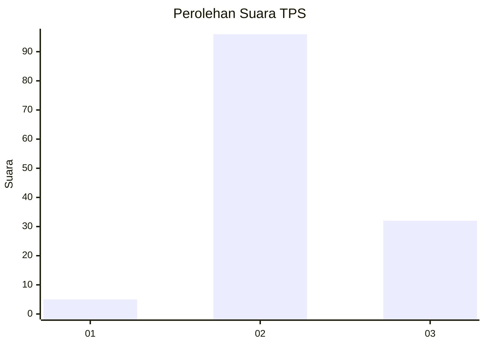
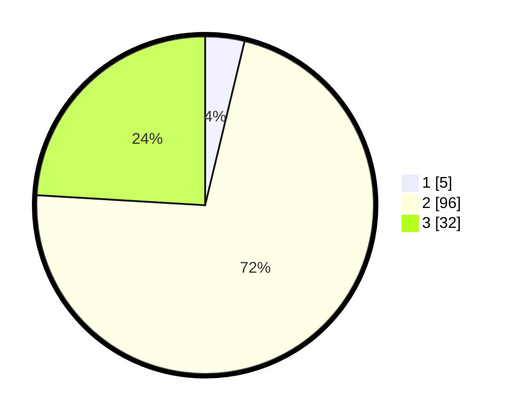

# Hasil

## Grafik

## Tabel

| No. | Nama Paslon    | Suara | Suara (raw) | Persentase |
|:--- |:-------------- | -----:| -----------:| ----------:|
| 1   | ANIES MUHAIMIN | 5     | [5][p-1]    | 3,76       |
| 2   | PRABOWO GIBRAN | 96    | [96][p-2]   | 72,18      |
| 3   | GANJAR MAHFUD  | 32    | [32][p-3]   | 24,06      |

[p-1]: https://github.com/gigit-pemilu/pemilu-2024-33-jawa-tengah/blob/main/pilpres/hitung-suara/sub/33-jawa-tengah/sub/15-grobogan/sub/16-godong/sub/2001-guyangan/sub/004-tps/sub/paslon-1.txt
[p-2]: https://github.com/gigit-pemilu/pemilu-2024-33-jawa-tengah/blob/main/pilpres/hitung-suara/sub/33-jawa-tengah/sub/15-grobogan/sub/16-godong/sub/2001-guyangan/sub/004-tps/sub/paslon-2.txt
[p-3]: https://github.com/gigit-pemilu/pemilu-2024-33-jawa-tengah/blob/main/pilpres/hitung-suara/sub/33-jawa-tengah/sub/15-grobogan/sub/16-godong/sub/2001-guyangan/sub/004-tps/sub/paslon-3.txt

## Foto C Plano

https://sirekap-obj-formc.kpu.go.id/b17c/pemilu/ppwp/33/15/16/20/01/3315162001004-20240217-140206--279894ce-39b9-415c-afa1-caa7f596fe15.jpg

https://sirekap-obj-formc.kpu.go.id/b17c/pemilu/ppwp/33/15/16/20/01/3315162001004-20240217-120016--b3206515-2ecf-4f4b-93ae-bbac624b0079.jpg

https://sirekap-obj-formc.kpu.go.id/b17c/pemilu/ppwp/33/15/16/20/01/3315162001004-20240217-120210--d9ecef1c-412c-4daa-8908-a7cb135c0ed8.jpg

## Metadata

| Key        | Value               |
| ---------- | ------------------- |
| Time Stamp | 2024-02-17 16:00:02 |

