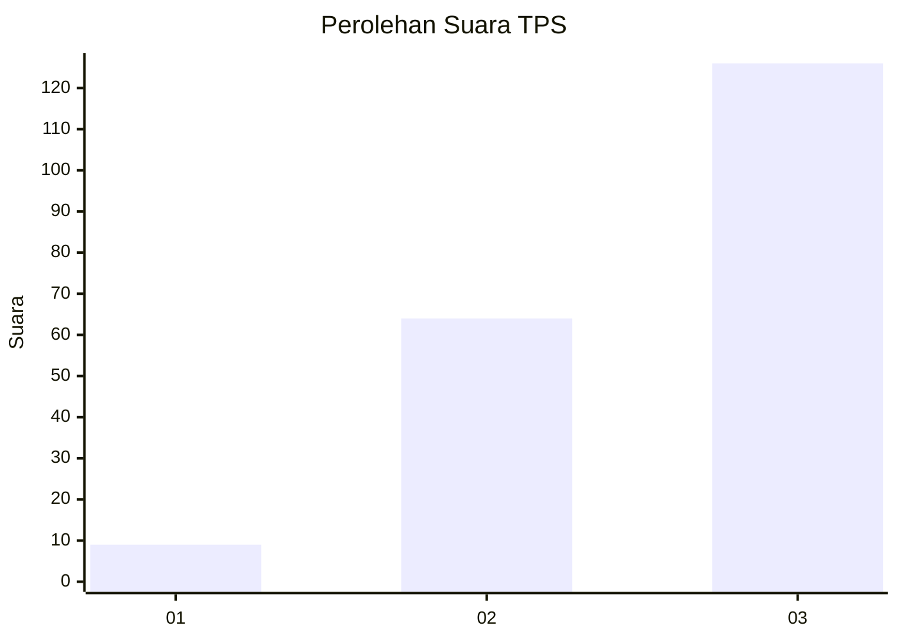
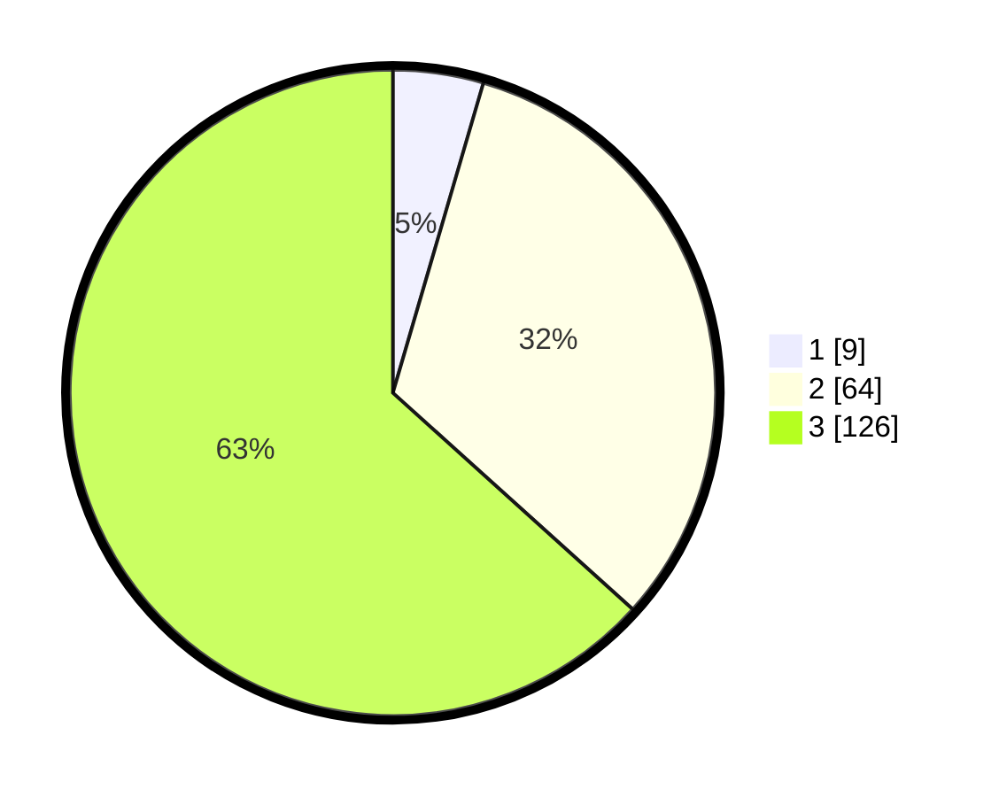

# Hasil

## Grafik

## Tabel

| No. | Nama Paslon    | Suara | Suara (raw) | Persentase |
|:--- |:-------------- | -----:| -----------:| ----------:|
| 1   | ANIES MUHAIMIN | 9     | [9][p-1]    | 4,52       |
| 2   | PRABOWO GIBRAN | 64    | [64][p-2]   | 32,16      |
| 3   | GANJAR MAHFUD  | 126   | [126][p-3]  | 63,32      |

[p-1]: https://github.com/gigit-pemilu/pemilu-2024/blob/main/pilpres/hitung-suara/sub/33-jawa-tengah/sub/15-grobogan/sub/16-godong/sub/2001-guyangan/sub/007-tps/sub/paslon-1.txt
[p-2]: https://github.com/gigit-pemilu/pemilu-2024/blob/main/pilpres/hitung-suara/sub/33-jawa-tengah/sub/15-grobogan/sub/16-godong/sub/2001-guyangan/sub/007-tps/sub/paslon-2.txt
[p-3]: https://github.com/gigit-pemilu/pemilu-2024/blob/main/pilpres/hitung-suara/sub/33-jawa-tengah/sub/15-grobogan/sub/16-godong/sub/2001-guyangan/sub/007-tps/sub/paslon-3.txt

## Foto C Plano

https://sirekap-obj-formc.kpu.go.id/e313/pemilu/ppwp/33/15/16/20/01/3315162001007-20240217-171211--110fa2ff-f1df-4801-bf06-63c1c1541cc4.jpg

https://sirekap-obj-formc.kpu.go.id/e313/pemilu/ppwp/33/15/16/20/01/3315162001007-20240217-172040--e16feab4-269b-47e4-80db-35ca3e15dde7.jpg

## Metadata

| Key        | Value               |
| ---------- | ------------------- |
| Time Stamp | 2024-02-20 11:00:00 |

