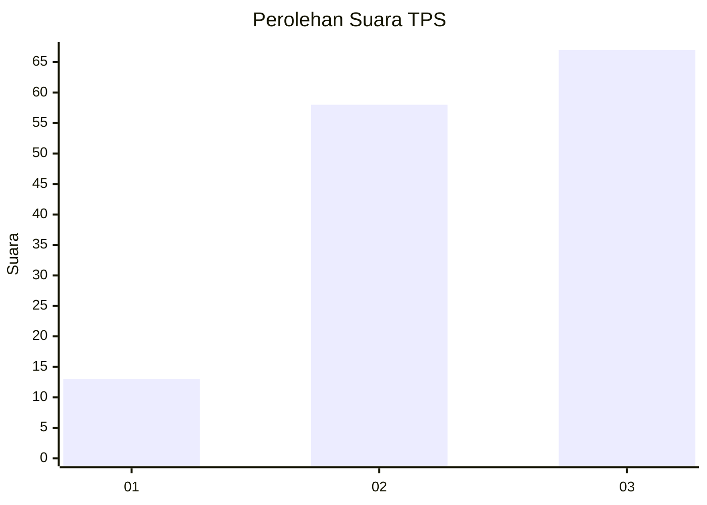
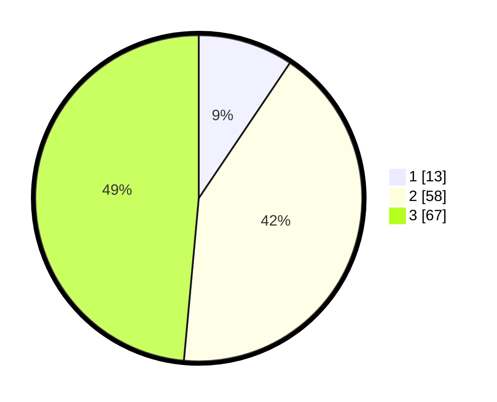

# Hasil

## Grafik

## Tabel

| No. | Nama Paslon    | Suara | Suara (raw) | Persentase |
|:--- |:-------------- | -----:| -----------:| ----------:|
| 1   | ANIES MUHAIMIN | 13    | [13][p-1]   | 9,42       |
| 2   | PRABOWO GIBRAN | 58    | [58][p-2]   | 42,03      |
| 3   | GANJAR MAHFUD  | 67    | [67][p-3]   | 48,55      |

[p-1]: https://github.com/gigit-pemilu/pemilu-2024/blob/main/pilpres/hitung-suara/sub/33-jawa-tengah/sub/15-grobogan/sub/16-godong/sub/2005-ketangirejo/sub/006-tps/sub/paslon-1.txt
[p-2]: https://github.com/gigit-pemilu/pemilu-2024/blob/main/pilpres/hitung-suara/sub/33-jawa-tengah/sub/15-grobogan/sub/16-godong/sub/2005-ketangirejo/sub/006-tps/sub/paslon-2.txt
[p-3]: https://github.com/gigit-pemilu/pemilu-2024/blob/main/pilpres/hitung-suara/sub/33-jawa-tengah/sub/15-grobogan/sub/16-godong/sub/2005-ketangirejo/sub/006-tps/sub/paslon-3.txt

## Foto C Plano

https://sirekap-obj-formc.kpu.go.id/1fa7/pemilu/ppwp/33/15/16/20/05/3315162005006-20240214-205839--c538f082-619b-4ac6-9747-d9a900701c98.jpg

https://sirekap-obj-formc.kpu.go.id/1fa7/pemilu/ppwp/33/15/16/20/05/3315162005006-20240214-205918--6ec05f35-1b81-45dc-bd1a-8f41cef365a4.jpg

https://sirekap-obj-formc.kpu.go.id/1fa7/pemilu/ppwp/33/15/16/20/05/3315162005006-20240214-210002--3b14ee81-7140-4c80-8234-118ec3649cd1.jpg

## Metadata

| Key        | Value               |
| ---------- | ------------------- |
| Time Stamp | 2024-02-15 02:10:27 |

