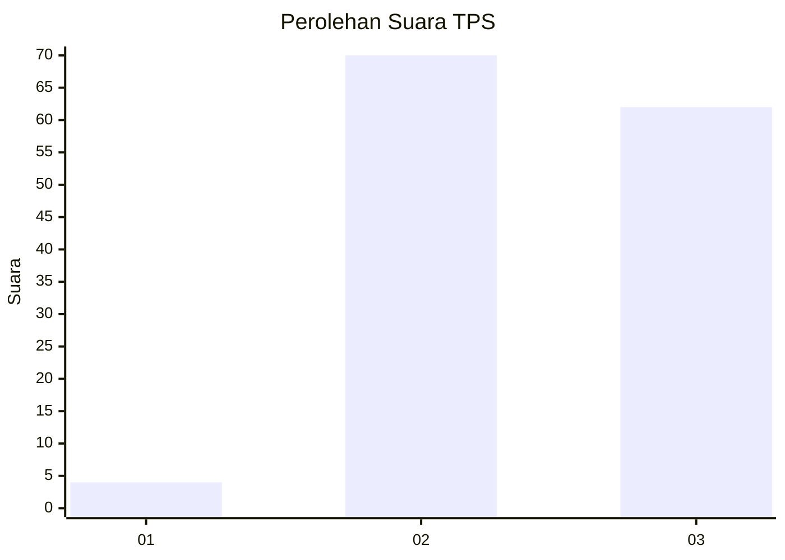
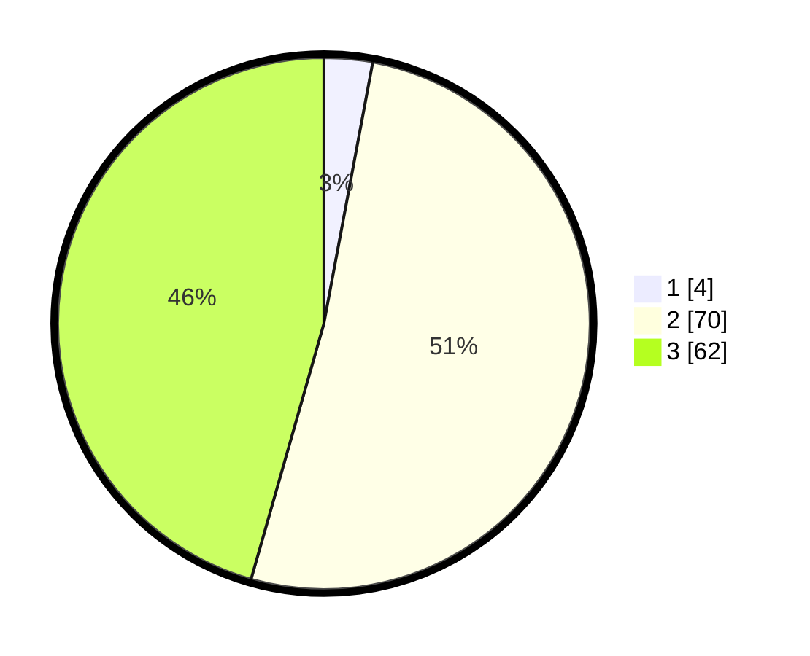

# Hasil

## Grafik

## Tabel

| No. | Nama Paslon    | Suara | Suara (raw) | Persentase |
|:--- |:-------------- | -----:| -----------:| ----------:|
| 1   | ANIES MUHAIMIN | 4     | [4][p-1]    | 2,94       |
| 2   | PRABOWO GIBRAN | 70    | [70][p-2]   | 51,47      |
| 3   | GANJAR MAHFUD  | 62    | [62][p-3]   | 45,59      |

[p-1]: https://github.com/gigit-pemilu/pemilu-2024/blob/main/pilpres/hitung-suara/sub/33-jawa-tengah/sub/15-grobogan/sub/16-godong/sub/2006-sambung/sub/011-tps/sub/paslon-1.txt
[p-2]: https://github.com/gigit-pemilu/pemilu-2024/blob/main/pilpres/hitung-suara/sub/33-jawa-tengah/sub/15-grobogan/sub/16-godong/sub/2006-sambung/sub/011-tps/sub/paslon-2.txt
[p-3]: https://github.com/gigit-pemilu/pemilu-2024/blob/main/pilpres/hitung-suara/sub/33-jawa-tengah/sub/15-grobogan/sub/16-godong/sub/2006-sambung/sub/011-tps/sub/paslon-3.txt

## Foto C Plano

https://sirekap-obj-formc.kpu.go.id/71ed/pemilu/ppwp/33/15/16/20/06/3315162006011-20240214-231343--9d2d3514-8fdd-4ab2-ae47-24ce1b3121ea.jpg

https://sirekap-obj-formc.kpu.go.id/71ed/pemilu/ppwp/33/15/16/20/06/3315162006011-20240214-155502--e22eaab0-eadd-49cd-9e4e-2ee9ca6dfc50.jpg

https://sirekap-obj-formc.kpu.go.id/71ed/pemilu/ppwp/33/15/16/20/06/3315162006011-20240214-155505--a66f53cf-7913-44d9-a342-d5b48067a73e.jpg

## Metadata

| Key        | Value               |
| ---------- | ------------------- |
| Time Stamp | 2024-02-15 00:41:44 |

