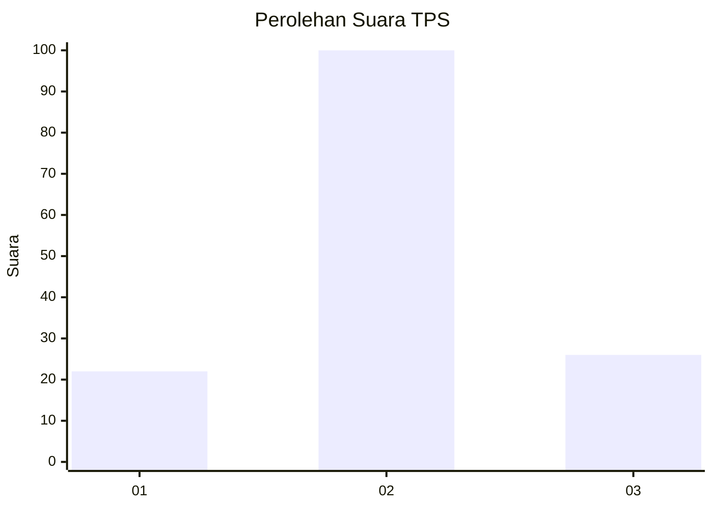
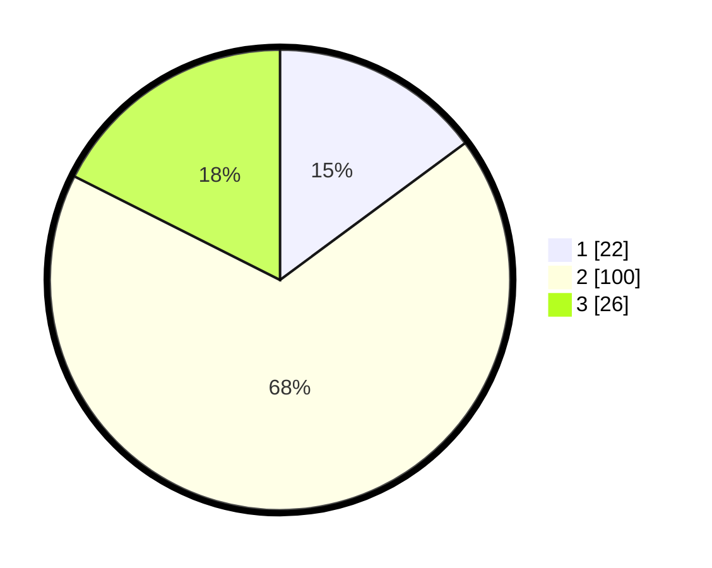

# Hasil

## Grafik

## Tabel

| No. | Nama Paslon    | Suara | Suara (raw) | Persentase |
|:--- |:-------------- | -----:| -----------:| ----------:|
| 1   | ANIES MUHAIMIN | 22    | [22][p-1]   | 14,86      |
| 2   | PRABOWO GIBRAN | 100   | [100][p-2]  | 67,57      |
| 3   | GANJAR MAHFUD  | 26    | [26][p-3]   | 17,57      |

[p-1]: https://github.com/gigit-pemilu/pemilu-2024/blob/main/pilpres/hitung-suara/sub/33-jawa-tengah/sub/15-grobogan/sub/16-godong/sub/2007-sumurgede/sub/001-tps/sub/paslon-1.txt
[p-2]: https://github.com/gigit-pemilu/pemilu-2024/blob/main/pilpres/hitung-suara/sub/33-jawa-tengah/sub/15-grobogan/sub/16-godong/sub/2007-sumurgede/sub/001-tps/sub/paslon-2.txt
[p-3]: https://github.com/gigit-pemilu/pemilu-2024/blob/main/pilpres/hitung-suara/sub/33-jawa-tengah/sub/15-grobogan/sub/16-godong/sub/2007-sumurgede/sub/001-tps/sub/paslon-3.txt

## Foto C Plano

https://sirekap-obj-formc.kpu.go.id/5364/pemilu/ppwp/33/15/16/20/07/3315162007001-20240214-231729--c0fafcb6-0c21-4fbd-ad2f-f8b319bb2763.jpg

https://sirekap-obj-formc.kpu.go.id/5364/pemilu/ppwp/33/15/16/20/07/3315162007001-20240214-231956--32fb8282-cdcc-477b-b5ad-19bdf3b6c019.jpg

https://sirekap-obj-formc.kpu.go.id/5364/pemilu/ppwp/33/15/16/20/07/3315162007001-20240214-232220--b0c17719-0488-45b7-b4b0-06b553f505c3.jpg

## Metadata

| Key        | Value               |
| ---------- | ------------------- |
| Time Stamp | 2024-02-15 15:00:29 |

