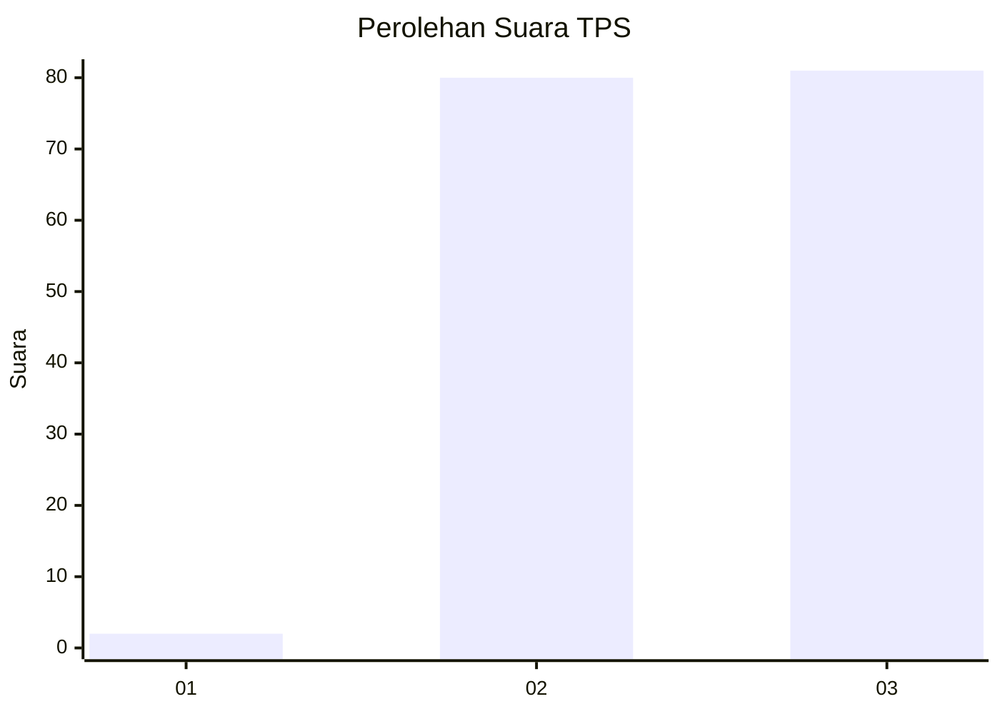
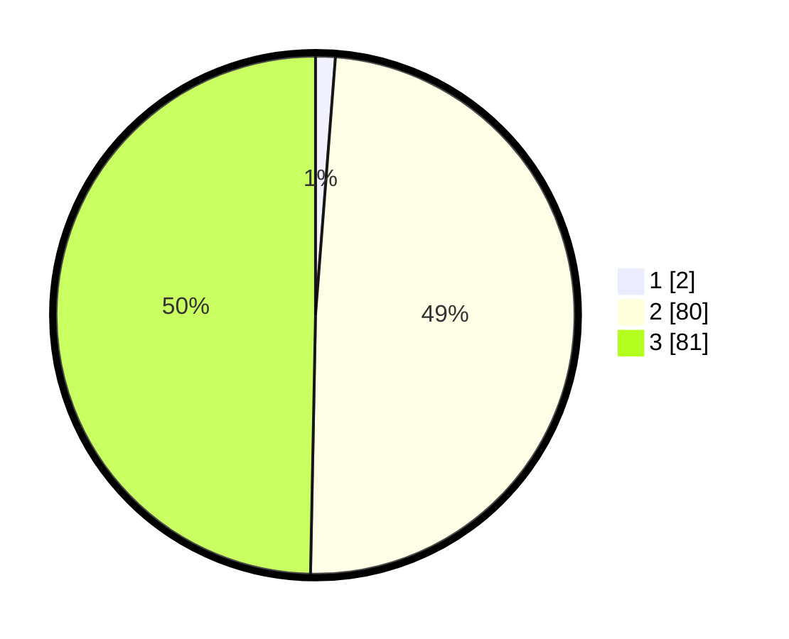

# Hasil

## Grafik

## Tabel

| No. | Nama Paslon    | Suara | Suara (raw) | Persentase |
|:--- |:-------------- | -----:| -----------:| ----------:|
| 1   | ANIES MUHAIMIN | 2     | [2][p-1]    | 1,23       |
| 2   | PRABOWO GIBRAN | 80    | [80][p-2]   | 49,08      |
| 3   | GANJAR MAHFUD  | 81    | [81][p-3]   | 49,69      |

[p-1]: https://github.com/gigit-pemilu/pemilu-2024-33-jawa-tengah/blob/main/pilpres/hitung-suara/sub/33-jawa-tengah/sub/15-grobogan/sub/16-godong/sub/2007-sumurgede/sub/005-tps/sub/paslon-1.txt
[p-2]: https://github.com/gigit-pemilu/pemilu-2024-33-jawa-tengah/blob/main/pilpres/hitung-suara/sub/33-jawa-tengah/sub/15-grobogan/sub/16-godong/sub/2007-sumurgede/sub/005-tps/sub/paslon-2.txt
[p-3]: https://github.com/gigit-pemilu/pemilu-2024-33-jawa-tengah/blob/main/pilpres/hitung-suara/sub/33-jawa-tengah/sub/15-grobogan/sub/16-godong/sub/2007-sumurgede/sub/005-tps/sub/paslon-3.txt

## Foto C Plano

https://sirekap-obj-formc.kpu.go.id/968c/pemilu/ppwp/33/15/16/20/07/3315162007005-20240215-212851--389334a4-78df-4053-b0e9-cd24c5d28ce8.jpg

https://sirekap-obj-formc.kpu.go.id/968c/pemilu/ppwp/33/15/16/20/07/3315162007005-20240215-214441--73a0809e-8228-4960-bcab-09ffb11274d4.jpg

https://sirekap-obj-formc.kpu.go.id/968c/pemilu/ppwp/33/15/16/20/07/3315162007005-20240215-224005--f9650f83-a25f-452a-b806-070de39958a2.jpg

## Metadata

| Key        | Value               |
| ---------- | ------------------- |
| Time Stamp | 2024-02-16 12:51:22 |

